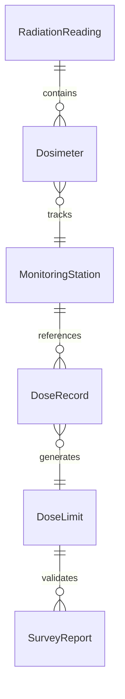
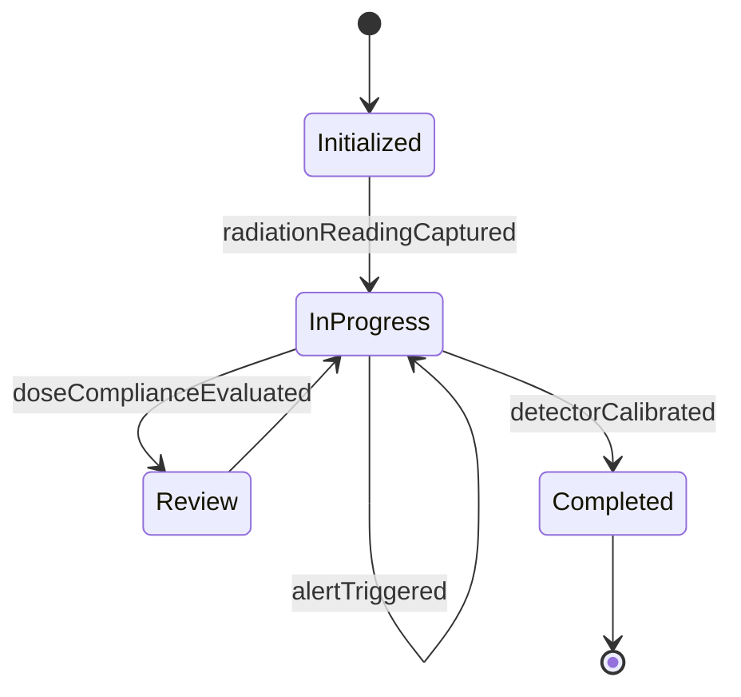
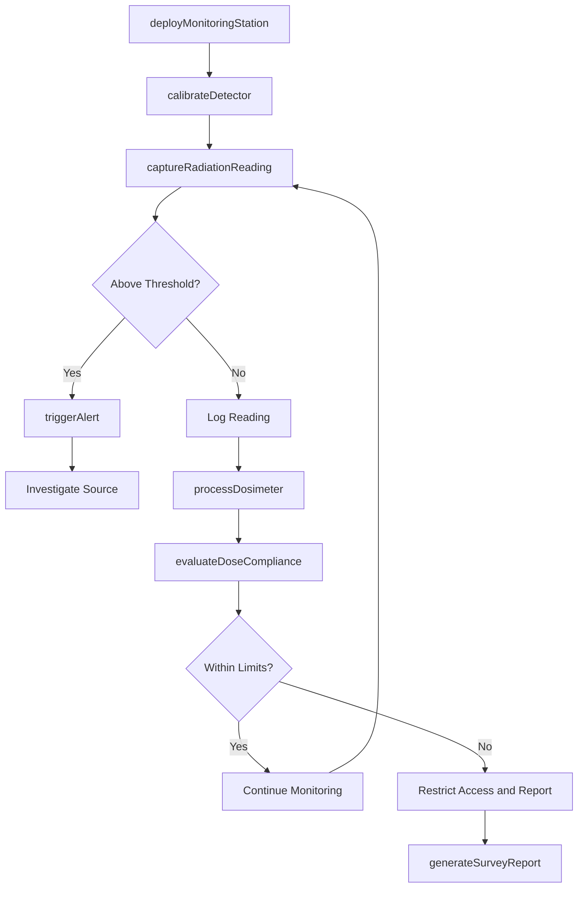
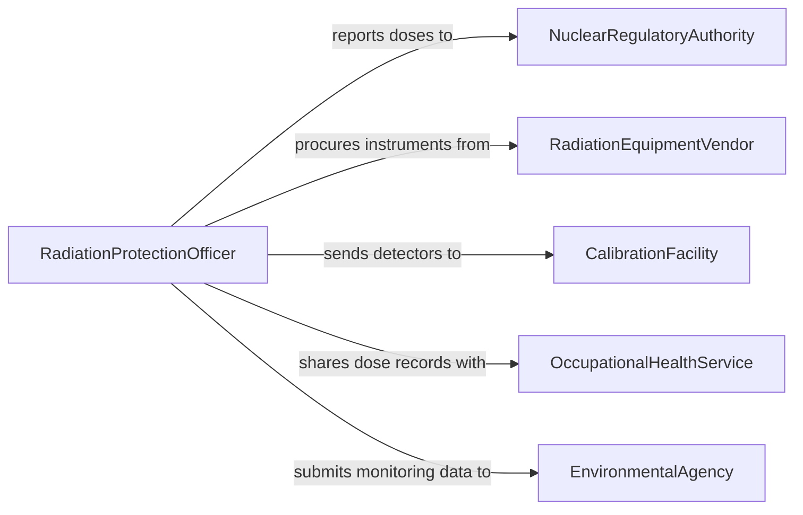

# Measure Radiation Levels

> Business-as-Code definition for measuring radiation levels. Models radiation monitoring workflows from detector deployment through dose tracking and regulatory reporting.

## Overview

Measuring radiation levels is essential for protecting workers, the public, and the environment in nuclear energy, healthcare, industrial radiography, and research settings. This definition exposes actions for capturing radiation dose rates, monitoring cumulative exposure, and generating regulatory compliance reports. Events enable automated alerts when radiation exceeds safe thresholds and integration with personal dosimetry systems.

## Actors

| Actor | Description |
|-------|-------------|
| NuclearRegulatoryAuthority | Sets permissible dose limits and requires radiation reporting |
| RadiationEquipmentVendor | Supplies detectors, dosimeters, and monitoring systems |
| CalibrationFacility | Certifies radiation detection instruments against reference sources |
| OccupationalHealthService | Monitors worker dose records and conducts health assessments |
| EnvironmentalAgency | Oversees radiation releases and environmental monitoring data |

## Roles

| Role | Description |
|------|-------------|
| RadiationProtectionOfficer | Manages the radiation safety program and regulatory compliance |
| HealthPhysicist | Analyzes radiation data and assesses dose implications |
| RadiationTechnician | Performs field measurements and deploys monitoring equipment |
| DosimetryClerk | Processes personal dosimeter readings and maintains exposure records |

## Entities

| Entity | Description |
|--------|-------------|
| RadiationReading | A measured dose rate at a specific location and time |
| Dosimeter | A personal device that records cumulative radiation exposure |
| MonitoringStation | A fixed location equipped with radiation detection instruments |
| DoseRecord | An individual worker's cumulative radiation exposure history |
| DoseLimit | A regulatory or organizational maximum permissible exposure level |
| SurveyReport | A documented summary of radiation measurements for an area or event |

## Actions

| Action | Description |
|--------|-------------|
| captureRadiationReading | Record the current dose rate at a monitoring point |
| deployMonitoringStation | Install and configure a fixed radiation detection system |
| processDosimeter | Read and record cumulative exposure from a personal dosimeter |
| evaluateDoseCompliance | Compare recorded doses against permissible limits |
| generateSurveyReport | Produce a radiation survey report for an area or time period |
| triggerAlert | Initiate an immediate notification when a dose rate exceeds a threshold |
| calibrateDetector | Verify and adjust a radiation detection instrument against a known source |

## Events

| Event | Description |
|-------|-------------|
| radiationReadingCaptured | A dose rate measurement has been recorded |
| monitoringStationDeployed | A fixed radiation monitoring system has been installed |
| dosimeterProcessed | A personal dosimeter reading has been recorded |
| doseComplianceEvaluated | A dose record has been assessed against permissible limits |
| surveyReportGenerated | A radiation survey report has been produced |
| alertTriggered | A radiation level has exceeded a defined threshold |
| detectorCalibrated | A radiation detection instrument has been verified and adjusted |

## Searches

| Search | Description |
|--------|-------------|
| findRadiationReadings | Retrieve readings by location, date range, or dose rate range |
| getDoseRecords | Look up cumulative exposure records by worker or time period |
| getThresholdExceedances | Find readings or doses that exceeded permissible limits |
| getMonitoringStations | List active monitoring stations by area, type, or status |
| getSurveyReports | Retrieve survey reports by area, date, or regulatory period |


## Entity Relationships



## State Diagram


## Workflow



## Actor Relationships



## Usage

### Calling Actions

```typescript
import { measureRadiationLevels } from '@headlessly/measure-radiation-levels'

const radiation = measureRadiationLevels()

// Capture a radiation reading
const reading = await radiation.captureRadiationReading({
  stationId: 'MON-REACTOR-HALL-03',
  doseRate: 0.45,
  unit: 'mSv/h',
  detectorId: 'DET-GM-017'
})

// Process a personal dosimeter
const dose = await radiation.processDosimeter({
  dosimeterId: 'DOS-2026-0334',
  workerId: 'EMP-1042',
  cumulativeDose: 2.8,
  unit: 'mSv',
  period: '2026-Q1'
})

// Evaluate compliance
await radiation.evaluateDoseCompliance({
  doseRecordId: dose.id,
  limitId: 'LIMIT-ANNUAL-OCCUPATIONAL'
})
```

### Event-Driven Automation

```typescript
// Immediate alert on high radiation
radiation.alertTriggered(async ({ stationId, doseRate, threshold }) => {
  await notify({
    to: 'radiation-safety',
    priority: 'critical',
    message: `Station ${stationId}: ${doseRate} mSv/h exceeds threshold of ${threshold} mSv/h`
  })
})

// Quarterly compliance review
radiation.doseComplianceEvaluated(async ({ workerId, cumulativeDose, limit, compliant }) => {
  if (!compliant) {
    await notify({
      to: 'health-physics',
      message: `Worker ${workerId} dose of ${cumulativeDose} mSv exceeds limit of ${limit} mSv`
    })
  }
})
```
