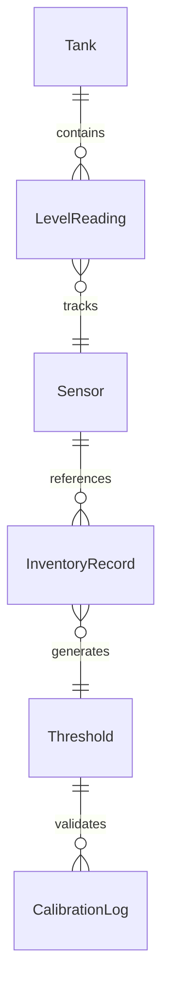
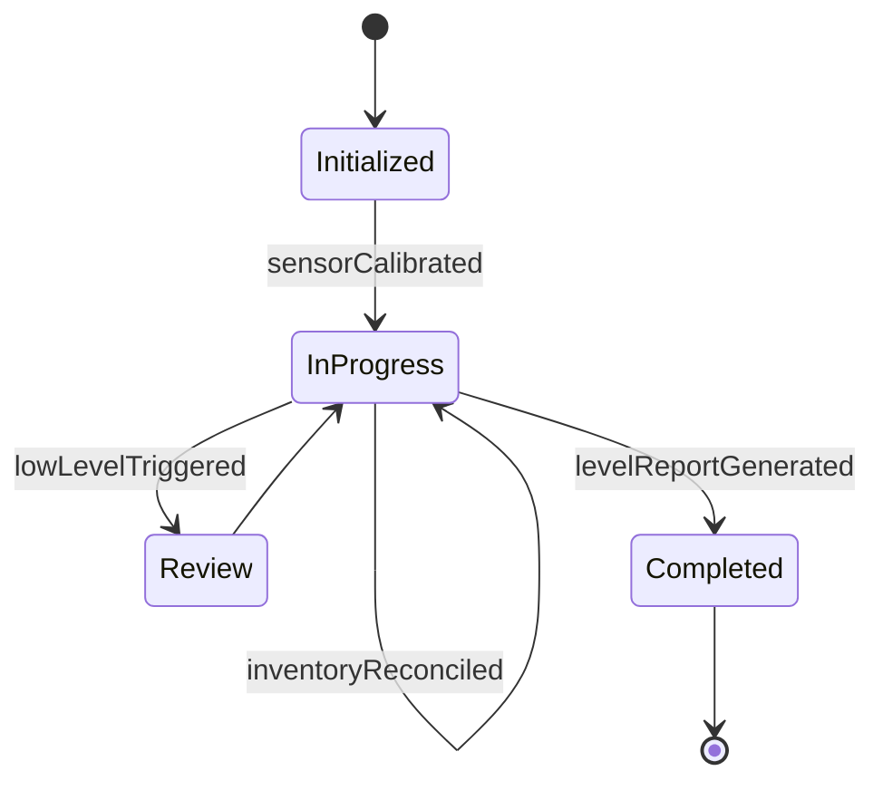
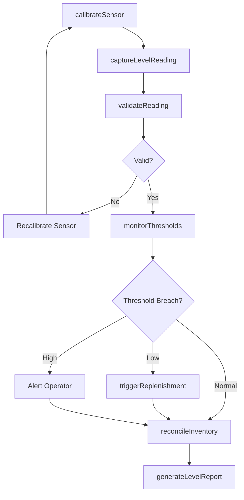
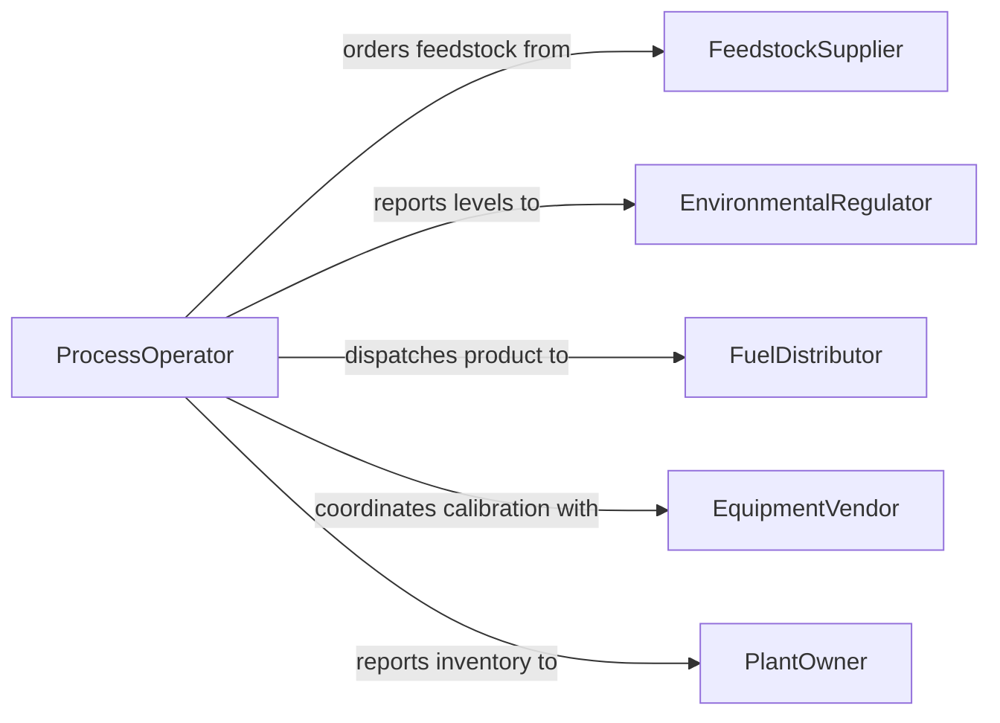

# Measure Stock Liquid Levels Sustainable

> Business-as-Code definition for measuring stock or liquid levels in sustainable fuel production systems. Models the complete level measurement lifecycle from sensor calibration through reading capture, threshold monitoring, and inventory reconciliation.

## Overview

Measuring stock or liquid levels in sustainable fuel production systems involves monitoring feedstock tanks, bioreactor vessels, fermentation vats, and product storage to track volumes, flow rates, and inventory positions throughout the biofuel production process. This definition exposes actions for capturing and validating level readings, events for threshold alerts and inventory changes, and searches for retrieving level data and consumption trends.

## Actors

| Actor | Description |
|-------|-------------|
| FeedstockSupplier | Delivers biomass or other raw materials to production facility tanks |
| EnvironmentalRegulator | Monitors emissions, spills, and storage compliance at the facility |
| FuelDistributor | Receives finished biofuel products for distribution |
| EquipmentVendor | Provides and services level sensors and gauging instruments |
| PlantOwner | Operates the sustainable fuel production facility |

## Roles

| Role | Description |
|------|-------------|
| ProcessOperator | Monitors tank levels and adjusts production flow |
| InstrumentTechnician | Calibrates and maintains level measurement sensors |
| InventoryController | Reconciles measured levels against production and shipment records |
| SafetyEngineer | Ensures tank levels stay within safe operating ranges |

## Entities

| Entity | Description |
|--------|-------------|
| Tank | A storage vessel holding feedstock, intermediates, or finished fuel |
| LevelReading | A recorded measurement of liquid or stock height in a tank |
| Sensor | A gauging instrument that captures level data from a tank |
| InventoryRecord | A log of stock quantities reconciled from level readings |
| Threshold | A defined minimum or maximum level that triggers an alert |
| CalibrationLog | Documentation of sensor calibration status and history |

## Actions

| Action | Description |
|--------|-------------|
| calibrateSensor | Verify and adjust a level sensor to ensure measurement accuracy |
| captureLevelReading | Record the current stock or liquid level from a tank sensor |
| validateReading | Check that a captured reading is consistent and within sensor range |
| monitorThresholds | Continuously compare current levels against defined limits |
| reconcileInventory | Compare measured levels to expected volumes from production records |
| triggerReplenishment | Initiate a feedstock order when levels fall below minimum threshold |
| generateLevelReport | Produce a summary of tank levels and inventory positions |

## Events

| Event | Description |
|-------|-------------|
| sensorCalibrated | A level sensor has been verified and adjusted for accuracy |
| levelReadingCaptured | A stock or liquid level has been recorded from a tank |
| readingValidated | A captured reading has been confirmed as consistent and accurate |
| lowLevelTriggered | A tank level has dropped below the defined minimum threshold |
| highLevelTriggered | A tank level has exceeded the defined maximum threshold |
| inventoryReconciled | Measured levels have been compared and aligned with production records |
| levelReportGenerated | A tank level and inventory summary report has been produced |

## Searches

| Search | Description |
|--------|-------------|
| findLevelReadings | List readings by tank, date range, or production stage |
| getTankStatus | Retrieve current level and capacity utilization for a tank |
| findThresholdBreaches | Identify instances where levels exceeded defined limits |
| getConsumptionTrends | Retrieve feedstock or product consumption rates over time |


## Entity Relationships



## State Diagram


## Workflow



## Actor Relationships



## Usage

### Calling Actions

```typescript
import { measureStockLiquidLevelsSustainable } from '@headlessly/measure-stock-liquid-levels-sustainable'

const levels = measureStockLiquidLevelsSustainable()

// Calibrate sensor and capture a reading
await levels.calibrateSensor({
  sensorId: 'sensor-T4-001',
  tankId: 'ethanol-storage-4',
  calibrationStandard: 'NIST-traceable',
  date: '2026-05-01'
})

const reading = await levels.captureLevelReading({
  tankId: 'ethanol-storage-4',
  sensorId: 'sensor-T4-001',
  value: 7250,
  unit: 'gallons',
  timestamp: '2026-05-01T14:30:00Z'
})

// Validate and check thresholds
await levels.validateReading({ readingId: reading.id })
await levels.monitorThresholds({
  tankId: 'ethanol-storage-4',
  currentLevel: 7250,
  minThreshold: 2000,
  maxThreshold: 15000
})
```

### Event-Driven Automation

```typescript
// Auto-order feedstock when tank runs low
levels.lowLevelTriggered(async ({ tankId, currentLevel, minThreshold }) => {
  await levels.triggerReplenishment({
    tankId,
    orderQuantity: minThreshold * 3 - currentLevel,
    priority: 'standard'
  })
})

// Alert safety team on high-level conditions
levels.highLevelTriggered(async ({ tankId, currentLevel, maxThreshold }) => {
  await notify({
    to: 'safety-team',
    message: `Tank ${tankId} at ${currentLevel} exceeds max threshold of ${maxThreshold}. Shut off inflow.`
  })
})
```
