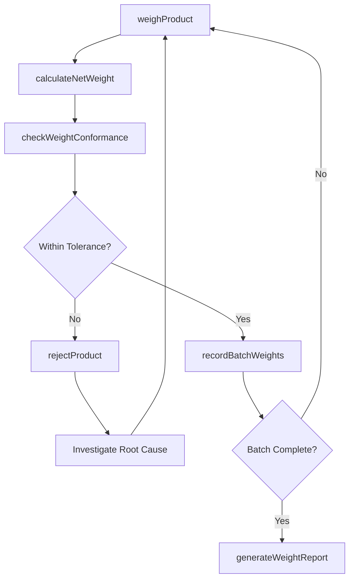
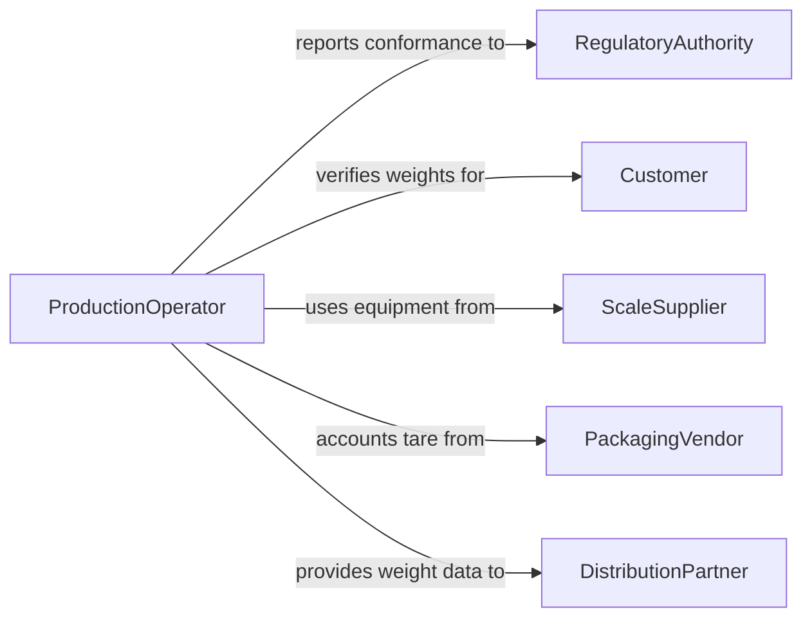

# Weigh Finished Products

> Business-as-Code definition for weighing finished products. Models weight verification workflows from production line through packaging and quality acceptance.

## Overview

Weighing finished products ensures that manufactured goods meet weight specifications, labeling requirements, and regulatory standards before release. This definition exposes actions for capturing product weights at various production stages, checking conformance against target weights, and generating weight-based quality reports. Events support automated rejection of out-of-tolerance products and integration with packaging systems.

## Actors

| Actor | Description |
|-------|-------------|
| RegulatoryAuthority | Enforces weight labeling accuracy and net content laws |
| Customer | Receives finished products and expects declared weight accuracy |
| ScaleSupplier | Provides and services industrial weighing equipment |
| PackagingVendor | Supplies packaging materials with known tare weights |
| DistributionPartner | Uses product weight data for logistics planning |

## Roles

| Role | Description |
|------|-------------|
| ProductionOperator | Weighs finished products on the production line |
| QualityController | Verifies weight conformance and approves product release |
| LineManager | Oversees production weighing throughput and accuracy |
| MetrologyTechnician | Maintains and calibrates weighing equipment |

## Entities

| Entity | Description |
|--------|-------------|
| FinishedProduct | A manufactured item ready for weight verification |
| WeightReading | A recorded weight measurement for a specific product unit |
| WeightSpecification | Target weight and acceptable tolerance for a product type |
| TareWeight | The weight of packaging or containers excluded from net weight |
| WeightBatch | A group of products weighed together for statistical control |
| NonConformanceReport | Documentation of products outside weight tolerance |

## Actions

| Action | Description |
|--------|-------------|
| weighProduct | Capture the gross weight of a finished product |
| calculateNetWeight | Subtract tare weight from gross weight to determine net weight |
| checkWeightConformance | Compare measured weight against product specification |
| rejectProduct | Flag a product as non-conforming due to weight deviation |
| recordBatchWeights | Log weights for a group of products for statistical analysis |
| generateWeightReport | Produce a summary of weight measurements and conformance rates |
| calibrateScale | Verify and adjust scale accuracy with certified reference weights |

## Events

| Event | Description |
|-------|-------------|
| productWeighed | A finished product weight has been captured |
| netWeightCalculated | Net weight has been determined after tare subtraction |
| weightConformanceChecked | A product weight has been evaluated against specification |
| productRejected | A product has been flagged for weight non-conformance |
| batchWeightsRecorded | Weights for a production batch have been logged |
| weightReportGenerated | A weight conformance report has been produced |
| scaleCalibrated | A production scale has been verified and adjusted |

## Searches

| Search | Description |
|--------|-------------|
| findWeightReadings | Retrieve weight records by product type, date, or line |
| getNonConformances | Find products rejected for weight deviations |
| getBatchStatistics | Get mean, standard deviation, and range for a weight batch |
| getCalibrationHistory | Retrieve calibration records for a specific scale |

## Workflow



## Actor Relationships



## Usage

### Calling Actions

```typescript
import { weighFinishedProducts } from '@headlessly/weigh-finished-products'

const products = weighFinishedProducts()

// Weigh a finished product
const reading = await products.weighProduct({
  productId: 'PROD-2026-8834',
  productType: 'cereal-box-500g',
  scaleId: 'line-3-scale-01',
  grossWeight: 537.2,
  unit: 'g'
})

// Calculate net weight
const net = await products.calculateNetWeight({
  readingId: reading.id,
  tareWeight: 32.0,
  unit: 'g'
})

// Check conformance
const check = await products.checkWeightConformance({
  readingId: reading.id,
  netWeight: net.value,
  specificationId: 'SPEC-CEREAL-500G'
})
```

### Event-Driven Automation

```typescript
// Auto-reject out-of-tolerance products
products.weightConformanceChecked(async ({ readingId, conforming, deviation }) => {
  if (!conforming) {
    await products.rejectProduct({
      readingId,
      reason: `Weight deviation of ${deviation}g exceeds tolerance`
    })
  }
})

// Generate report when batch completes
products.batchWeightsRecorded(async ({ batchId, productCount }) => {
  if (productCount >= 100) {
    await products.generateWeightReport({ batchId })
  }
})
```
