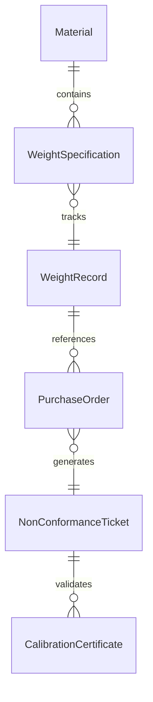
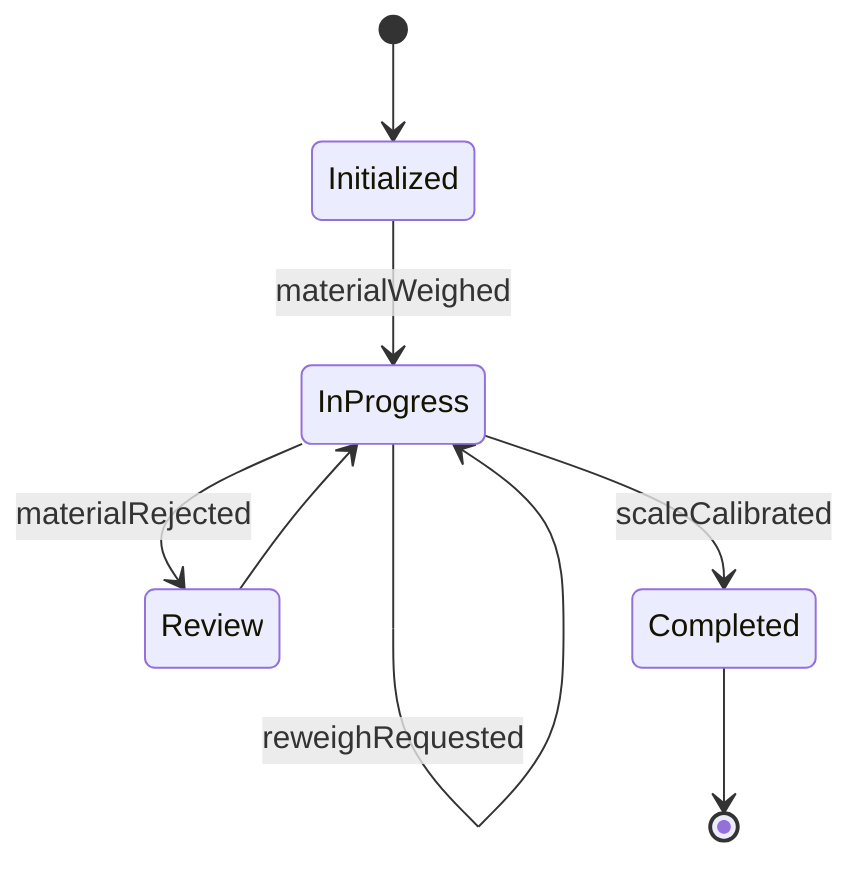
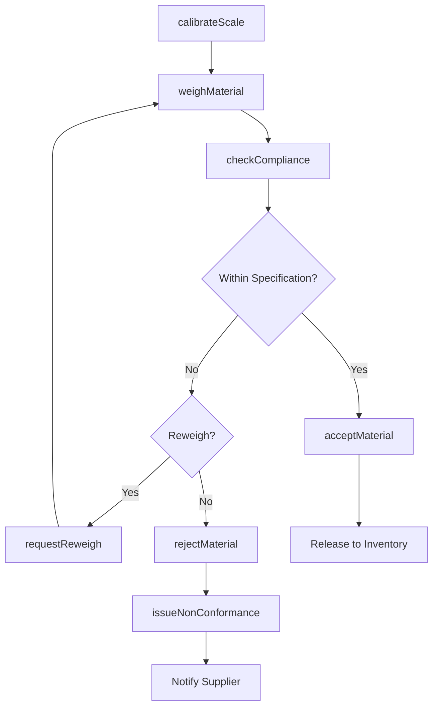
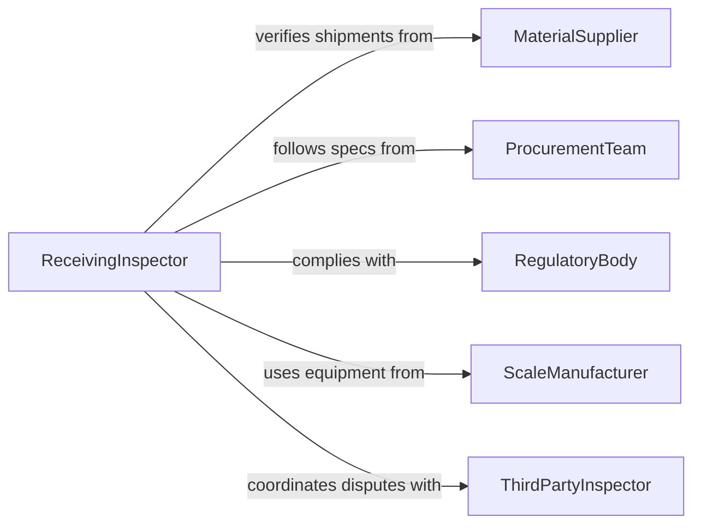

# Weigh Materials Ensure Compliance Specifications

> Business-as-Code definition for weighing materials to ensure compliance with specifications. Models material weight verification workflows from incoming receipt through acceptance or rejection.

## Overview

Weighing materials for specification compliance is a fundamental quality control activity in manufacturing, construction, and procurement. This definition exposes actions for capturing material weights, comparing them against purchase order and engineering specifications, and documenting conformance. Events enable automated supplier notifications, inventory adjustments, and non-conformance routing when materials fall outside acceptable weight tolerances.

## Actors

| Actor | Description |
|-------|-------------|
| MaterialSupplier | Delivers materials with declared weight specifications |
| ProcurementTeam | Issues purchase orders with weight requirements |
| RegulatoryBody | Mandates weight accuracy for certain materials and products |
| ScaleManufacturer | Provides and maintains industrial weighing equipment |
| ThirdPartyInspector | Independently verifies material weights for disputed shipments |

## Roles

| Role | Description |
|------|-------------|
| ReceivingInspector | Weighs incoming materials and checks against specifications |
| QualityEngineer | Defines weight specifications and acceptable tolerances |
| MaterialsManager | Manages material acceptance decisions and supplier follow-up |
| MetrologyTechnician | Calibrates and maintains weighing equipment |

## Entities

| Entity | Description |
|--------|-------------|
| Material | A raw or semi-finished material subject to weight verification |
| WeightSpecification | The target weight and tolerance for a material type or order |
| WeightRecord | A documented weight measurement with timestamp and instrument ID |
| PurchaseOrder | The procurement document specifying material weight requirements |
| NonConformanceTicket | A record of a material that failed weight specification |
| CalibrationCertificate | Documentation of scale accuracy verification |

## Actions

| Action | Description |
|--------|-------------|
| weighMaterial | Capture the weight of a material shipment or sample |
| checkCompliance | Compare measured weight against the applicable specification |
| acceptMaterial | Approve a material lot that meets weight specifications |
| rejectMaterial | Refuse a material lot that fails weight specifications |
| issueNonConformance | Create a formal non-conformance record for a weight deviation |
| requestReweigh | Initiate a second weighing to confirm an initial result |
| calibrateScale | Verify and adjust scale accuracy using certified reference weights |

## Events

| Event | Description |
|-------|-------------|
| materialWeighed | A material weight measurement has been captured |
| complianceChecked | A material weight has been evaluated against specification |
| materialAccepted | A material lot has been approved based on weight conformance |
| materialRejected | A material lot has been refused due to weight non-conformance |
| nonConformanceIssued | A formal weight deviation record has been created |
| reweighRequested | A second weighing has been initiated to confirm results |
| scaleCalibrated | A weighing scale has been verified and adjusted |

## Searches

| Search | Description |
|--------|-------------|
| findWeightRecords | Retrieve weight records by material, supplier, date, or order |
| getNonConformances | Find materials that failed weight specification checks |
| getComplianceHistory | Review weight conformance rates by supplier or material type |
| getCalibrationRecords | Retrieve calibration history for a specific scale |


## Entity Relationships



## State Diagram


## Workflow



## Actor Relationships



## Usage

### Calling Actions

```typescript
import { weighMaterialsEnsureComplianceSpecifications } from '@headlessly/weigh-materials-ensure-compliance-specifications'

const weighing = weighMaterialsEnsureComplianceSpecifications()

// Weigh incoming material
const record = await weighing.weighMaterial({
  materialId: 'MAT-STEEL-COIL-001',
  purchaseOrderId: 'PO-2026-3344',
  measuredWeight: 2487.5,
  unit: 'kg',
  scaleId: 'floor-scale-dock-02'
})

// Check compliance against specification
const result = await weighing.checkCompliance({
  weightRecordId: record.id,
  specificationId: 'SPEC-COIL-2500KG'
})

// Accept or reject based on result
if (result.compliant) {
  await weighing.acceptMaterial({ weightRecordId: record.id })
} else {
  await weighing.rejectMaterial({
    weightRecordId: record.id,
    reason: `Weight ${record.measuredWeight}kg outside tolerance of ${result.tolerance}kg`
  })
}
```

### Event-Driven Automation

```typescript
// Auto-notify supplier on rejection
weighing.materialRejected(async ({ materialId, purchaseOrderId, measuredWeight, specification }) => {
  await notify({
    to: 'procurement',
    message: `Material ${materialId} on PO ${purchaseOrderId} rejected: ${measuredWeight}kg vs spec ${specification.target}kg +/- ${specification.tolerance}kg`
  })
})

// Track supplier compliance trends
weighing.complianceChecked(async ({ supplierId, compliant }) => {
  if (!compliant) {
    const history = await weighing.getComplianceHistory({ supplierId, period: 'last-90-days' })
    if (history.failureRate > 0.1) {
      await notify({
        to: 'supplier-quality',
        message: `Supplier ${supplierId} weight failure rate is ${(history.failureRate * 100).toFixed(1)}% over 90 days`
      })
    }
  }
})
```
