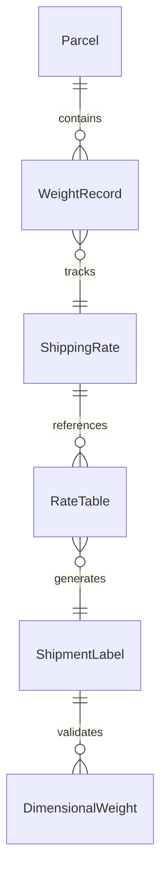
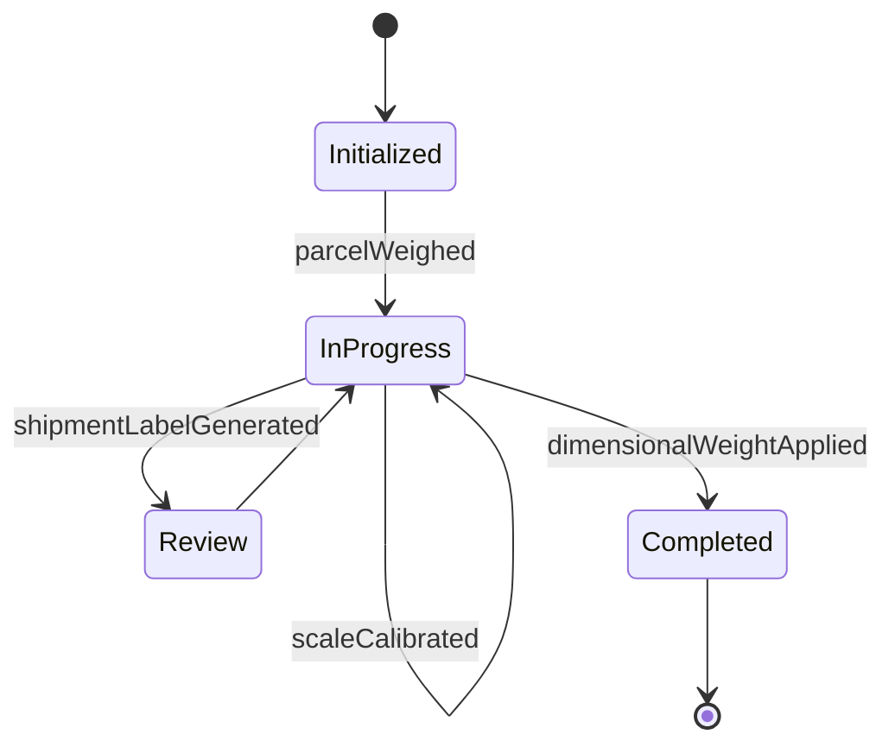
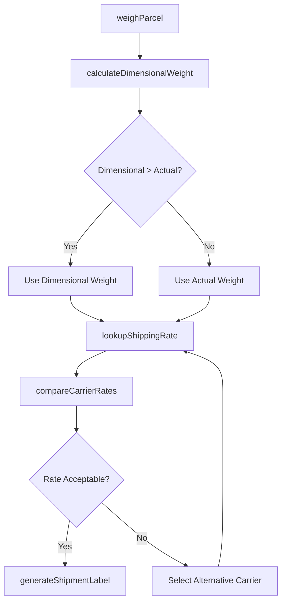
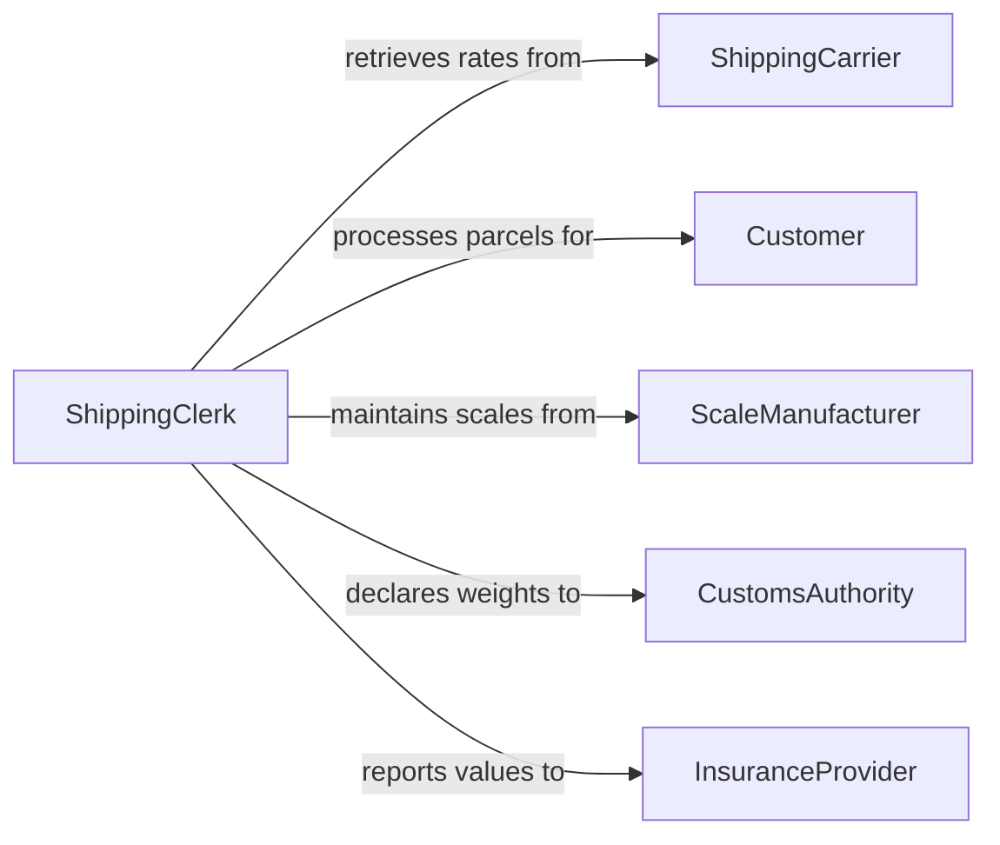

# Weigh Parcels Determine Shipping Costs

> Business-as-Code definition for weighing parcels to determine shipping costs. Models the end-to-end process from parcel measurement through rate calculation and label generation.

## Overview

Weighing parcels to determine shipping costs is a foundational logistics activity that connects physical measurement with carrier rate systems. This definition exposes actions for capturing parcel weight and dimensions, calculating shipping rates across carriers, and generating cost estimates. Events enable automation of label printing and rate optimization workflows.

## Actors

| Actor | Description |
|-------|-------------|
| ShippingCarrier | Provides rate tables and accepts parcels for delivery |
| Customer | Sends or receives parcels and pays shipping costs |
| ScaleManufacturer | Supplies and maintains weighing equipment |
| CustomsAuthority | Requires weight declarations for international shipments |
| InsuranceProvider | Uses declared weight and value for coverage pricing |

## Roles

| Role | Description |
|------|-------------|
| ShippingClerk | Weighs parcels and processes shipments |
| LogisticsCoordinator | Selects carriers and optimizes shipping costs |
| WarehouseManager | Oversees parcel processing throughput and accuracy |
| RateAnalyst | Evaluates carrier pricing and negotiates volume discounts |

## Entities

| Entity | Description |
|--------|-------------|
| Parcel | A package to be weighed and shipped |
| WeightRecord | The measured weight of a parcel with timestamp and method |
| ShippingRate | A carrier-specific cost based on weight, dimensions, and destination |
| RateTable | A carrier's published pricing schedule by weight bracket |
| ShipmentLabel | Generated shipping documentation with cost and tracking details |
| DimensionalWeight | Calculated volumetric weight used when it exceeds actual weight |

## Actions

| Action | Description |
|--------|-------------|
| weighParcel | Capture the weight of a parcel using a calibrated scale |
| calculateDimensionalWeight | Compute volumetric weight from parcel length, width, and height |
| lookupShippingRate | Retrieve applicable rates from carrier rate tables |
| compareCarrierRates | Evaluate costs across multiple carriers for the same parcel |
| generateShipmentLabel | Create a shipping label with calculated cost and tracking number |
| recordWeightDiscrepancy | Log a difference between declared and measured weight |
| calibrateScale | Verify and adjust scale accuracy using reference weights |

## Events

| Event | Description |
|-------|-------------|
| parcelWeighed | A parcel weight has been captured and recorded |
| shippingRateCalculated | A shipping cost has been determined for a parcel |
| carrierRatesCompared | Multiple carrier options have been evaluated for a shipment |
| shipmentLabelGenerated | A shipping label has been created with cost and tracking info |
| weightDiscrepancyRecorded | A mismatch between declared and measured weight was logged |
| scaleCalibrated | A scale has been verified and adjusted for accuracy |
| dimensionalWeightApplied | Volumetric weight was used instead of actual weight for pricing |

## Searches

| Search | Description |
|--------|-------------|
| findWeightRecords | Retrieve parcel weight records by date, weight range, or parcel ID |
| getShippingRates | Look up rates by carrier, weight bracket, or destination |
| getDiscrepancies | Find parcels with weight discrepancies above a threshold |
| getShipmentCosts | Retrieve shipping cost history by period, carrier, or customer |


## Entity Relationships



## State Diagram


## Workflow



## Actor Relationships



## Usage

### Calling Actions

```typescript
import { weighParcelsDetermineShippingCosts } from '@headlessly/weigh-parcels-determine-shipping-costs'

const shipping = weighParcelsDetermineShippingCosts()

// Weigh a parcel
const weight = await shipping.weighParcel({
  parcelId: 'PKG-2026-0042',
  scaleId: 'scale-dock-03',
  unit: 'kg'
})

// Compare carrier rates
const rates = await shipping.compareCarrierRates({
  weight: weight.value,
  dimensions: { length: 30, width: 20, height: 15, unit: 'cm' },
  origin: 'US-90210',
  destination: 'US-10001',
  serviceLevel: 'ground'
})

// Generate label with best rate
await shipping.generateShipmentLabel({
  parcelId: 'PKG-2026-0042',
  carrierId: rates[0].carrierId,
  rateId: rates[0].id
})
```

### Event-Driven Automation

```typescript
// Auto-flag weight discrepancies
shipping.parcelWeighed(async ({ parcelId, measuredWeight, declaredWeight }) => {
  if (declaredWeight && Math.abs(measuredWeight - declaredWeight) > 0.5) {
    await shipping.recordWeightDiscrepancy({
      parcelId,
      measuredWeight,
      declaredWeight,
      difference: measuredWeight - declaredWeight
    })
  }
})

// Notify when dimensional weight is applied
shipping.dimensionalWeightApplied(async ({ parcelId, actualWeight, dimensionalWeight }) => {
  await notify({
    to: 'logistics-team',
    message: `Parcel ${parcelId} billed at ${dimensionalWeight}kg (dimensional) vs ${actualWeight}kg (actual)`
  })
})
```
