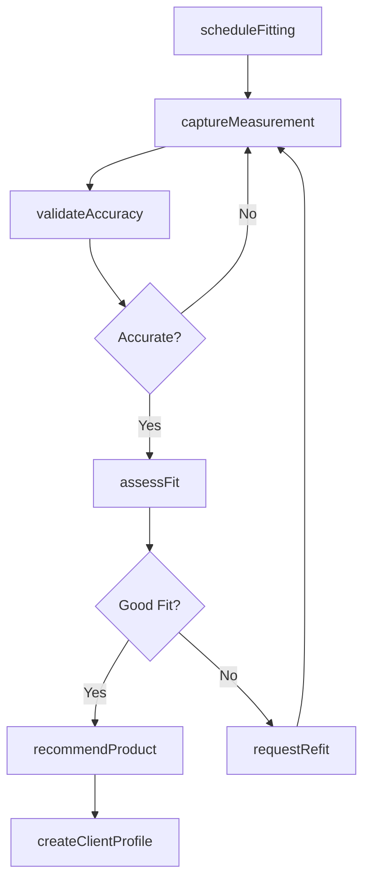
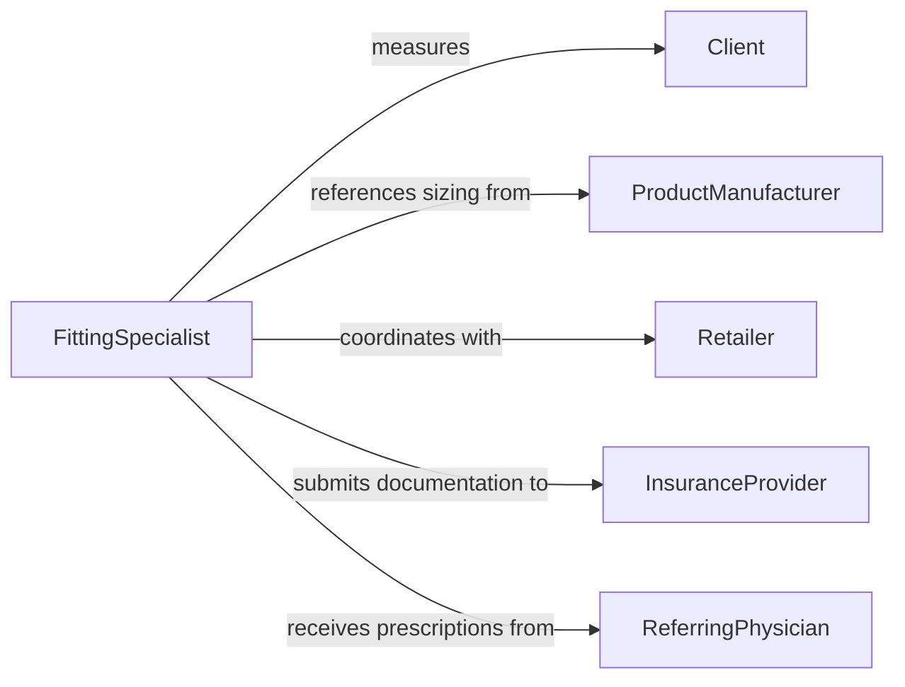

# Measure Client Product Fit

> Business-as-Code definition for measuring client product fit. Models the end-to-end measurement workflow from client intake through sizing, fit validation, and product recommendation.

## Overview

Measuring clients for proper product fit involves taking precise physical measurements of a client's body, limbs, or other relevant dimensions to match them with correctly sized products such as garments, orthotics, prosthetics, eyewear, or custom goods. This definition exposes actions for capturing measurements, validating fit against product specifications, and recommending appropriate sizes or custom adjustments. Events enable automated alerts when measurements fall outside standard ranges or when refitting is needed.

## Actors

| Actor | Description |
|-------|-------------|
| Client | The individual being measured for product fit |
| ProductManufacturer | Supplies sizing charts and product specifications |
| Retailer | Sells the products and coordinates fitting appointments |
| InsuranceProvider | Covers costs for medically prescribed fitted products |
| ReferringPhysician | Prescribes custom-fit medical devices or orthotics |

## Roles

| Role | Description |
|------|-------------|
| FittingSpecialist | Takes measurements and determines proper product size |
| QualityReviewer | Validates measurement accuracy and fit compliance |
| ProductAdvisor | Recommends products based on measurement data |
| AppointmentCoordinator | Schedules fitting sessions and follow-ups |

## Entities

| Entity | Description |
|--------|-------------|
| MeasurementRecord | A set of dimensional readings taken from a client |
| ClientProfile | Stored measurement history and preferences for a client |
| SizingChart | A manufacturer-provided table mapping measurements to sizes |
| FitAssessment | An evaluation of how well a product matches client dimensions |
| ProductRecommendation | A suggested product and size based on measurements |
| FittingAppointment | A scheduled session for taking or verifying measurements |

## Actions

| Action | Description |
|--------|-------------|
| captureMeasurement | Record a specific dimensional reading from the client |
| createClientProfile | Initialize a new measurement profile for a client |
| assessFit | Compare client measurements against product sizing specifications |
| recommendProduct | Suggest a product and size based on measurement data |
| scheduleFitting | Book a fitting appointment for a client |
| validateAccuracy | Verify that recorded measurements meet precision standards |
| requestRefit | Initiate a follow-up measurement session for adjustment |

## Events

| Event | Description |
|-------|-------------|
| measurementCaptured | A dimensional reading has been recorded |
| clientProfileCreated | A new measurement profile has been established |
| fitAssessed | A fit evaluation against product specs is complete |
| productRecommended | A product and size suggestion has been generated |
| fittingScheduled | A fitting appointment has been booked |
| accuracyValidated | Measurement precision has been confirmed |
| refitRequested | A follow-up fitting session has been initiated |

## Searches

| Search | Description |
|--------|-------------|
| findClientProfiles | Look up client measurement profiles by name, ID, or date |
| getMeasurements | Retrieve measurement records for a specific client |
| getRecommendations | Find product recommendations by client or product category |
| getFittingAppointments | List upcoming or past fitting appointments |

## Workflow



## Actor Relationships



## Usage

### Calling Actions

```typescript
import { measureClientProductFit } from '@headlessly/measure-client-product-fit'

const fitting = measureClientProductFit()

// Capture client measurements
const record = await fitting.captureMeasurement({
  clientId: 'client-789',
  type: 'body',
  measurements: [
    { dimension: 'chest', value: 40.5, unit: 'inches' },
    { dimension: 'waist', value: 34.0, unit: 'inches' },
    { dimension: 'inseam', value: 32.0, unit: 'inches' }
  ]
})

// Assess fit against a product
const assessment = await fitting.assessFit({
  clientId: 'client-789',
  productId: 'blazer-classic-navy',
  sizingChartId: 'manufacturer-chart-001'
})

// Recommend the best product
const recommendation = await fitting.recommendProduct({
  clientId: 'client-789',
  category: 'blazer',
  fitPreference: 'slim'
})
```

### Event-Driven Automation

```typescript
// Alert when measurements fall outside standard ranges
fitting.measurementCaptured(async ({ clientId, measurements }) => {
  for (const m of measurements) {
    if (isOutsideStandardRange(m)) {
      await notify({
        to: 'fitting-specialist',
        message: `Client ${clientId}: ${m.dimension} measurement of ${m.value}${m.unit} is outside standard range`
      })
    }
  }
})

// Auto-schedule refit when fit assessment fails
fitting.fitAssessed(async ({ clientId, productId, result }) => {
  if (result === 'poor-fit') {
    await fitting.requestRefit({ clientId, reason: `Poor fit for product ${productId}` })
  }
})
```
