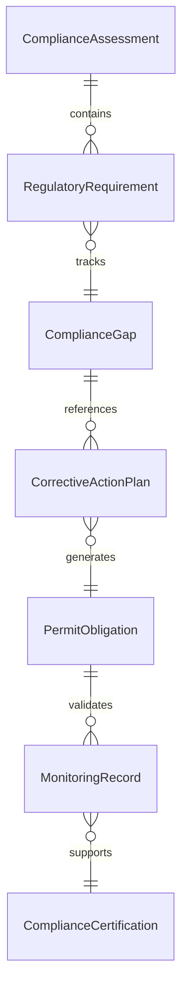
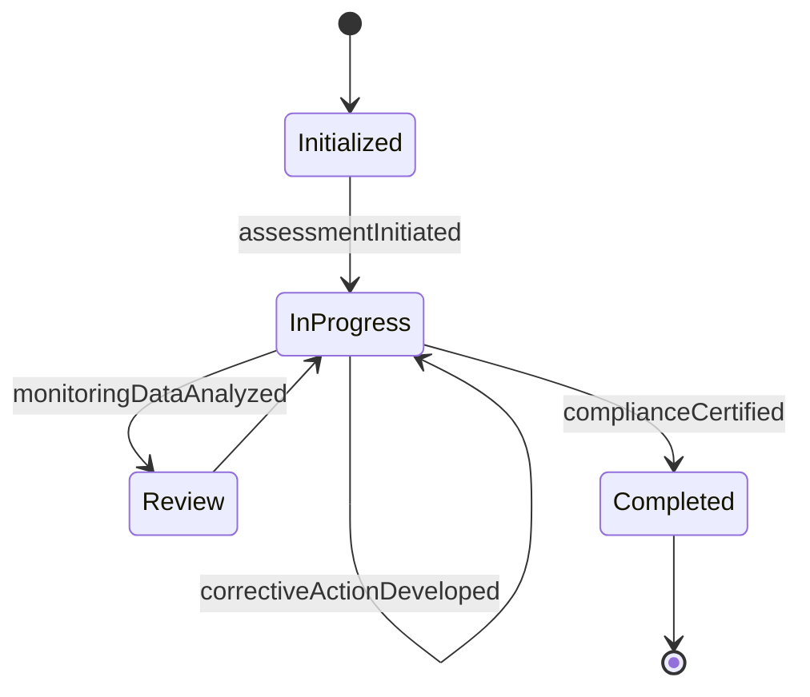
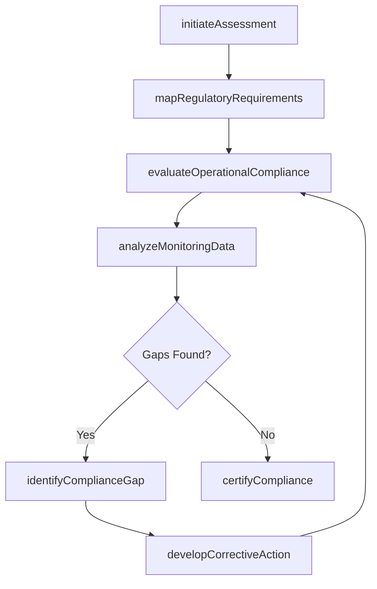
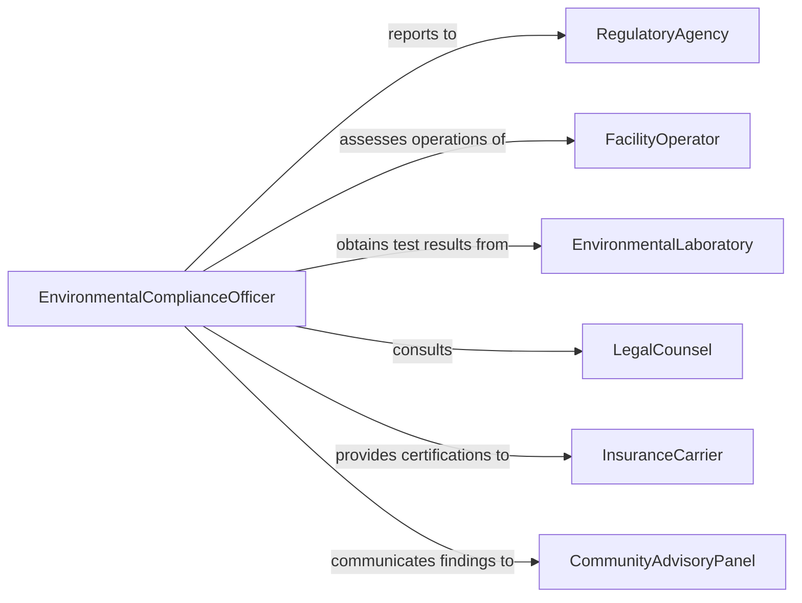

# Assess Compliance with Environmental Laws

> Business-as-Code definition for assessing compliance with environmental laws. Models the evaluation of organizational operations, facilities, and practices against federal, state, and local environmental statutes including the Clean Air Act, Clean Water Act, RCRA, CERCLA, and state-specific environmental codes.

## Overview

Assessing compliance with environmental laws involves systematically reviewing facility operations, waste management practices, emission levels, and discharge activities against applicable environmental statutes and regulatory requirements. This definition provides actions for regulatory mapping, compliance gap analysis, corrective action planning, and compliance certification. It supports environmental health and safety departments, compliance officers, environmental attorneys, and regulatory affairs teams.

## Actors

| Actor | Description |
|-------|-------------|
| RegulatoryAgency | Enforces environmental laws and issues compliance orders |
| FacilityOperator | Manages the operations and facilities being assessed |
| EnvironmentalLaboratory | Provides analytical testing of emissions, discharges, and waste |
| LegalCounsel | Interprets environmental statutes and advises on compliance obligations |
| InsuranceCarrier | Requires environmental compliance verification for coverage |
| CommunityAdvisoryPanel | Represents local interests affected by facility operations |

## Roles

| Role | Description |
|------|-------------|
| EnvironmentalComplianceOfficer | Leads the compliance assessment and manages regulatory obligations |
| ComplianceAuditor | Conducts systematic evaluations of operations against legal requirements |
| RegulatorySpecialist | Tracks changes in environmental law and updates compliance requirements |
| CorrectiveActionManager | Oversees remediation of identified compliance gaps |

## Entities

| Entity | Description |
|--------|-------------|
| ComplianceAssessment | A structured evaluation of operations against environmental laws |
| RegulatoryRequirement | A specific obligation imposed by an environmental statute |
| ComplianceGap | An identified area where operations fail to meet legal requirements |
| CorrectiveActionPlan | A documented strategy to resolve compliance deficiencies |
| PermitObligation | A condition of an environmental permit that must be satisfied |
| MonitoringRecord | Data from environmental sampling or monitoring activities |
| ComplianceCertification | A formal attestation that operations meet all applicable laws |

## Actions

| Action | Description |
|--------|-------------|
| initiateAssessment | Begin a compliance evaluation for a facility or operation |
| mapRegulatoryRequirements | Identify all applicable environmental laws and their obligations |
| evaluateOperationalCompliance | Review operations against mapped regulatory requirements |
| analyzeMonitoringData | Assess environmental monitoring records for exceedances or violations |
| identifyComplianceGap | Document an area where operations do not meet legal requirements |
| developCorrectiveAction | Create a plan to address identified compliance deficiencies |
| certifyCompliance | Issue a formal compliance determination for the assessed operations |

## Events

| Event | Description |
|-------|-------------|
| assessmentInitiated | A compliance evaluation has been started |
| regulatoryRequirementsMapped | All applicable environmental laws have been identified |
| operationalComplianceEvaluated | Operations have been reviewed against legal requirements |
| monitoringDataAnalyzed | Environmental monitoring records have been assessed |
| complianceGapIdentified | A regulatory deficiency has been documented |
| correctiveActionDeveloped | A plan to resolve a compliance gap has been created |
| complianceCertified | Operations have been formally certified as compliant |

## Searches

| Search | Description |
|--------|-------------|
| findAssessments | List compliance assessments by facility, date, or status |
| getComplianceGaps | Retrieve identified gaps by regulation, severity, or facility |
| getPendingCorrectiveActions | Find unresolved compliance deficiencies awaiting remediation |
| getMonitoringExceedances | Locate monitoring data points that exceed regulatory limits |
| getCertificationHistory | Track compliance certifications over time for a facility |


## Entity Relationships



## State Diagram


## Workflow



## Actor Relationships



## Usage

### Calling Actions

```typescript
import { assessComplianceEnvironmentalLaws } from '@headlessly/assess-compliance-environmental-laws'

const assessor = assessComplianceEnvironmentalLaws()

// Initiate a facility compliance assessment
const assessment = await assessor.initiateAssessment({
  facilityId: 'manufacturing-plant-047',
  scope: 'full-environmental',
  period: { start: '2025-01-01', end: '2025-12-31' }
})

// Map regulations and evaluate
await assessor.mapRegulatoryRequirements({
  assessmentId: assessment.id,
  laws: ['clean-air-act-title-V', 'clean-water-act-NPDES', 'RCRA-subtitle-C']
})

await assessor.evaluateOperationalCompliance({ assessmentId: assessment.id })
await assessor.analyzeMonitoringData({ assessmentId: assessment.id })

// Certify compliance
await assessor.certifyCompliance({ assessmentId: assessment.id })
```

### Event-Driven Automation

```typescript
// Escalate critical compliance gaps
assessor.complianceGapIdentified(async ({ assessmentId, facilityId, regulation, severity }) => {
  if (severity === 'critical') {
    await notify({
      to: 'legal-counsel',
      message: `Critical environmental compliance gap at ${facilityId}: ${regulation}`
    })
  }
})

// Notify regulatory agency of compliance certification
assessor.complianceCertified(async ({ assessmentId, facilityId }) => {
  await submitReport({ to: 'regulatory-agency', facilityId, type: 'annual-compliance-certification' })
})
```
