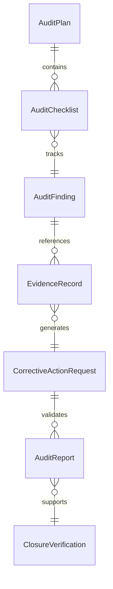
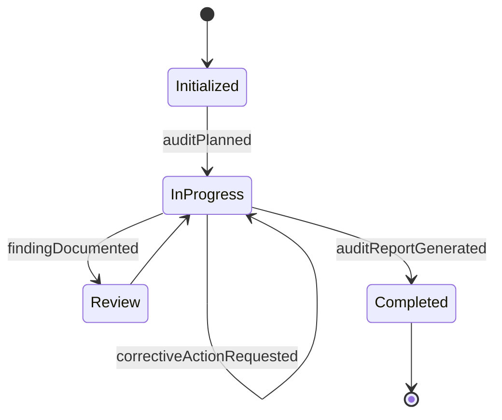
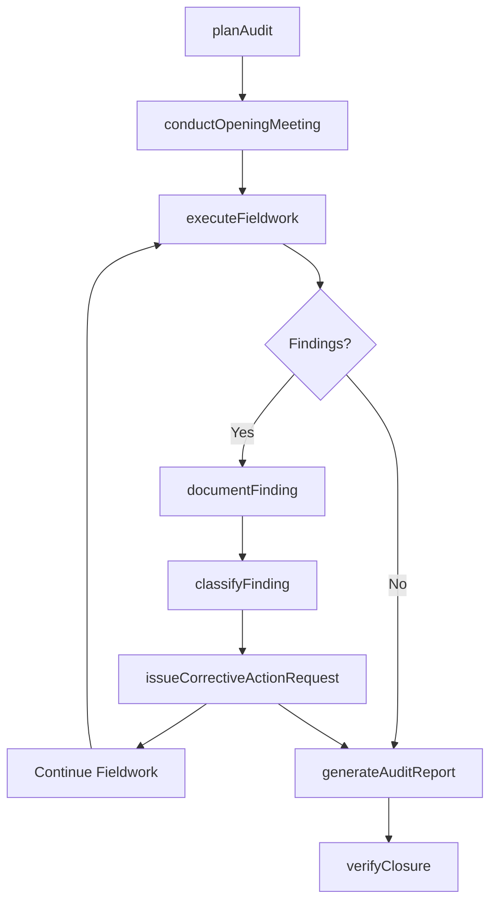
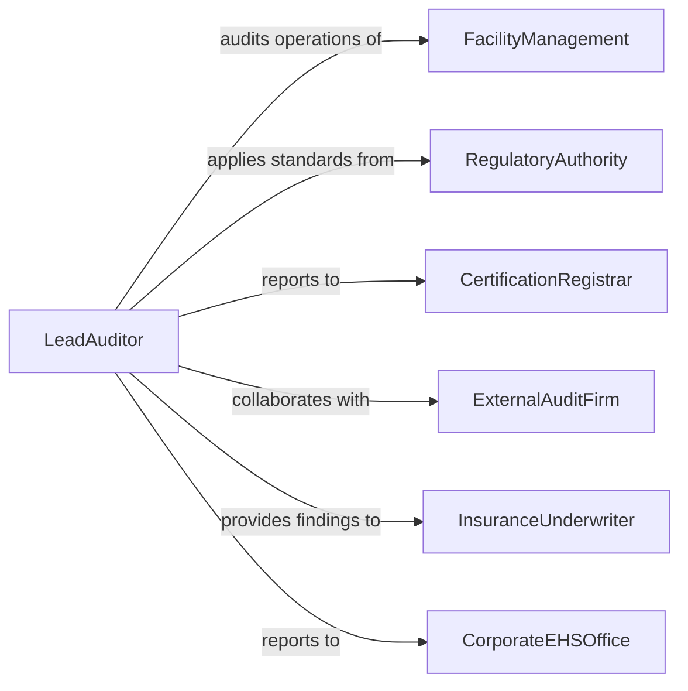

# Conduct Environmental Audits

> Business-as-Code definition for conducting environmental audits. Models the systematic examination of facility operations, waste management systems, emission controls, and environmental management programs to verify compliance with regulatory requirements and identify areas for improvement.

## Overview

Conducting environmental audits involves planning and executing systematic inspections of facilities, processes, and management systems to evaluate compliance with environmental regulations, permit conditions, and internal environmental policies. This definition provides actions for audit planning, fieldwork execution, evidence collection, finding documentation, and report generation. It supports environmental auditors, EHS managers, regulatory compliance teams, and third-party audit firms.

## Actors

| Actor | Description |
|-------|-------------|
| FacilityManagement | Operates the site being audited and provides access to records |
| RegulatoryAuthority | Sets environmental standards that the audit evaluates against |
| CertificationRegistrar | Accredits auditors and recognizes audit outcomes for certification |
| ExternalAuditFirm | Provides independent third-party audit services |
| InsuranceUnderwriter | Uses audit results to assess environmental liability risk |
| CorporateEHSOffice | Commissions audits and oversees corrective action implementation |

## Roles

| Role | Description |
|------|-------------|
| LeadAuditor | Plans and directs the environmental audit engagement |
| FieldAuditor | Conducts on-site inspections and collects environmental evidence |
| AuditProgramManager | Schedules audits, tracks findings, and monitors corrective actions |
| TechnicalSpecialist | Provides subject matter expertise on specific environmental media |

## Entities

| Entity | Description |
|--------|-------------|
| AuditPlan | A document defining the scope, objectives, and schedule of the audit |
| AuditChecklist | A structured list of regulatory and policy requirements to evaluate |
| AuditFinding | An identified condition of non-compliance or improvement opportunity |
| EvidenceRecord | Documentation, photographs, or samples collected during the audit |
| CorrectiveActionRequest | A formal directive to address an audit finding |
| AuditReport | The comprehensive summary of audit results and recommendations |
| ClosureVerification | Confirmation that a corrective action has been satisfactorily implemented |

## Actions

| Action | Description |
|--------|-------------|
| planAudit | Define the scope, criteria, schedule, and team for the environmental audit |
| conductOpeningMeeting | Brief facility management on the audit objectives and process |
| executeFieldwork | Perform on-site inspections, interviews, and evidence collection |
| documentFinding | Record an identified non-compliance condition or improvement opportunity |
| classifyFinding | Categorize findings by severity, environmental media, and regulatory basis |
| issueCorrectiveActionRequest | Direct responsible parties to address identified findings |
| generateAuditReport | Produce the formal audit report with findings and recommendations |
| verifyClosure | Confirm that corrective actions have been implemented and are effective |

## Events

| Event | Description |
|-------|-------------|
| auditPlanned | The audit scope, schedule, and team have been defined |
| openingMeetingConducted | Facility management has been briefed on the audit process |
| fieldworkExecuted | On-site inspections and evidence collection have been completed |
| findingDocumented | A non-compliance condition has been formally recorded |
| findingClassified | An audit finding has been categorized by severity and type |
| correctiveActionRequested | Responsible parties have been directed to address a finding |
| auditReportGenerated | The formal audit report has been produced |
| closureVerified | A corrective action has been confirmed as implemented |

## Searches

| Search | Description |
|--------|-------------|
| findAudits | List audits by facility, date, scope, or status |
| getFindings | Retrieve audit findings by severity, category, or regulation |
| getOpenCorrectiveActions | Find unresolved corrective action requests |
| getAuditHistory | Track audit frequency and finding trends for a facility |
| getClosureStatus | Check the implementation status of corrective actions |


## Entity Relationships



## State Diagram


## Workflow



## Actor Relationships



## Usage

### Calling Actions

```typescript
import { conductEnvironmentalAudits } from '@headlessly/conduct-environmental-audits'

const auditor = conductEnvironmentalAudits()

// Plan an environmental audit
const audit = await auditor.planAudit({
  facilityId: 'chemical-processing-plant-east',
  scope: ['air-emissions', 'wastewater-discharge', 'hazardous-waste-management'],
  criteria: ['EPA-RCRA', 'state-air-permit-conditions', 'ISO-14001'],
  scheduledDate: '2026-03-15',
  team: ['lead-auditor-jones', 'field-auditor-chen', 'hazmat-specialist-park']
})

// Execute the audit
await auditor.conductOpeningMeeting({ auditId: audit.id })
await auditor.executeFieldwork({ auditId: audit.id })

// Document and classify findings
await auditor.documentFinding({
  auditId: audit.id,
  area: 'hazardous-waste-storage',
  description: 'Secondary containment capacity below 110% of largest container',
  regulation: 'RCRA-40-CFR-264.175'
})

// Generate report
await auditor.generateAuditReport({ auditId: audit.id })
```

### Event-Driven Automation

```typescript
// Escalate critical findings immediately
auditor.findingClassified(async ({ auditId, findingId, severity, facilityId }) => {
  if (severity === 'critical') {
    await notify({
      to: 'corporate-ehs-director',
      message: `Critical environmental finding at ${facilityId}. Immediate action required.`
    })
  }
})

// Schedule follow-up verification
auditor.correctiveActionRequested(async ({ findingId, dueDate }) => {
  await scheduleTask({
    type: 'closure-verification',
    findingId,
    scheduledDate: dueDate
  })
})
```
