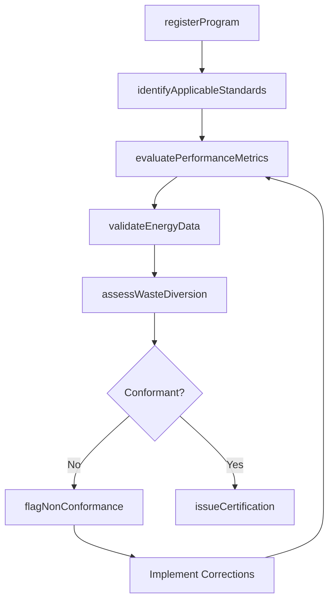
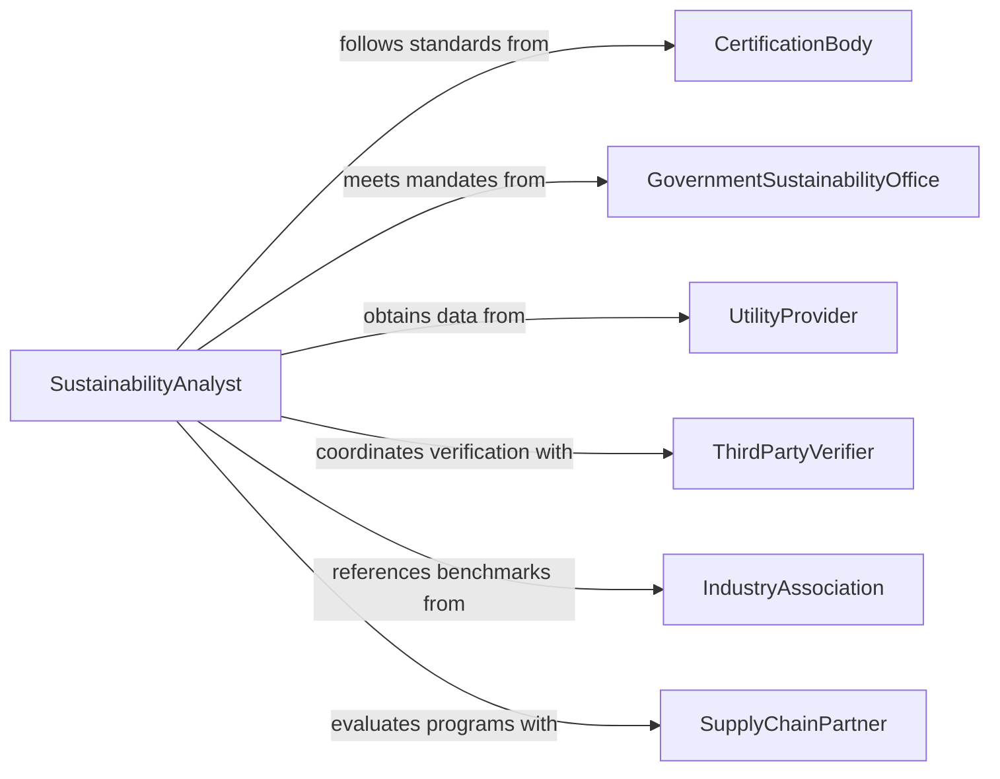

# Evaluate Green Operations or Programs for Compliance with Standards or Regulations

> Business-as-Code definition for evaluating green operations and programs for compliance with environmental standards. Models the assessment of sustainability initiatives, energy efficiency programs, waste reduction efforts, and green certification programs against standards such as LEED, ISO 14001, Energy Star, and government sustainability mandates.

## Overview

Evaluating green operations or programs for compliance with standards or regulations involves reviewing sustainability initiatives, renewable energy programs, waste diversion strategies, and green building practices against industry certification standards, government mandates, and voluntary environmental frameworks. This definition provides actions for program registration, benchmark evaluation, metric validation, and compliance reporting. It supports sustainability directors, green building consultants, energy managers, and corporate environmental responsibility teams.

## Actors

| Actor | Description |
|-------|-------------|
| CertificationBody | Administers green standards such as LEED, ISO 14001, or Energy Star |
| GovernmentSustainabilityOffice | Sets mandatory green operations requirements for organizations |
| UtilityProvider | Supplies energy data and participates in demand-side management programs |
| ThirdPartyVerifier | Independently validates sustainability metrics and claims |
| IndustryAssociation | Publishes voluntary environmental performance benchmarks |
| SupplyChainPartner | Participates in green procurement and sustainable supply chain programs |

## Roles

| Role | Description |
|------|-------------|
| SustainabilityAnalyst | Evaluates green programs against applicable standards and benchmarks |
| GreenProgramManager | Oversees sustainability initiatives and tracks compliance milestones |
| EnergyAuditor | Assesses energy efficiency measures and validates performance data |
| ComplianceReportingOfficer | Prepares and submits sustainability compliance documentation |

## Entities

| Entity | Description |
|--------|-------------|
| GreenProgram | A sustainability initiative or environmental improvement effort |
| ComplianceStandard | A certification or regulatory framework for green operations |
| SustainabilityMetric | A quantifiable measure of environmental performance |
| BenchmarkTarget | A performance threshold the program must meet for compliance |
| VerificationReport | An independent assessment confirming program performance claims |
| CertificationRecord | Documentation of a program achieving green standard certification |
| NonConformance | An identified deviation from a green standard requirement |

## Actions

| Action | Description |
|--------|-------------|
| registerProgram | Submit a green operations program for compliance evaluation |
| identifyApplicableStandards | Determine which green standards and regulations apply |
| evaluatePerformanceMetrics | Review sustainability data against benchmark targets |
| validateEnergyData | Confirm energy consumption and savings claims with utility data |
| assessWasteDiversion | Evaluate waste reduction and recycling rates against targets |
| flagNonConformance | Document a deviation from a green standard requirement |
| issueCertification | Grant green operations compliance certification |

## Events

| Event | Description |
|-------|-------------|
| programRegistered | A green program has been submitted for compliance evaluation |
| standardsIdentified | Applicable green standards and regulations have been determined |
| performanceMetricsEvaluated | Sustainability data has been reviewed against benchmarks |
| energyDataValidated | Energy consumption and savings claims have been confirmed |
| wasteDiversionAssessed | Waste reduction rates have been evaluated |
| nonConformanceFlagged | A deviation from a green standard has been documented |
| certificationIssued | Green operations compliance certification has been granted |

## Searches

| Search | Description |
|--------|-------------|
| findProgramEvaluations | List green program evaluations by type, date, or status |
| getNonConformances | Retrieve deviations by standard, program, or severity |
| getCertifiedPrograms | Find programs that have achieved green certification |
| getPerformanceTrends | Track sustainability metrics over time for a program |
| getPendingVerifications | Locate programs awaiting third-party verification |

## Workflow



## Actor Relationships



## Usage

### Calling Actions

```typescript
import { evaluateGreenOperationsProgramsCompliance } from '@headlessly/evaluate-green-operations-programs-compliance'

const evaluator = evaluateGreenOperationsProgramsCompliance()

// Register a green building program
const evaluation = await evaluator.registerProgram({
  programId: 'headquarters-leed-gold',
  type: 'green-building',
  facilityId: 'corporate-hq-building-A',
  targetCertification: 'LEED-Gold-v4.1'
})

// Identify standards and evaluate
await evaluator.identifyApplicableStandards({
  evaluationId: evaluation.id,
  standards: ['LEED-v4.1', 'local-green-building-code', 'energy-star-commercial']
})

await evaluator.evaluatePerformanceMetrics({ evaluationId: evaluation.id })
await evaluator.validateEnergyData({ evaluationId: evaluation.id })
await evaluator.assessWasteDiversion({ evaluationId: evaluation.id })

// Issue certification
await evaluator.issueCertification({ evaluationId: evaluation.id })
```

### Event-Driven Automation

```typescript
// Alert program manager of non-conformances
evaluator.nonConformanceFlagged(async ({ evaluationId, programId, standard, deviation }) => {
  await notify({
    to: 'green-program-manager',
    message: `Non-conformance in ${programId}: ${deviation} (${standard})`
  })
})

// Announce certification achievement
evaluator.certificationIssued(async ({ programId, certification }) => {
  await announce({
    to: 'corporate-communications',
    message: `${programId} has achieved ${certification} certification`
  })
})
```
