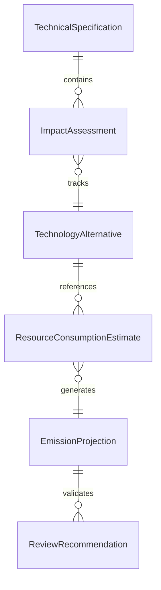
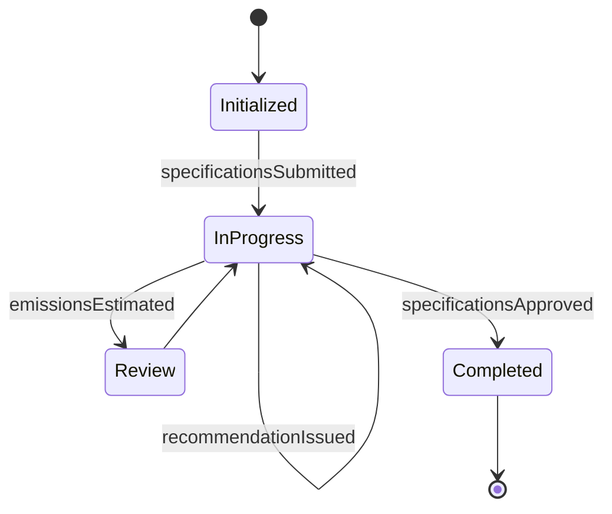
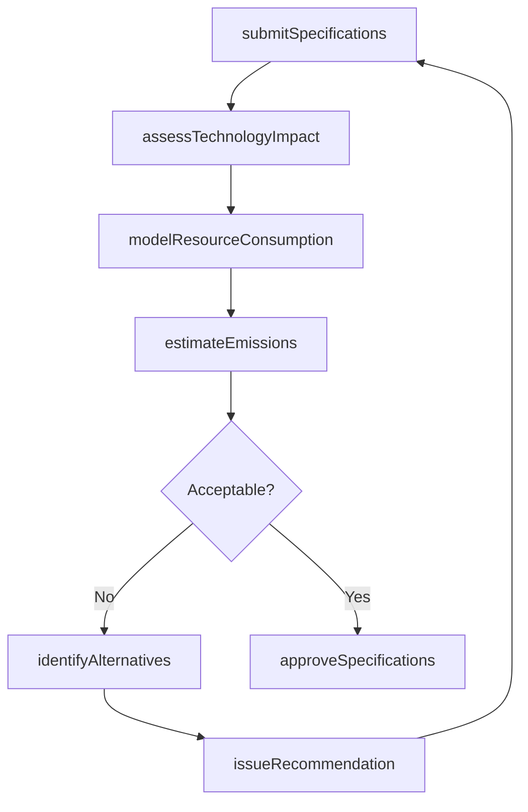
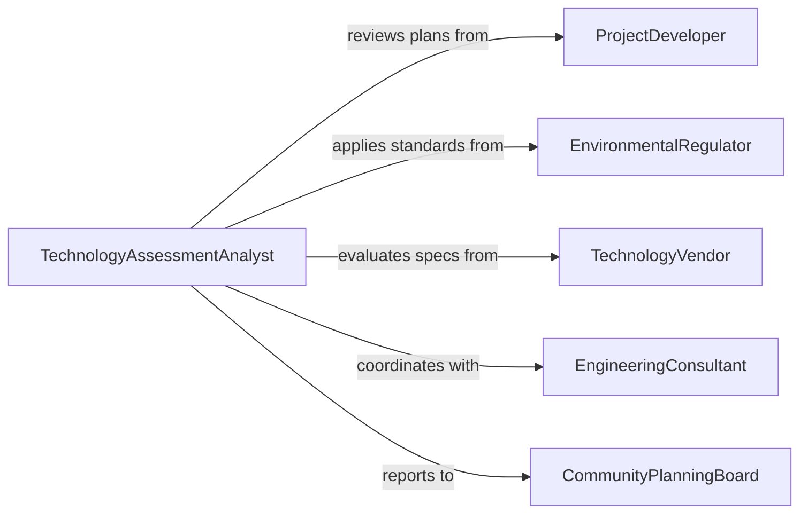

# Evaluate Plans or Specifications to Determine Technological or Environmental Implications

> Business-as-Code definition for evaluating plans and specifications to determine technological or environmental implications. Models the review of engineering designs, construction specifications, and technology deployment plans to assess their environmental footprint, resource consumption, and alignment with sustainability goals.

## Overview

Evaluating plans or specifications to determine technological or environmental implications involves analyzing engineering drawings, technical specifications, and project proposals to identify potential environmental impacts, resource demands, and technology trade-offs. This definition provides actions for specification intake, impact modeling, technology assessment, and recommendation generation. It supports environmental engineers, technology assessment specialists, sustainability consultants, and project review boards.

## Actors

| Actor | Description |
|-------|-------------|
| ProjectDeveloper | Submits plans and specifications for environmental and technological review |
| EnvironmentalRegulator | Enforces environmental standards that plans must satisfy |
| TechnologyVendor | Provides technical specifications for proposed equipment or systems |
| EngineeringConsultant | Prepares detailed technical designs and environmental analyses |
| CommunityPlanningBoard | Reviews project implications for local land use and environmental quality |

## Roles

| Role | Description |
|------|-------------|
| TechnologyAssessmentAnalyst | Evaluates technological choices for environmental and operational impact |
| EnvironmentalEngineer | Analyzes specifications for emissions, waste, and resource implications |
| SustainabilityAdvisor | Recommends design modifications to minimize environmental impact |
| ReviewBoardChair | Makes final determinations on plan acceptability |

## Entities

| Entity | Description |
|--------|-------------|
| TechnicalSpecification | A detailed document describing system design, materials, and performance |
| ImpactAssessment | An analysis of environmental effects resulting from the proposed plan |
| TechnologyAlternative | A different technological approach that may reduce environmental impact |
| ResourceConsumptionEstimate | A projection of energy, water, or material usage for the proposed design |
| EmissionProjection | An estimate of air, water, or noise emissions from the proposed system |
| ReviewRecommendation | A suggested modification or approval condition for the submitted plan |

## Actions

| Action | Description |
|--------|-------------|
| submitSpecifications | Accept plans or specifications for technological and environmental review |
| assessTechnologyImpact | Evaluate the environmental implications of proposed technologies |
| modelResourceConsumption | Project energy, water, and material demands of the proposed design |
| estimateEmissions | Calculate projected emissions from the proposed system or process |
| identifyAlternatives | Recommend technological alternatives with lower environmental impact |
| issueRecommendation | Provide a formal assessment with conditions or modifications |
| approveSpecifications | Clear the plans as acceptable from a technology and environment standpoint |

## Events

| Event | Description |
|-------|-------------|
| specificationsSubmitted | Plans or specifications have been received for review |
| technologyImpactAssessed | The environmental implications of proposed technologies have been evaluated |
| resourceConsumptionModeled | Energy and material demands have been projected |
| emissionsEstimated | Projected emissions from the proposed system have been calculated |
| alternativesIdentified | Lower-impact technological alternatives have been recommended |
| recommendationIssued | A formal assessment with conditions has been provided |
| specificationsApproved | The plans have been cleared for implementation |

## Searches

| Search | Description |
|--------|-------------|
| findReviews | List specification reviews by project, technology type, or status |
| getImpactAssessments | Retrieve environmental impact analyses by project or category |
| getAlternatives | View recommended technology alternatives for a project |
| getPendingReviews | Find specifications awaiting assessment |
| getEmissionProjections | Compare emission estimates across projects or technologies |


## Entity Relationships



## State Diagram


## Workflow



## Actor Relationships



## Usage

### Calling Actions

```typescript
import { evaluatePlansSpecificationsDetermineTechnological } from '@headlessly/evaluate-plans-specifications-determine-technological'

const evaluator = evaluatePlansSpecificationsDetermineTechnological()

// Submit a manufacturing facility expansion plan
const review = await evaluator.submitSpecifications({
  projectId: 'plant-expansion-phase-3',
  type: 'industrial-facility',
  specifications: ['hvac-design', 'process-equipment-layout', 'wastewater-treatment-upgrade'],
  developerId: 'acme-manufacturing'
})

// Assess technology and environmental impact
await evaluator.assessTechnologyImpact({ reviewId: review.id })
await evaluator.modelResourceConsumption({ reviewId: review.id })
await evaluator.estimateEmissions({ reviewId: review.id })

// Approve if acceptable
await evaluator.approveSpecifications({ reviewId: review.id })
```

### Event-Driven Automation

```typescript
// Alert when alternatives are recommended
evaluator.alternativesIdentified(async ({ reviewId, projectId, alternatives }) => {
  await notify({
    to: 'project-developer',
    message: `Technology alternatives recommended for ${projectId}: ${alternatives.join(', ')}`
  })
})

// Notify regulator of approved specifications
evaluator.specificationsApproved(async ({ reviewId, projectId }) => {
  await submitNotification({ to: 'environmental-regulator', projectId, status: 'specifications-approved' })
})
```
