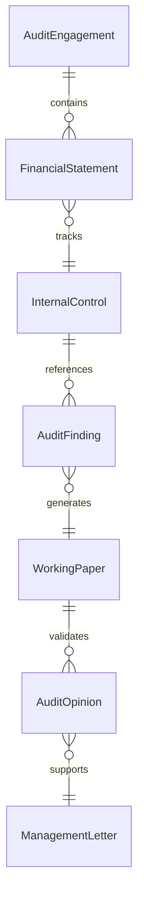
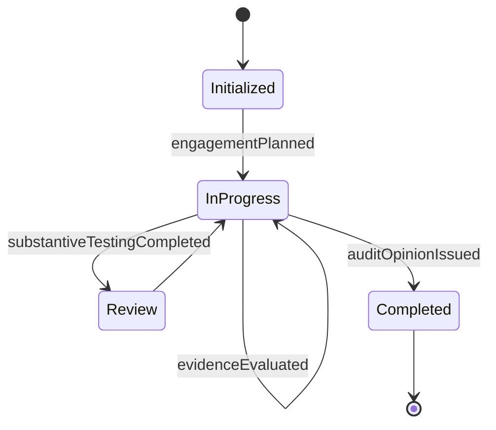
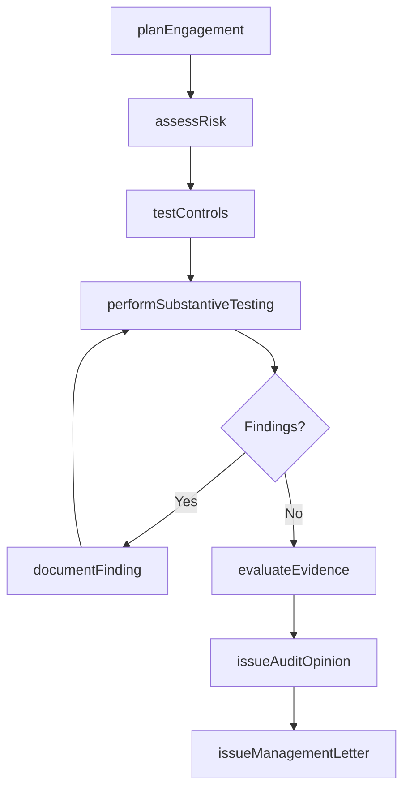
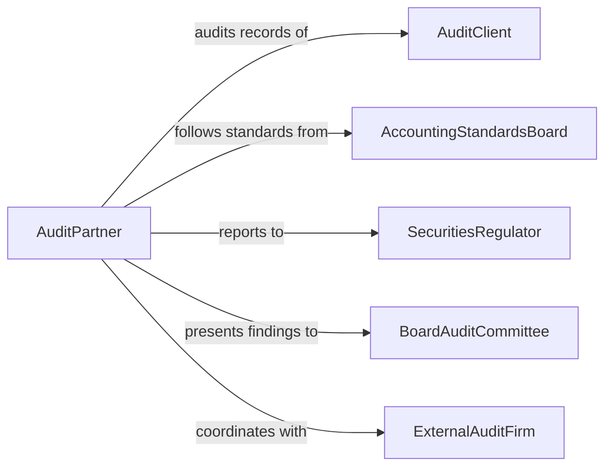

# Conduct Financial or Regulatory Audits

> Business-as-Code definition for conducting financial and regulatory audits. Models the systematic examination of financial statements, internal controls, and regulatory filings to verify accuracy, detect fraud, and ensure compliance with GAAP, IFRS, SOX, and other financial regulations.

## Overview

Conducting financial or regulatory audits involves planning and executing independent examinations of an organization's financial statements, accounting records, internal controls, and regulatory filings to express an opinion on their accuracy and compliance. This definition provides actions for engagement planning, risk assessment, substantive testing, control evaluation, and opinion issuance. It supports external audit firms, internal audit departments, regulatory examiners, and compliance teams.

## Actors

| Actor | Description |
|-------|-------------|
| AuditClient | The organization whose financial records and operations are being audited |
| SecuritiesRegulator | Enforces financial reporting standards such as SEC rules and SOX requirements |
| AccountingStandardsBoard | Publishes GAAP or IFRS standards that financial statements must follow |
| ExternalAuditFirm | Provides independent audit services and issues audit opinions |
| BoardAuditCommittee | Oversees the audit process and receives audit findings |
| TaxAuthority | Requires accurate financial reporting for tax compliance |

## Roles

| Role | Description |
|------|-------------|
| AuditPartner | Leads the audit engagement and signs the audit opinion |
| AuditManager | Supervises fieldwork and reviews working papers |
| StaffAuditor | Performs substantive testing and control evaluations |
| ForensicAccountant | Investigates potential fraud or financial irregularities |

## Entities

| Entity | Description |
|--------|-------------|
| AuditEngagement | The formal agreement defining the scope and terms of the audit |
| FinancialStatement | A report of financial position, results, and cash flows under audit |
| InternalControl | A process or procedure designed to ensure reliable financial reporting |
| AuditFinding | An identified misstatement, control weakness, or compliance deficiency |
| WorkingPaper | Documentation supporting audit procedures and conclusions |
| AuditOpinion | The formal conclusion on the fairness of the financial statements |
| ManagementLetter | A communication of control recommendations to client management |

## Actions

| Action | Description |
|--------|-------------|
| planEngagement | Define audit scope, timeline, materiality, and team assignments |
| assessRisk | Evaluate the risk of material misstatement in financial areas |
| testControls | Evaluate the design and operating effectiveness of internal controls |
| performSubstantiveTesting | Examine account balances and transactions for accuracy |
| documentFinding | Record a misstatement, control weakness, or compliance issue |
| evaluateEvidence | Assess the sufficiency and appropriateness of audit evidence collected |
| issueAuditOpinion | Deliver the formal audit opinion on the financial statements |
| issueManagementLetter | Communicate internal control recommendations to management |

## Events

| Event | Description |
|-------|-------------|
| engagementPlanned | The audit scope, timeline, and team have been defined |
| riskAssessed | The risk of material misstatement has been evaluated |
| controlsTested | Internal controls have been evaluated for effectiveness |
| substantiveTestingCompleted | Account balances and transactions have been examined |
| findingDocumented | A misstatement or control weakness has been recorded |
| evidenceEvaluated | Audit evidence has been assessed for sufficiency |
| auditOpinionIssued | The formal audit opinion has been delivered |
| managementLetterIssued | Control recommendations have been communicated |

## Searches

| Search | Description |
|--------|-------------|
| findEngagements | List audit engagements by client, period, or status |
| getFindings | Retrieve audit findings by severity, account area, or engagement |
| getControlWeaknesses | Find documented internal control deficiencies |
| getAuditOpinions | View issued audit opinions by client or fiscal year |
| getPendingFieldwork | Locate engagements with incomplete substantive testing |


## Entity Relationships



## State Diagram


## Workflow



## Actor Relationships



## Usage

### Calling Actions

```typescript
import { conductFinancialRegulatoryAudits } from '@headlessly/conduct-financial-regulatory-audits'

const auditor = conductFinancialRegulatoryAudits()

// Plan an annual financial audit
const engagement = await auditor.planEngagement({
  clientId: 'consolidated-industries-inc',
  fiscalYear: '2025',
  scope: ['balance-sheet', 'income-statement', 'cash-flow', 'equity'],
  materiality: 500000,
  team: ['partner-williams', 'manager-garcia', 'staff-auditor-lee']
})

// Assess risk and test controls
await auditor.assessRisk({ engagementId: engagement.id })
await auditor.testControls({
  engagementId: engagement.id,
  areas: ['revenue-recognition', 'accounts-payable', 'inventory-valuation']
})

// Perform substantive testing and issue opinion
await auditor.performSubstantiveTesting({ engagementId: engagement.id })
await auditor.issueAuditOpinion({ engagementId: engagement.id, type: 'unqualified' })
```

### Event-Driven Automation

```typescript
// Escalate material findings to audit committee
auditor.findingDocumented(async ({ engagementId, findingId, severity, amount }) => {
  if (severity === 'material') {
    await notify({
      to: 'audit-committee-chair',
      message: `Material audit finding: ${findingId} ($${amount.toLocaleString()})`
    })
  }
})

// File audit opinion with regulator
auditor.auditOpinionIssued(async ({ engagementId, clientId, opinionType }) => {
  await submitFiling({ to: 'securities-regulator', clientId, opinionType })
})
```
