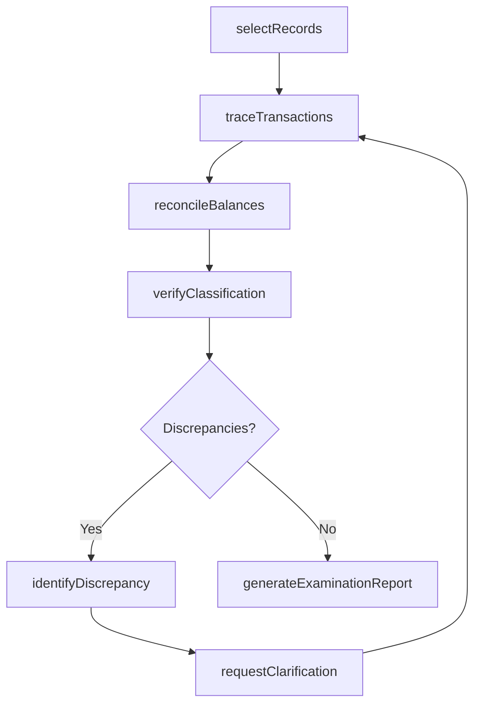
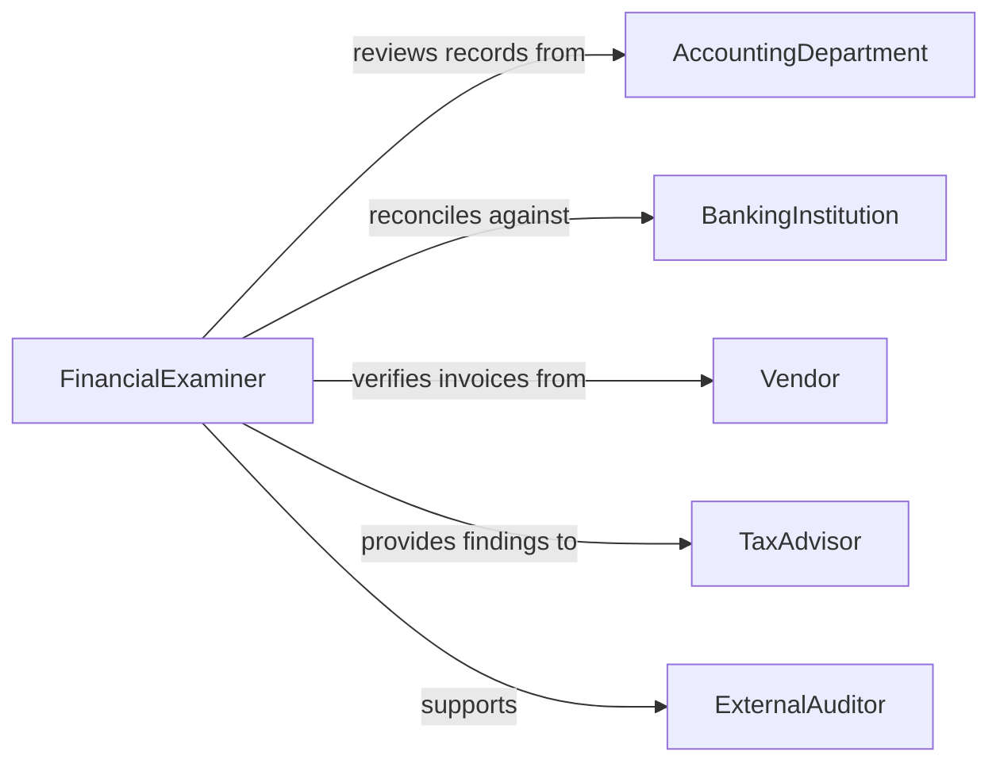

# Examine Financial Records

> Business-as-Code definition for examining financial records. Models the review of ledgers, journals, bank statements, invoices, and transaction logs to verify accuracy, identify discrepancies, and support financial oversight and decision-making.

## Overview

Examining financial records involves reviewing general ledgers, subsidiary journals, bank reconciliations, invoices, receipts, and transaction histories to verify the accuracy of recorded amounts and identify irregularities. This definition provides actions for record selection, transaction tracing, balance verification, and discrepancy reporting. It supports accountants, bookkeepers, financial controllers, and audit support staff.

## Actors

| Actor | Description |
|-------|-------------|
| AccountingDepartment | Maintains the financial records under examination |
| BankingInstitution | Provides statements and transaction confirmations |
| Vendor | Issues invoices and receipts that must match recorded payments |
| TaxAdvisor | Uses examined records for tax preparation and planning |
| ExternalAuditor | Relies on examined records as the basis for audit procedures |

## Roles

| Role | Description |
|------|-------------|
| FinancialExaminer | Reviews records for accuracy, completeness, and proper classification |
| AccountingClerk | Prepares and organizes financial records for examination |
| FinancialController | Oversees the examination process and addresses identified issues |
| ReconciliationSpecialist | Matches internal records against external statements |

## Entities

| Entity | Description |
|--------|-------------|
| GeneralLedger | The primary accounting record containing all financial transactions |
| JournalEntry | A recorded transaction in the accounting system |
| BankStatement | A periodic summary of account activity from a financial institution |
| Invoice | A document requesting payment for goods or services |
| Reconciliation | A comparison of internal records against external data sources |
| Discrepancy | A difference between recorded amounts and supporting documentation |
| ExaminationReport | A summary of findings from the financial records review |

## Actions

| Action | Description |
|--------|-------------|
| selectRecords | Identify the financial records and period to examine |
| traceTransactions | Follow individual transactions from source documents to ledger entries |
| reconcileBalances | Compare account balances against bank statements and external sources |
| verifyClassification | Confirm transactions are recorded in the correct accounts |
| identifyDiscrepancy | Flag a difference between recorded and supporting amounts |
| requestClarification | Ask the accounting department to explain an unusual transaction |
| generateExaminationReport | Produce a summary of examination findings |

## Events

| Event | Description |
|-------|-------------|
| recordsSelected | Financial records for examination have been identified |
| transactionsTraced | Individual transactions have been traced to source documents |
| balancesReconciled | Account balances have been compared against external sources |
| classificationVerified | Transaction account classifications have been confirmed |
| discrepancyIdentified | A difference between records and documentation has been found |
| clarificationRequested | An explanation for an unusual transaction has been requested |
| examinationReportGenerated | The examination summary has been produced |

## Searches

| Search | Description |
|--------|-------------|
| findExaminations | List financial record examinations by period, account, or status |
| getDiscrepancies | Retrieve identified discrepancies by amount, account, or type |
| getUnreconciledItems | Find transactions that have not been matched to external sources |
| getTransactionHistory | View transaction details for a specific account or period |
| getExaminationReports | Locate completed examination summaries by date or department |

## Workflow



## Actor Relationships



## Usage

### Calling Actions

```typescript
import { examineFinancialRecords } from '@headlessly/examine-financial-records'

const examiner = examineFinancialRecords()

// Select records for examination
const examination = await examiner.selectRecords({
  accountIds: ['accounts-payable', 'accounts-receivable', 'cash'],
  period: { start: '2025-07-01', end: '2025-12-31' },
  department: 'operations'
})

// Trace transactions and reconcile
await examiner.traceTransactions({ examinationId: examination.id })
await examiner.reconcileBalances({
  examinationId: examination.id,
  externalSources: ['bank-statement-q3', 'bank-statement-q4']
})

// Generate report
await examiner.generateExaminationReport({ examinationId: examination.id })
```

### Event-Driven Automation

```typescript
// Alert controller on large discrepancies
examiner.discrepancyIdentified(async ({ examinationId, account, amount }) => {
  if (amount > 10000) {
    await notify({
      to: 'financial-controller',
      message: `Discrepancy of $${amount.toLocaleString()} found in ${account}`
    })
  }
})

// Distribute examination report
examiner.examinationReportGenerated(async ({ examinationId, reportId }) => {
  await distribute({ reportId, recipients: ['controller', 'external-auditor'] })
})
```
