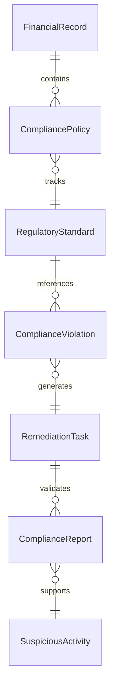
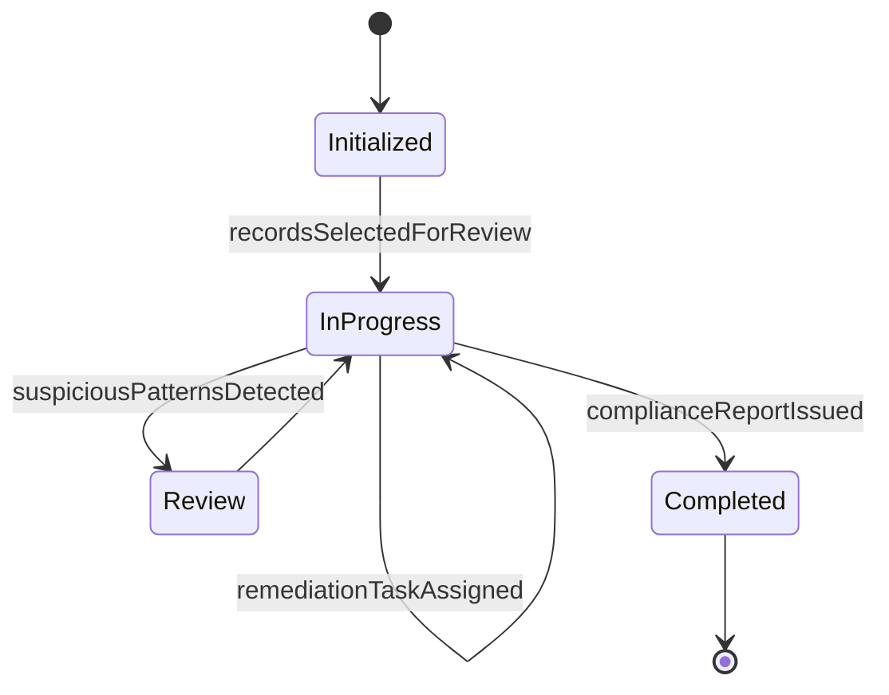
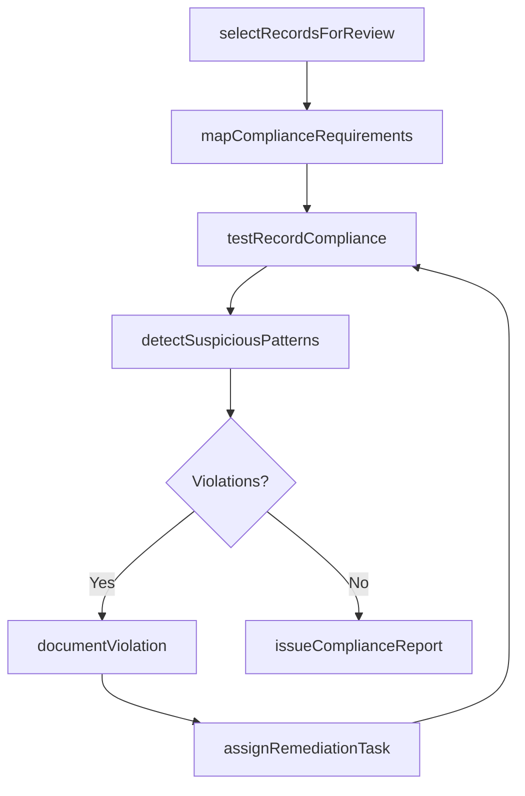
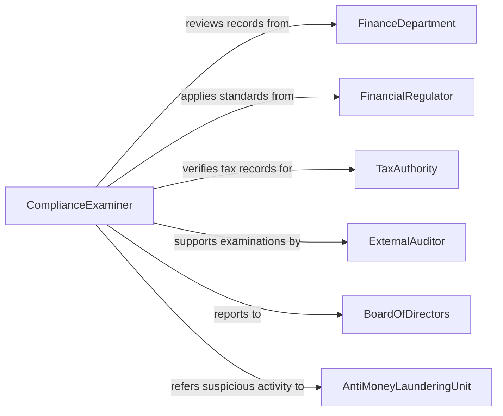

# Examine Financial Records to Ensure Compliance with Policies or Regulations

> Business-as-Code definition for examining financial records to ensure compliance with policies and regulations. Models the systematic review of accounting entries, financial reports, and transaction documentation against SOX, GAAP, tax codes, anti-money-laundering rules, and internal financial policies.

## Overview

Examining financial records to ensure compliance with policies or regulations involves reviewing journal entries, financial reports, tax filings, and transaction documentation against applicable accounting standards, tax laws, anti-fraud regulations, and organizational financial policies. This definition provides actions for record selection, regulatory mapping, compliance testing, violation documentation, and remediation tracking. It supports compliance auditors, financial examiners, regulatory affairs teams, and internal audit departments.

## Actors

| Actor | Description |
|-------|-------------|
| FinanceDepartment | Produces the financial records subject to compliance examination |
| FinancialRegulator | Enforces accounting standards, reporting rules, and financial regulations |
| TaxAuthority | Mandates accurate tax-related financial recordkeeping |
| ExternalAuditor | Independently verifies financial compliance as part of audit engagements |
| BoardOfDirectors | Receives compliance examination results and oversees remediation |
| AntiMoneyLaunderingUnit | Monitors financial transactions for suspicious activity patterns |

## Roles

| Role | Description |
|------|-------------|
| ComplianceExaminer | Reviews financial records against applicable policies and regulations |
| RegulatoryReportingOfficer | Ensures financial filings meet regulatory requirements |
| TaxComplianceSpecialist | Verifies that financial records support accurate tax reporting |
| ChiefComplianceOfficer | Provides oversight and final approval of compliance determinations |

## Entities

| Entity | Description |
|--------|-------------|
| FinancialRecord | A journal entry, report, or document subject to compliance review |
| CompliancePolicy | An internal policy governing financial recordkeeping and reporting |
| RegulatoryStandard | An external regulation the financial records must satisfy |
| ComplianceViolation | An identified instance where records fail to meet a policy or regulation |
| RemediationTask | A corrective action to resolve a compliance violation |
| ComplianceReport | A formal summary of examination results and compliance status |
| SuspiciousActivity | A transaction pattern that may indicate fraud or money laundering |

## Actions

| Action | Description |
|--------|-------------|
| selectRecordsForReview | Identify financial records and periods for compliance examination |
| mapComplianceRequirements | Determine which policies and regulations apply to the selected records |
| testRecordCompliance | Evaluate financial entries against mapped compliance requirements |
| detectSuspiciousPatterns | Screen transactions for indicators of fraud or money laundering |
| documentViolation | Record a compliance failure with supporting evidence |
| assignRemediationTask | Direct the finance department to correct identified violations |
| issueComplianceReport | Produce a formal summary of examination findings and status |

## Events

| Event | Description |
|-------|-------------|
| recordsSelectedForReview | Financial records for examination have been identified |
| complianceRequirementsMapped | Applicable policies and regulations have been determined |
| recordComplianceTested | Financial entries have been evaluated against requirements |
| suspiciousPatternsDetected | Transaction patterns indicating potential fraud have been identified |
| violationDocumented | A compliance failure has been formally recorded |
| remediationTaskAssigned | The finance department has been directed to correct a violation |
| complianceReportIssued | The examination summary has been produced |

## Searches

| Search | Description |
|--------|-------------|
| findExaminations | List compliance examinations by department, period, or status |
| getViolations | Retrieve documented violations by regulation, severity, or account |
| getPendingRemediations | Find unresolved compliance violations awaiting correction |
| getSuspiciousActivities | Locate flagged transactions requiring further investigation |
| getComplianceTrends | Track violation rates and compliance scores over time |


## Entity Relationships



## State Diagram


## Workflow



## Actor Relationships



## Usage

### Calling Actions

```typescript
import { examineFinancialRecordsEnsureCompliance } from '@headlessly/examine-financial-records-ensure-compliance'

const examiner = examineFinancialRecordsEnsureCompliance()

// Select records for compliance review
const examination = await examiner.selectRecordsForReview({
  department: 'treasury',
  recordTypes: ['wire-transfers', 'cash-receipts', 'intercompany-transactions'],
  period: { start: '2025-01-01', end: '2025-06-30' }
})

// Map requirements and test compliance
await examiner.mapComplianceRequirements({
  examinationId: examination.id,
  policies: ['corporate-expense-policy', 'segregation-of-duties'],
  regulations: ['SOX-302', 'BSA-AML', 'IRS-recordkeeping']
})

await examiner.testRecordCompliance({ examinationId: examination.id })
await examiner.detectSuspiciousPatterns({ examinationId: examination.id })

// Issue compliance report
await examiner.issueComplianceReport({ examinationId: examination.id })
```

### Event-Driven Automation

```typescript
// Escalate suspicious activity immediately
examiner.suspiciousPatternsDetected(async ({ examinationId, transactionIds, riskScore }) => {
  if (riskScore > 80) {
    await notify({
      to: 'aml-investigation-unit',
      message: `High-risk suspicious activity detected. ${transactionIds.length} transactions flagged.`
    })
  }
})

// Track remediation deadlines
examiner.remediationTaskAssigned(async ({ violationId, assignee, deadline }) => {
  await createReminder({ assignee, violationId, reminderDate: daysBefore(deadline, 7) })
})
```
