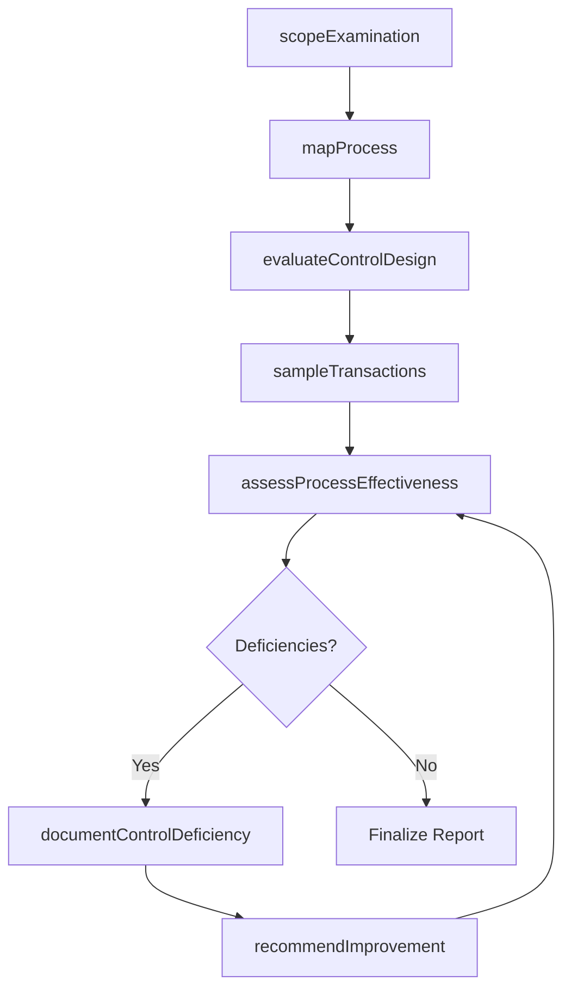
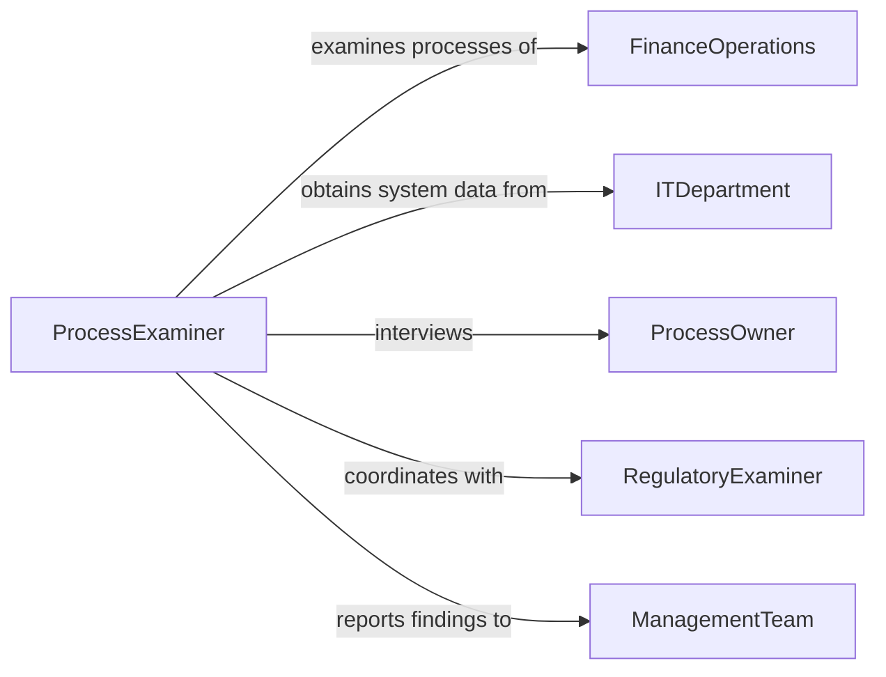

# Examine Financial Records or Processes

> Business-as-Code definition for examining financial records and processes. Models the review of accounting workflows, transaction processing systems, and financial control procedures alongside their output records to assess operational effectiveness and data integrity.

## Overview

Examining financial records or processes involves reviewing both the financial data produced by accounting systems and the underlying processes that generate, approve, and record transactions. This definition provides actions for process mapping, control point evaluation, transaction sampling, and effectiveness assessment. It supports internal auditors, process improvement specialists, financial operations managers, and compliance teams.

## Actors

| Actor | Description |
|-------|-------------|
| FinanceOperations | Operates the accounting processes and systems under examination |
| ITDepartment | Maintains the financial systems and provides access to transaction data |
| ProcessOwner | Manages the specific business process being examined |
| RegulatoryExaminer | Conducts examinations on behalf of financial regulators |
| ManagementTeam | Receives examination findings and implements process improvements |

## Roles

| Role | Description |
|------|-------------|
| ProcessExaminer | Evaluates the design and effectiveness of financial processes |
| DataAnalyst | Performs analytical procedures on transaction data sets |
| ControlEvaluator | Assesses internal control points within financial workflows |
| ExaminationLead | Coordinates the examination and presents findings to management |

## Entities

| Entity | Description |
|--------|-------------|
| FinancialProcess | A defined workflow for recording, approving, or reporting financial data |
| ControlPoint | A step in a process designed to prevent or detect errors and fraud |
| TransactionSample | A selected subset of transactions tested for accuracy and compliance |
| ProcessMap | A visual representation of the financial workflow being examined |
| ControlDeficiency | A weakness in a process control that could lead to errors or fraud |
| ProcessEffectivenessRating | A scored assessment of how well a financial process operates |
| ExaminationWorkpaper | Documentation supporting examination procedures and conclusions |

## Actions

| Action | Description |
|--------|-------------|
| scopeExamination | Define the financial processes and records to be examined |
| mapProcess | Document the workflow steps, inputs, outputs, and control points |
| evaluateControlDesign | Assess whether control points are properly designed to mitigate risks |
| sampleTransactions | Select and test a representative set of transactions |
| assessProcessEffectiveness | Rate the overall effectiveness of the financial process |
| documentControlDeficiency | Record a weakness in a process control |
| recommendImprovement | Propose process modifications to address identified deficiencies |

## Events

| Event | Description |
|-------|-------------|
| examinationScoped | The processes and records for examination have been defined |
| processMapped | The financial workflow has been documented |
| controlDesignEvaluated | Process control points have been assessed for proper design |
| transactionsSampled | A representative transaction set has been selected and tested |
| processEffectivenessAssessed | The financial process has been rated for operational effectiveness |
| controlDeficiencyDocumented | A process control weakness has been recorded |
| improvementRecommended | Process modifications have been proposed |

## Searches

| Search | Description |
|--------|-------------|
| findExaminations | List process examinations by department, process, or status |
| getControlDeficiencies | Retrieve documented control weaknesses by process or severity |
| getProcessMaps | View documented workflows for specific financial processes |
| getTransactionSamples | Retrieve tested transaction samples and their results |
| getEffectivenessRatings | Compare process effectiveness ratings across departments or periods |

## Workflow



## Actor Relationships



## Usage

### Calling Actions

```typescript
import { examineFinancialRecordsProcesses } from '@headlessly/examine-financial-records-processes'

const examiner = examineFinancialRecordsProcesses()

// Scope the examination
const examination = await examiner.scopeExamination({
  processes: ['purchase-to-pay', 'order-to-cash'],
  department: 'finance-operations',
  period: { start: '2025-01-01', end: '2025-12-31' }
})

// Map and evaluate processes
await examiner.mapProcess({ examinationId: examination.id, processName: 'purchase-to-pay' })
await examiner.evaluateControlDesign({ examinationId: examination.id })
await examiner.sampleTransactions({ examinationId: examination.id, sampleSize: 50 })

// Assess effectiveness
const assessment = await examiner.assessProcessEffectiveness({ examinationId: examination.id })
```

### Event-Driven Automation

```typescript
// Escalate significant control deficiencies
examiner.controlDeficiencyDocumented(async ({ examinationId, processName, severity }) => {
  if (severity === 'significant') {
    await notify({
      to: 'cfo-office',
      message: `Significant control deficiency in ${processName}. Remediation required.`
    })
  }
})

// Track improvement implementation
examiner.improvementRecommended(async ({ examinationId, recommendation, processOwner }) => {
  await createTask({
    assignee: processOwner,
    title: `Implement process improvement: ${recommendation}`,
    dueDate: daysFromNow(60)
  })
})
```
