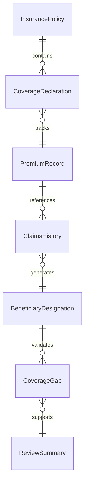
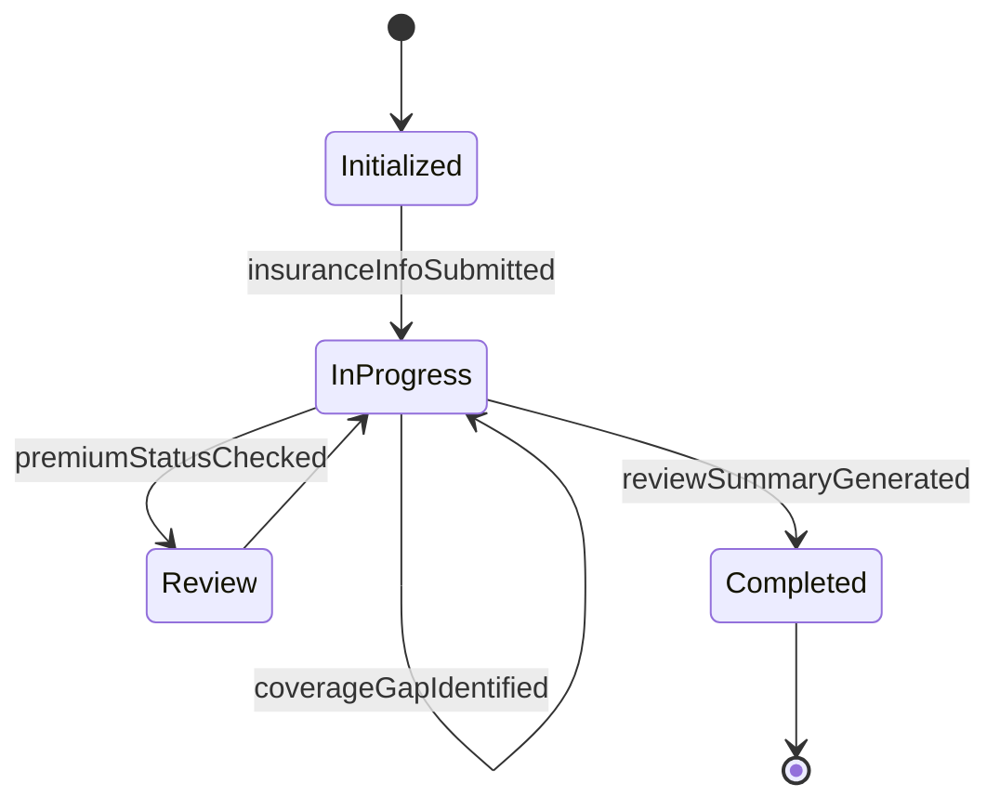
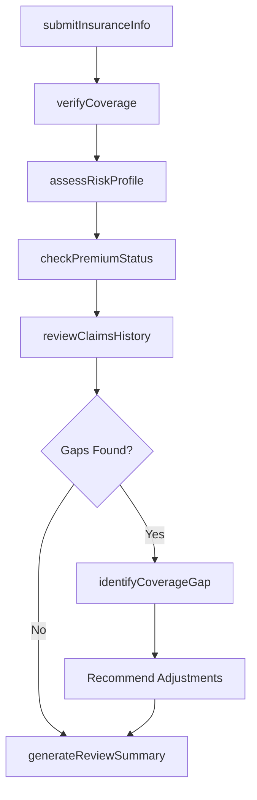
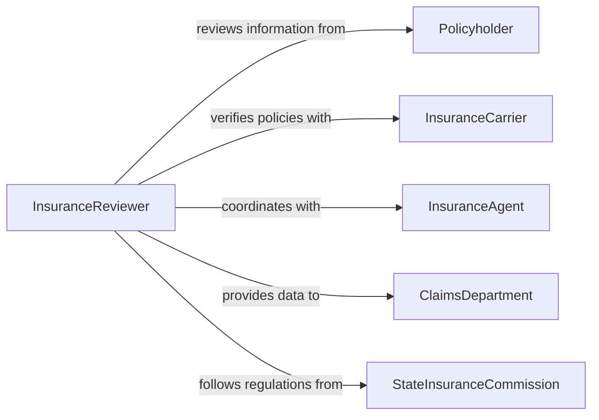

# Review Customer Insurance Information

> Business-as-Code definition for reviewing customer insurance information. Models the verification of insurance policies, coverage limits, deductibles, beneficiary designations, and claims history to ensure adequate protection and accurate records for underwriting, billing, and claims processing.

## Overview

Reviewing customer insurance information involves examining policy documents, coverage declarations, premium payment records, claims history, and beneficiary designations to verify accuracy, assess adequacy, and support underwriting or claims decisions. This definition provides actions for policy intake, coverage verification, risk assessment, and recommendation generation. It supports insurance agents, underwriters, claims adjusters, customer service representatives, and compliance officers.

## Actors

| Actor | Description |
|-------|-------------|
| Policyholder | The customer whose insurance information is under review |
| InsuranceCarrier | The company that issues policies and bears the insured risk |
| InsuranceAgent | Sells policies and assists customers with coverage decisions |
| ClaimsDepartment | Processes claims and needs accurate policy information |
| StateInsuranceCommission | Regulates insurance practices and mandates coverage requirements |

## Roles

| Role | Description |
|------|-------------|
| InsuranceReviewer | Examines customer insurance information for accuracy and adequacy |
| Underwriter | Evaluates risk and determines coverage terms and pricing |
| PolicyAdministrator | Maintains policy records and processes endorsements |
| ComplianceAnalyst | Ensures insurance information meets regulatory requirements |

## Entities

| Entity | Description |
|--------|-------------|
| InsurancePolicy | A contract outlining coverage terms, limits, and conditions |
| CoverageDeclaration | A summary page listing insured items, limits, and deductibles |
| PremiumRecord | A history of premium payments and billing status |
| ClaimsHistory | A record of past claims filed and their disposition |
| BeneficiaryDesignation | The named recipients of policy benefits |
| CoverageGap | An identified area where insurance protection is insufficient |
| ReviewSummary | A report of findings from the insurance information review |

## Actions

| Action | Description |
|--------|-------------|
| submitInsuranceInfo | Accept customer insurance documents for review |
| verifyCoverage | Confirm that coverage limits and terms match customer needs |
| assessRiskProfile | Evaluate the customer's risk characteristics against policy terms |
| checkPremiumStatus | Verify premium payment history and current billing status |
| reviewClaimsHistory | Examine past claims for patterns or concerns |
| identifyCoverageGap | Flag an area where the customer lacks adequate insurance protection |
| generateReviewSummary | Produce a report of findings and recommendations |

## Events

| Event | Description |
|-------|-------------|
| insuranceInfoSubmitted | Customer insurance documents have been received for review |
| coverageVerified | Policy coverage limits and terms have been confirmed |
| riskProfileAssessed | The customer's risk characteristics have been evaluated |
| premiumStatusChecked | Premium payment history has been verified |
| claimsHistoryReviewed | Past claims have been examined for patterns |
| coverageGapIdentified | An inadequate area of insurance protection has been flagged |
| reviewSummaryGenerated | A report of findings has been produced |

## Searches

| Search | Description |
|--------|-------------|
| findPolicyReviews | List insurance reviews by customer, policy type, or date |
| getCoverageGaps | Retrieve identified gaps by customer or coverage area |
| getClaimsPatterns | View claims frequency and severity by customer or policy |
| getPremiumArrearage | Find customers with overdue premium payments |
| getExpiringPolicies | List policies approaching renewal dates |


## Entity Relationships



## State Diagram


## Workflow



## Actor Relationships



## Usage

### Calling Actions

```typescript
import { reviewCustomerInsuranceInformation } from '@headlessly/review-customer-insurance-information'

const reviewer = reviewCustomerInsuranceInformation()

// Submit insurance documents for review
const review = await reviewer.submitInsuranceInfo({
  customerId: 'client-johnson-family',
  policies: ['homeowners-HO3', 'auto-PAP', 'umbrella-PUP'],
  reviewReason: 'annual-renewal'
})

// Verify coverage and assess risk
await reviewer.verifyCoverage({ reviewId: review.id })
await reviewer.assessRiskProfile({ reviewId: review.id })
await reviewer.checkPremiumStatus({ reviewId: review.id })
await reviewer.reviewClaimsHistory({ reviewId: review.id })

// Generate summary
await reviewer.generateReviewSummary({ reviewId: review.id })
```

### Event-Driven Automation

```typescript
// Alert agent when coverage gaps are found
reviewer.coverageGapIdentified(async ({ reviewId, customerId, gapType }) => {
  await notify({
    to: 'assigned-agent',
    message: `Coverage gap for ${customerId}: ${gapType}. Recommend additional coverage.`
  })
})

// Schedule renewal follow-up
reviewer.reviewSummaryGenerated(async ({ reviewId, customerId, expirationDate }) => {
  await scheduleFollowUp({ customerId, date: daysBefore(expirationDate, 30), type: 'renewal-review' })
})
```
