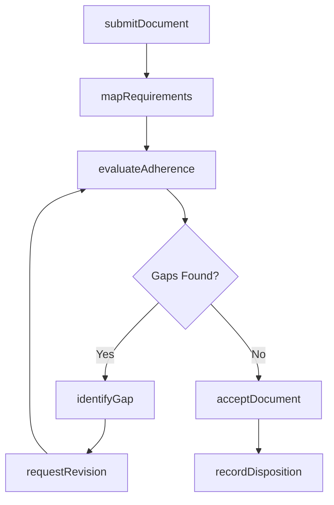
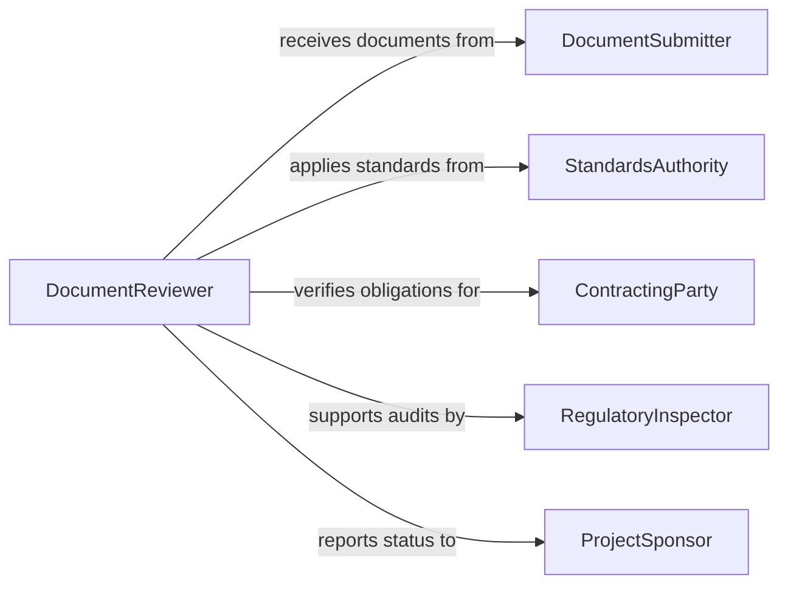

# Examine Documents to Verify Adherence to Requirements

> Business-as-Code definition for examining documents to verify adherence to requirements. Models the systematic review of contracts, specifications, reports, and forms against defined standards, criteria, or regulatory mandates.

## Overview

Examining documents to verify adherence to requirements involves reviewing submitted documentation against predefined standards, contractual obligations, regulatory mandates, or organizational policies. This definition provides actions for document intake, requirement mapping, gap identification, and disposition recording. It supports quality assurance teams, contract administrators, regulatory compliance staff, and project managers who must ensure documentation meets governing requirements.

## Actors

| Actor | Description |
|-------|-------------|
| DocumentSubmitter | Provides documents for adherence review |
| StandardsAuthority | Publishes the requirements against which documents are evaluated |
| ContractingParty | Holds contractual obligations that documents must fulfill |
| RegulatoryInspector | Audits documentation for mandatory compliance |
| ProjectSponsor | Requires documentation adherence as a condition of project progress |

## Roles

| Role | Description |
|------|-------------|
| DocumentReviewer | Evaluates documents against applicable requirements |
| QualityAssuranceAnalyst | Applies systematic checks to verify adherence |
| RequirementsSpecialist | Maintains the requirements baseline and traceability matrix |
| ApprovalManager | Makes final acceptance or rejection decisions |

## Entities

| Entity | Description |
|--------|-------------|
| Document | A contract, report, specification, or form under review |
| Requirement | A specific standard, rule, or obligation the document must satisfy |
| TraceabilityMatrix | A mapping of document sections to their governing requirements |
| AdherenceGap | An identified area where the document fails to meet a requirement |
| ReviewChecklist | A structured list of requirements to verify during examination |
| DispositionRecord | The recorded outcome of the adherence review |

## Actions

| Action | Description |
|--------|-------------|
| submitDocument | Accept a document for adherence review |
| mapRequirements | Link document sections to applicable requirements |
| evaluateAdherence | Check each document section against its mapped requirements |
| identifyGap | Flag a section that does not meet the governing requirement |
| requestRevision | Direct the submitter to address identified gaps |
| acceptDocument | Confirm the document satisfies all applicable requirements |
| recordDisposition | Log the final review outcome and any conditions |

## Events

| Event | Description |
|-------|-------------|
| documentSubmitted | A document has been received for adherence review |
| requirementsMapped | Document sections have been linked to governing requirements |
| adherenceEvaluated | The document has been checked against all mapped requirements |
| gapIdentified | A non-adherent section has been flagged |
| revisionRequested | The submitter has been directed to address gaps |
| documentAccepted | The document has been confirmed as meeting all requirements |
| dispositionRecorded | The review outcome has been logged |

## Searches

| Search | Description |
|--------|-------------|
| findReviews | List document reviews by submitter, date, or status |
| getGaps | Retrieve identified adherence gaps by requirement or severity |
| getPendingRevisions | Find documents awaiting submitter corrections |
| getTraceability | View the requirements mapping for a specific document |
| getDispositionHistory | Track review outcomes across multiple document submissions |

## Workflow



## Actor Relationships



## Usage

### Calling Actions

```typescript
import { examineDocumentsVerifyAdherenceRequirements } from '@headlessly/examine-documents-verify-adherence-requirements'

const reviewer = examineDocumentsVerifyAdherenceRequirements()

// Submit a design specification for review
const submission = await reviewer.submitDocument({
  title: 'Bridge Design Specification v3.1',
  type: 'engineering-specification',
  submitterId: 'contractor-meridian-eng'
})

// Map and evaluate requirements
await reviewer.mapRequirements({
  documentId: submission.id,
  requirements: ['AASHTO-LRFD-9th', 'state-dot-bridge-manual', 'contract-exhibit-C']
})

const evaluation = await reviewer.evaluateAdherence({ documentId: submission.id })

// Accept if compliant
if (evaluation.gaps.length === 0) {
  await reviewer.acceptDocument({ documentId: submission.id })
}
```

### Event-Driven Automation

```typescript
// Notify submitter of required revisions
reviewer.revisionRequested(async ({ documentId, gaps }) => {
  await notify({
    to: 'contractor-meridian-eng',
    message: `Revisions needed: ${gaps.map(g => g.requirement).join(', ')}`
  })
})

// Log acceptance for project milestone tracking
reviewer.documentAccepted(async ({ documentId, title }) => {
  await updateMilestone({ documentId, status: 'documentation-approved' })
})
```
