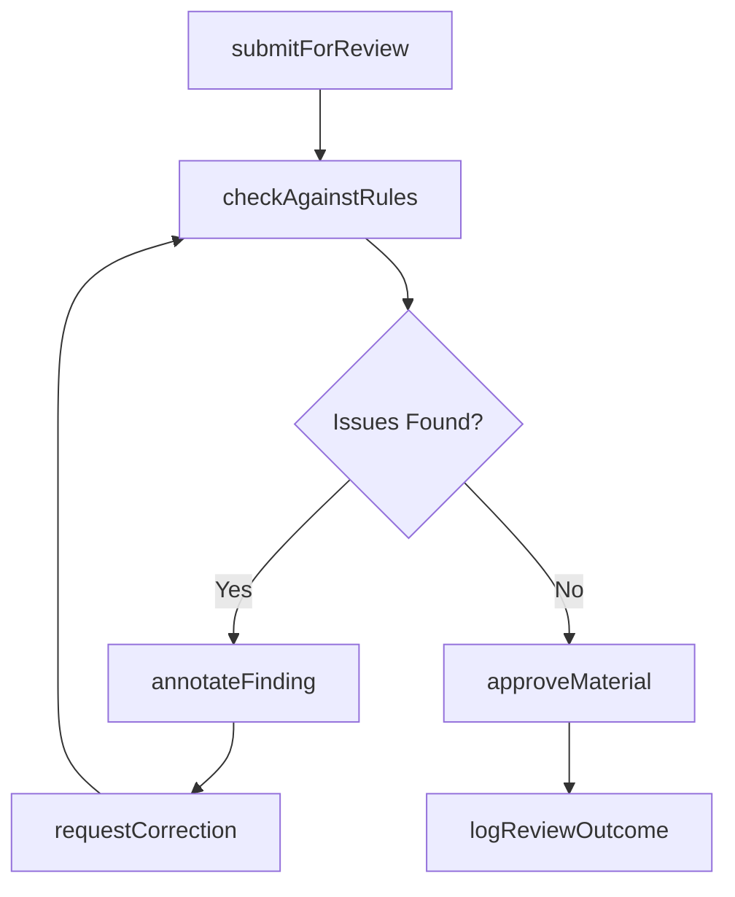
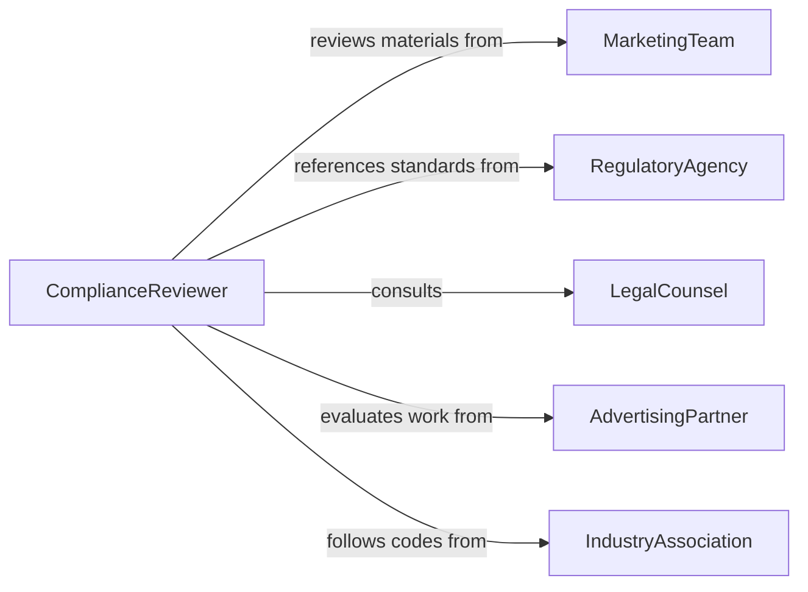

# Examine Marketing Materials to Ensure Compliance with Policies or Regulations

> Business-as-Code definition for examining marketing materials for regulatory and policy compliance. Models the review, annotation, and approval of advertisements, brochures, digital content, and promotional claims against industry regulations and internal brand standards.

## Overview

Examining marketing materials to ensure compliance involves reviewing advertising copy, promotional content, product claims, and visual assets against applicable regulations such as FTC guidelines, FDA labeling rules, financial advertising standards, and internal brand policies. This definition provides actions for material submission, compliance checking, issue annotation, and approval or rejection workflows. It supports compliance officers, marketing teams, legal counsel, and brand managers.

## Actors

| Actor | Description |
|-------|-------------|
| MarketingTeam | Creates and submits promotional materials for compliance review |
| RegulatoryAgency | Enforces advertising standards and may issue violations |
| LegalCounsel | Provides guidance on regulatory interpretation and risk |
| AdvertisingPartner | External agency producing marketing content on behalf of the organization |
| IndustryAssociation | Publishes voluntary advertising codes and best practices |
| Consumer | Files complaints about misleading or non-compliant marketing |

## Roles

| Role | Description |
|------|-------------|
| ComplianceReviewer | Evaluates marketing materials against regulatory requirements |
| BrandManager | Ensures materials align with internal brand guidelines |
| RegulatoryAffairsSpecialist | Interprets regulations and advises on permissible claims |
| ApprovalAuthority | Makes final decisions on material clearance for publication |

## Entities

| Entity | Description |
|--------|-------------|
| MarketingMaterial | An advertisement, brochure, email, or digital asset under review |
| ComplianceRule | A specific regulation or policy that materials must satisfy |
| ReviewSubmission | A formal request to evaluate a marketing material for compliance |
| ComplianceFinding | An identified issue or violation in the reviewed material |
| CorrectionRequest | A directive to modify non-compliant content |
| ApprovalRecord | Documentation that a material has passed compliance review |

## Actions

| Action | Description |
|--------|-------------|
| submitForReview | Send a marketing material to the compliance team for evaluation |
| checkAgainstRules | Compare material content against applicable compliance rules |
| annotateFinding | Document a specific compliance issue found in the material |
| requestCorrection | Direct the marketing team to fix identified compliance issues |
| approveMaterial | Clear the material for publication after successful review |
| rejectMaterial | Deny publication due to unresolvable compliance violations |
| logReviewOutcome | Record the final disposition and any conditions of approval |

## Events

| Event | Description |
|-------|-------------|
| materialSubmitted | A marketing material has been sent for compliance review |
| rulesChecked | The material has been evaluated against applicable regulations |
| findingAnnotated | A compliance issue has been documented in the review |
| correctionRequested | The marketing team has been directed to fix an issue |
| materialApproved | The material has been cleared for publication |
| materialRejected | The material has been denied publication |
| reviewOutcomeLogged | The final review disposition has been recorded |

## Searches

| Search | Description |
|--------|-------------|
| findSubmissions | List review submissions by material type, date, or status |
| getFindings | Retrieve compliance issues by rule, severity, or material |
| getPendingCorrections | Find materials awaiting fixes from the marketing team |
| getApprovalHistory | Track approval and rejection outcomes over time |
| findExpiredApprovals | Locate materials whose compliance approval has lapsed |

## Workflow



## Actor Relationships



## Usage

### Calling Actions

```typescript
import { examineMarketingMaterialsEnsureCompliance } from '@headlessly/examine-marketing-materials-ensure-compliance'

const reviewer = examineMarketingMaterialsEnsureCompliance()

// Submit a new ad campaign for review
const submission = await reviewer.submitForReview({
  materialType: 'digital-ad',
  title: 'Summer Savings Campaign',
  channel: 'social-media',
  content: { headline: 'Save up to 50%', disclaimers: ['*Terms apply'] }
})

// Check against applicable rules
const check = await reviewer.checkAgainstRules({
  submissionId: submission.id,
  rules: ['FTC-endorsement-guides', 'internal-discount-claims-policy']
})

// Approve or request corrections
if (check.findings.length === 0) {
  await reviewer.approveMaterial({ submissionId: submission.id })
}
```

### Event-Driven Automation

```typescript
// Notify marketing of required corrections
reviewer.correctionRequested(async ({ submissionId, findings }) => {
  await notify({
    to: 'marketing-team',
    message: `Compliance corrections needed for submission ${submissionId}: ${findings.map(f => f.description).join('; ')}`
  })
})

// Alert legal on high-severity findings
reviewer.findingAnnotated(async ({ submissionId, severity, rule }) => {
  if (severity === 'critical') {
    await notify({
      to: 'legal-counsel',
      message: `Critical compliance finding on ${submissionId} for rule ${rule}`
    })
  }
})
```
