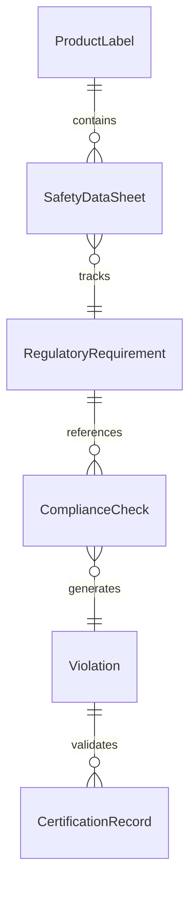
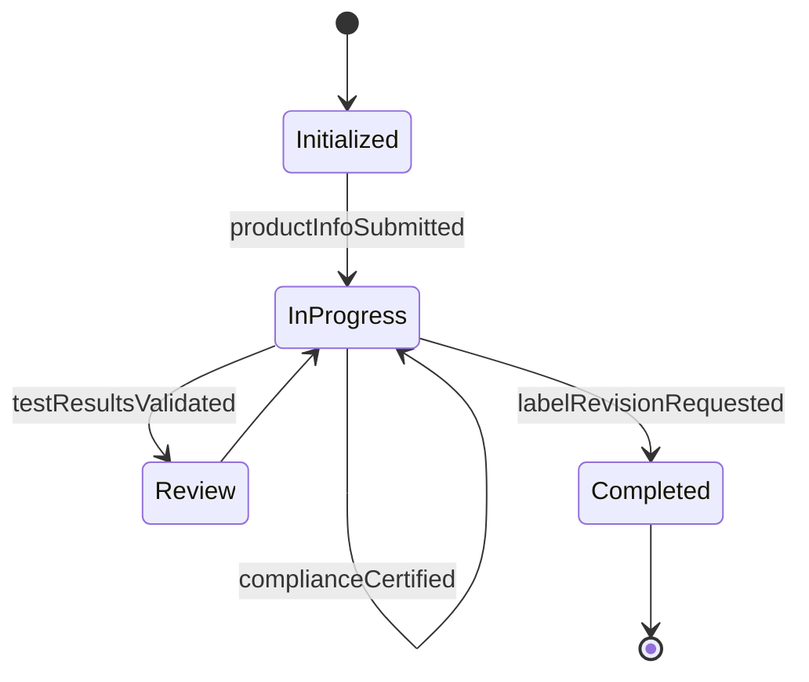
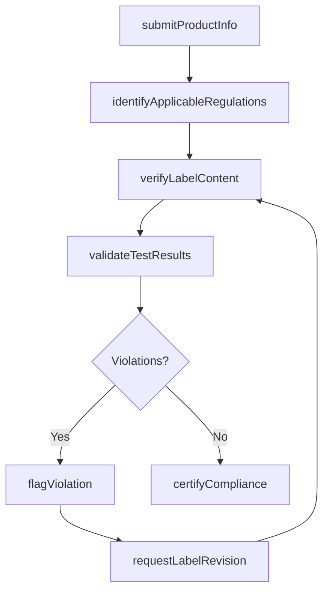
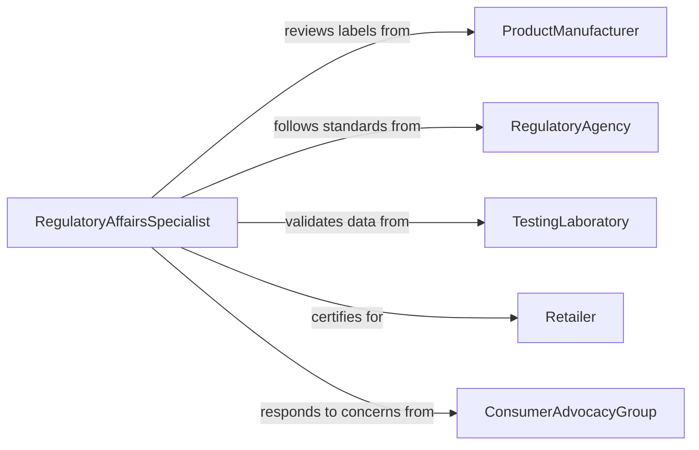

# Examine Product Information to Ensure Compliance with Regulations

> Business-as-Code definition for examining product information for regulatory compliance. Models the review of product labels, safety data sheets, nutritional facts, ingredient lists, and technical specifications against FDA, CPSC, EPA, and other regulatory requirements.

## Overview

Examining product information to ensure compliance with regulations involves reviewing product labels, packaging claims, safety warnings, ingredient disclosures, and technical documentation against applicable regulatory standards. This definition provides actions for product submission, regulation mapping, content verification, and compliance certification. It supports regulatory affairs teams, product managers, quality assurance departments, and legal advisors in consumer goods, food, pharmaceutical, and manufacturing industries.

## Actors

| Actor | Description |
|-------|-------------|
| ProductManufacturer | Creates product information and labeling for compliance review |
| RegulatoryAgency | Enforces product labeling and information standards |
| TestingLaboratory | Provides analytical results that support product claims |
| Retailer | Requires compliant product information before stocking shelves |
| ConsumerAdvocacyGroup | Monitors product claims and reports violations |
| ImportExportAuthority | Reviews product information for cross-border trade compliance |

## Roles

| Role | Description |
|------|-------------|
| RegulatoryAffairsSpecialist | Reviews product information against applicable regulations |
| LabelingCoordinator | Manages the creation and revision of product labels |
| QualityAssuranceManager | Ensures product documentation meets internal quality standards |
| ComplianceCounsel | Provides legal interpretation of regulatory requirements |

## Entities

| Entity | Description |
|--------|-------------|
| ProductLabel | The physical or digital label containing regulated product information |
| SafetyDataSheet | A standardized document describing chemical hazard and handling information |
| RegulatoryRequirement | A specific rule governing product labeling or information disclosure |
| ComplianceCheck | An evaluation of a product information element against a regulation |
| Violation | An identified instance of non-compliance in product information |
| CertificationRecord | Documentation confirming a product has passed compliance review |

## Actions

| Action | Description |
|--------|-------------|
| submitProductInfo | Provide product information for regulatory compliance review |
| identifyApplicableRegulations | Determine which regulations apply to the product category |
| verifyLabelContent | Check label text, warnings, and claims against regulatory requirements |
| validateTestResults | Confirm that laboratory results support product claims |
| flagViolation | Document a non-compliant element in the product information |
| certifyCompliance | Issue a compliance certification for the reviewed product |
| requestLabelRevision | Direct the manufacturer to correct non-compliant labeling |

## Events

| Event | Description |
|-------|-------------|
| productInfoSubmitted | Product information has been provided for compliance review |
| regulationsIdentified | Applicable regulations have been determined for the product |
| labelContentVerified | Label text and claims have been checked against requirements |
| testResultsValidated | Laboratory data supporting product claims has been confirmed |
| violationFlagged | A non-compliant element has been documented |
| complianceCertified | The product has received compliance certification |
| labelRevisionRequested | The manufacturer has been directed to correct labeling |

## Searches

| Search | Description |
|--------|-------------|
| findProductReviews | List product compliance reviews by product, date, or status |
| getViolations | Retrieve flagged violations by regulation, product, or severity |
| getCertifications | Find certified products by category or certification date |
| getPendingRevisions | Locate products awaiting label corrections |
| getRegulationMapping | View which regulations apply to a specific product category |


## Entity Relationships



## State Diagram


## Workflow



## Actor Relationships



## Usage

### Calling Actions

```typescript
import { examineProductInformationEnsureCompliance } from '@headlessly/examine-product-information-ensure-compliance'

const reviewer = examineProductInformationEnsureCompliance()

// Submit product labeling for review
const submission = await reviewer.submitProductInfo({
  productId: 'prod-sunscreen-spf50',
  category: 'over-the-counter-drug',
  labelVersion: '2.1',
  claims: ['SPF 50', 'Broad Spectrum', 'Water Resistant 80 min']
})

// Identify regulations and verify
await reviewer.identifyApplicableRegulations({
  submissionId: submission.id,
  regulations: ['FDA-OTC-sunscreen-monograph', 'FTC-advertising-guidelines']
})

await reviewer.verifyLabelContent({ submissionId: submission.id })

// Certify if compliant
await reviewer.certifyCompliance({ submissionId: submission.id })
```

### Event-Driven Automation

```typescript
// Escalate critical violations
reviewer.violationFlagged(async ({ submissionId, productId, regulation, severity }) => {
  if (severity === 'critical') {
    await notify({
      to: 'compliance-counsel',
      message: `Critical violation on ${productId}: ${regulation}`
    })
  }
})

// Notify retail partners when certification is issued
reviewer.complianceCertified(async ({ productId, certificationId }) => {
  await notifyRetailPartners({ productId, certificationId })
})
```
