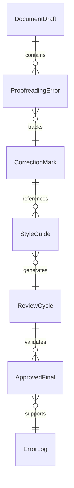
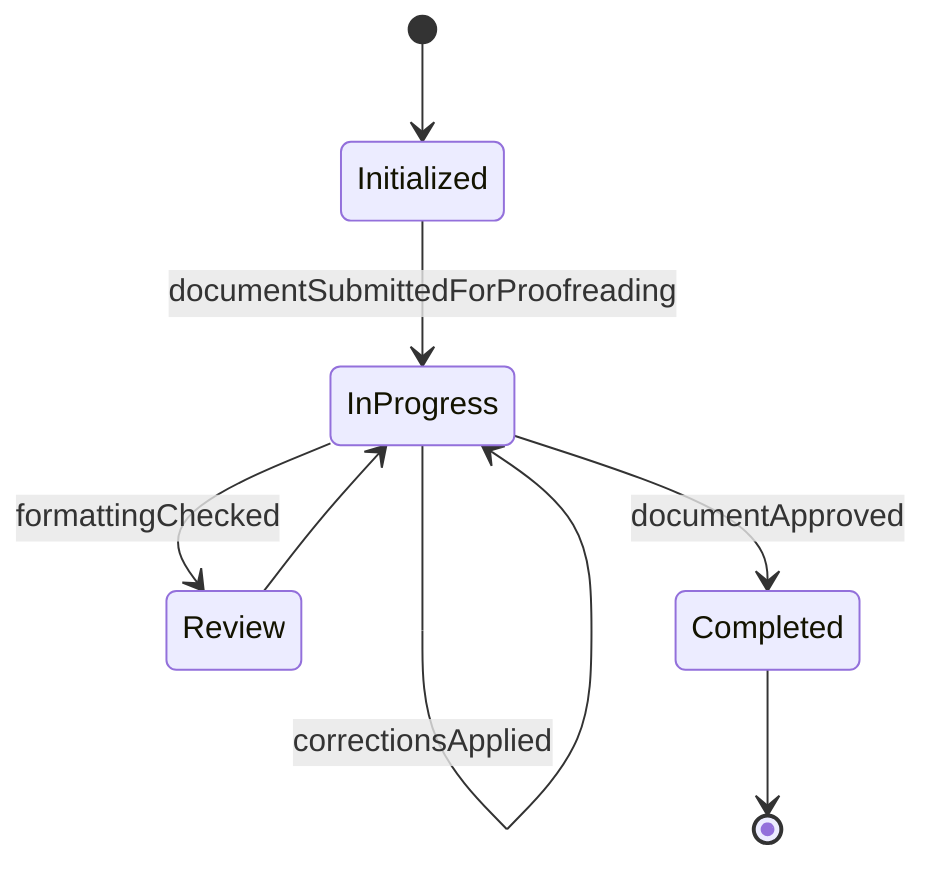
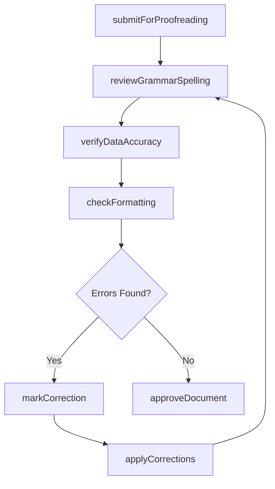
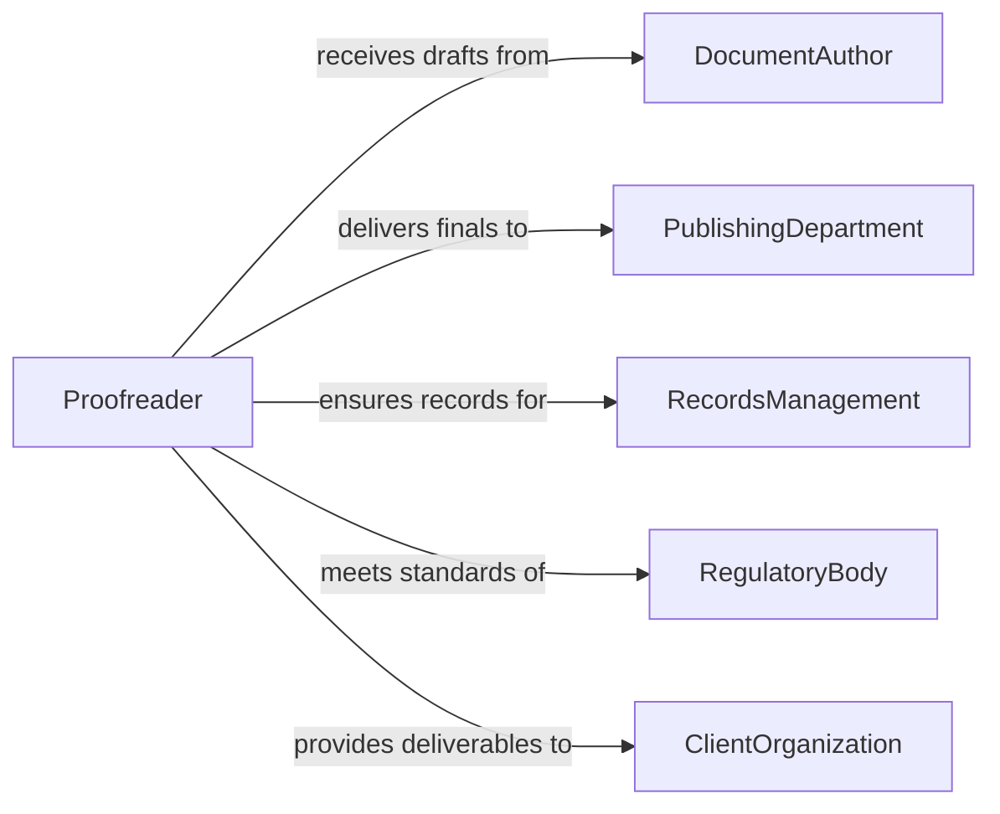

# Proofread Documents, Records, or Other Files to Ensure Accuracy

> Business-as-Code definition for proofreading documents, records, and files for accuracy. Models the systematic review of written materials for errors in grammar, formatting, data consistency, and factual correctness before finalization or publication.

## Overview

Proofreading documents, records, or other files to ensure accuracy involves examining written content for typographical errors, grammatical mistakes, formatting inconsistencies, data discrepancies, and factual inaccuracies. This definition provides actions for document submission, error detection, correction tracking, and final approval. It supports editors, administrative professionals, records managers, quality control teams, and publishing departments across industries.

## Actors

| Actor | Description |
|-------|-------------|
| DocumentAuthor | Creates the original content submitted for proofreading |
| PublishingDepartment | Requires error-free documents before release or distribution |
| RecordsManagement | Maintains official records that must be accurate and complete |
| RegulatoryBody | Mandates accuracy standards for filed documents or reports |
| ClientOrganization | Receives deliverable documents that must meet quality standards |

## Roles

| Role | Description |
|------|-------------|
| Proofreader | Reviews documents for errors in grammar, spelling, and formatting |
| DataVerifier | Cross-checks numerical data and references for accuracy |
| QualityReviewer | Performs final quality assessment before document release |
| EditorialSupervisor | Manages the proofreading workflow and assigns review priorities |

## Entities

| Entity | Description |
|--------|-------------|
| DocumentDraft | A version of a document submitted for proofreading review |
| ProofreadingError | An identified mistake in grammar, spelling, data, or formatting |
| CorrectionMark | An annotation indicating a specific change to be made |
| StyleGuide | A reference document defining formatting and writing standards |
| ReviewCycle | A single pass through the document for error identification |
| ApprovedFinal | The document version cleared for publication or filing |
| ErrorLog | A record of all errors found and corrections applied |

## Actions

| Action | Description |
|--------|-------------|
| submitForProofreading | Send a document draft for accuracy review |
| reviewGrammarSpelling | Check the document for grammatical and spelling errors |
| verifyDataAccuracy | Cross-check numerical values, dates, and references against source material |
| checkFormatting | Verify consistency with style guide and formatting standards |
| markCorrection | Annotate a specific error with the required correction |
| applyCorrections | Implement all marked corrections in the document |
| approveDocument | Clear the proofread document for finalization or release |

## Events

| Event | Description |
|-------|-------------|
| documentSubmittedForProofreading | A document has been received for accuracy review |
| grammarSpellingReviewed | Grammar and spelling check has been completed |
| dataAccuracyVerified | Numerical and reference data has been cross-checked |
| formattingChecked | Document formatting has been verified against standards |
| correctionMarked | An error has been annotated with the required fix |
| correctionsApplied | All marked corrections have been implemented |
| documentApproved | The document has been cleared for finalization |

## Searches

| Search | Description |
|--------|-------------|
| findDocumentsForReview | List documents pending proofreading by author, type, or deadline |
| getErrors | Retrieve identified errors by category, severity, or document |
| getPendingCorrections | Find documents with unapplied corrections |
| getReviewHistory | Track proofreading cycles and error rates for a document |
| getApprovedDocuments | List finalized documents by date or department |


## Entity Relationships



## State Diagram


## Workflow



## Actor Relationships



## Usage

### Calling Actions

```typescript
import { proofreadDocumentsRecordsFilesEnsure } from '@headlessly/proofread-documents-records-files-ensure'

const proofreader = proofreadDocumentsRecordsFilesEnsure()

// Submit a report for proofreading
const review = await proofreader.submitForProofreading({
  documentId: 'annual-report-2026-draft-v3',
  type: 'annual-report',
  author: 'finance-dept',
  styleGuide: 'corporate-style-guide-v2'
})

// Run review checks
await proofreader.reviewGrammarSpelling({ reviewId: review.id })
await proofreader.verifyDataAccuracy({
  reviewId: review.id,
  sourceMaterials: ['q1-financials', 'q2-financials', 'q3-financials', 'q4-financials']
})
await proofreader.checkFormatting({ reviewId: review.id })

// Approve if clean
await proofreader.approveDocument({ reviewId: review.id })
```

### Event-Driven Automation

```typescript
// Notify author when corrections are needed
proofreader.correctionMarked(async ({ documentId, errorCount, author }) => {
  await notify({
    to: author,
    message: `${errorCount} corrections marked on ${documentId}. Review and confirm changes.`
  })
})

// Distribute approved document
proofreader.documentApproved(async ({ documentId, type }) => {
  await distribute({ documentId, channels: ['publishing', 'records-management'] })
})
```
