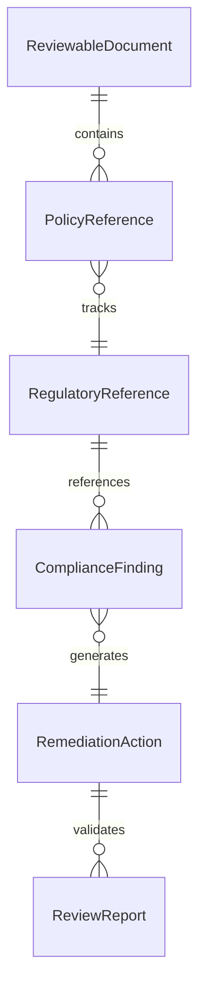
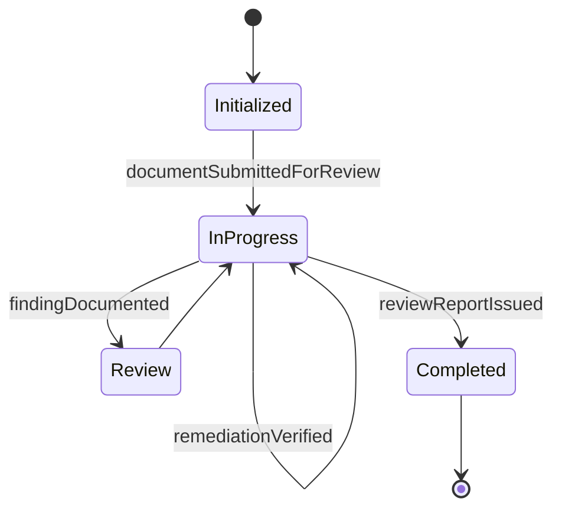
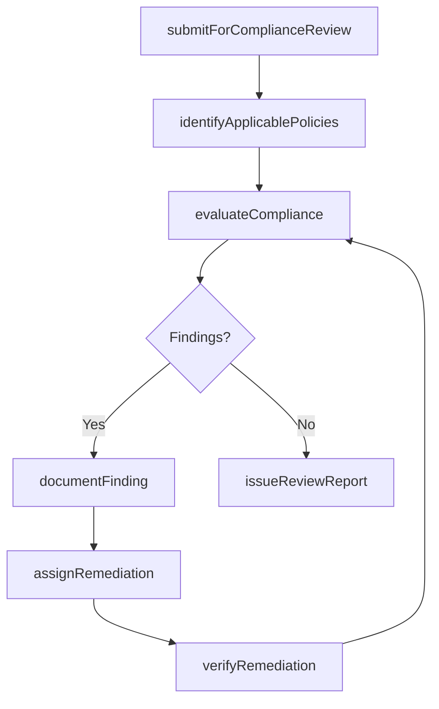
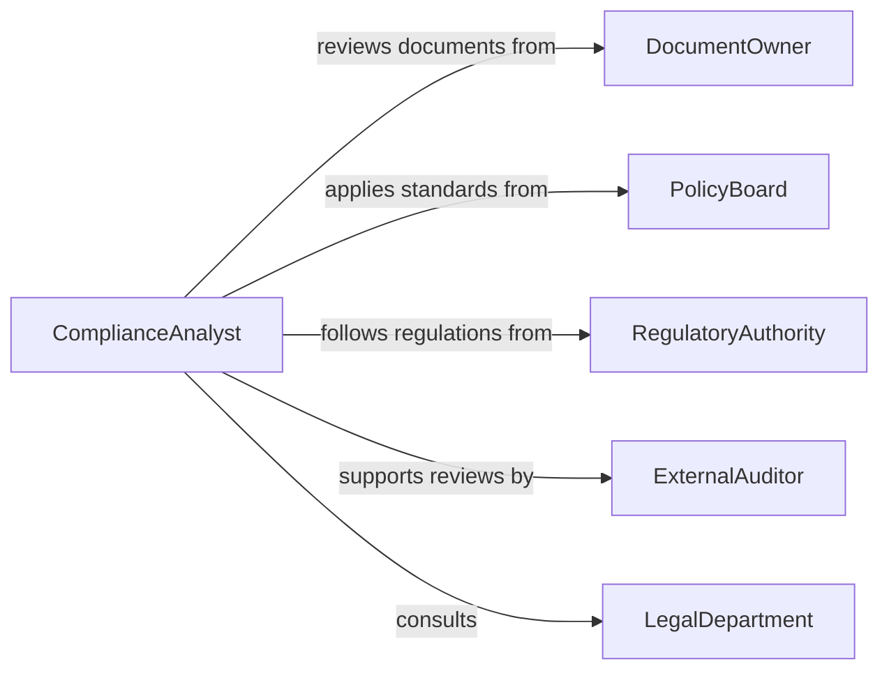

# Review Documents or Materials for Compliance with Policies or Regulations

> Business-as-Code definition for reviewing documents and materials for policy and regulatory compliance. Models the evaluation of business documents, operational materials, and procedural records against organizational policies and external regulations.

## Overview

Reviewing documents or materials for compliance with policies or regulations involves systematically examining business records, operational documents, and procedural materials to confirm they satisfy internal policies and external regulatory mandates. This definition provides actions for submission intake, policy identification, compliance evaluation, finding documentation, and resolution tracking. It supports compliance departments, risk management teams, quality assurance groups, and internal audit functions.

## Actors

| Actor | Description |
|-------|-------------|
| DocumentOwner | The department or individual responsible for the material under review |
| PolicyBoard | Establishes internal policies that documents must satisfy |
| RegulatoryAuthority | Enforces external regulations applicable to the materials |
| ExternalAuditor | Independently reviews compliance review processes and outcomes |
| LegalDepartment | Provides interpretation of regulatory and policy requirements |

## Roles

| Role | Description |
|------|-------------|
| ComplianceAnalyst | Evaluates documents against applicable policies and regulations |
| PolicyAdvisor | Clarifies policy intent and scope during reviews |
| ReviewCoordinator | Manages the review workflow and tracks remediation activities |
| ChiefComplianceOfficer | Provides final sign-off on compliance determinations |

## Entities

| Entity | Description |
|--------|-------------|
| ReviewableDocument | A document or material submitted for compliance evaluation |
| PolicyReference | An internal policy applicable to the document under review |
| RegulatoryReference | An external regulation the document must comply with |
| ComplianceFinding | An identified gap between the document and a policy or regulation |
| RemediationAction | A corrective step to address a compliance finding |
| ReviewReport | A summary of the compliance review with findings and disposition |

## Actions

| Action | Description |
|--------|-------------|
| submitForComplianceReview | Send a document or material for policy and regulatory evaluation |
| identifyApplicablePolicies | Determine which policies and regulations apply to the document |
| evaluateCompliance | Compare document content against identified policies and regulations |
| documentFinding | Record a specific compliance gap or violation |
| assignRemediation | Direct the document owner to correct identified findings |
| verifyRemediation | Confirm that corrective actions have been implemented |
| issueReviewReport | Produce a formal compliance review summary |

## Events

| Event | Description |
|-------|-------------|
| documentSubmittedForReview | A document has been received for compliance evaluation |
| policiesIdentified | Applicable policies and regulations have been determined |
| complianceEvaluated | The document has been assessed against all applicable standards |
| findingDocumented | A compliance gap has been formally recorded |
| remediationAssigned | The document owner has been directed to correct a finding |
| remediationVerified | Corrective actions have been confirmed as implemented |
| reviewReportIssued | A compliance review summary has been produced |

## Searches

| Search | Description |
|--------|-------------|
| findReviews | List compliance reviews by document type, owner, or status |
| getFindings | Retrieve compliance findings by policy, severity, or date |
| getPendingRemediations | Find findings awaiting corrective action |
| getReviewReports | Locate completed review reports by period or department |
| getComplianceTrends | Analyze finding rates across departments or policy areas over time |


## Entity Relationships



## State Diagram


## Workflow



## Actor Relationships



## Usage

### Calling Actions

```typescript
import { reviewDocumentsMaterialsCompliancePolicies } from '@headlessly/review-documents-materials-compliance-policies'

const reviewer = reviewDocumentsMaterialsCompliancePolicies()

// Submit a vendor contract for compliance review
const review = await reviewer.submitForComplianceReview({
  documentId: 'contract-vendor-2026-0088',
  type: 'vendor-agreement',
  owner: 'procurement-dept'
})

// Identify policies and evaluate
await reviewer.identifyApplicablePolicies({
  reviewId: review.id,
  policies: ['vendor-risk-policy-v4', 'data-protection-standard'],
  regulations: ['GDPR-article-28', 'SOX-section-404']
})

const evaluation = await reviewer.evaluateCompliance({ reviewId: review.id })
```

### Event-Driven Automation

```typescript
// Auto-assign remediation to document owner
reviewer.findingDocumented(async ({ reviewId, findingId, owner }) => {
  await reviewer.assignRemediation({
    findingId,
    assignee: owner,
    deadline: daysFromNow(14)
  })
})

// Distribute review report on completion
reviewer.reviewReportIssued(async ({ reviewId, reportId }) => {
  await distribute({
    reportId,
    recipients: ['compliance-committee', 'cco-office']
  })
})
```
