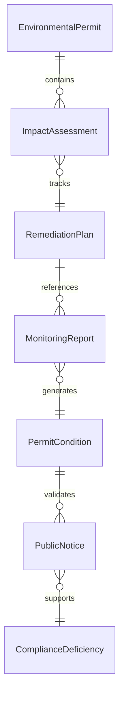
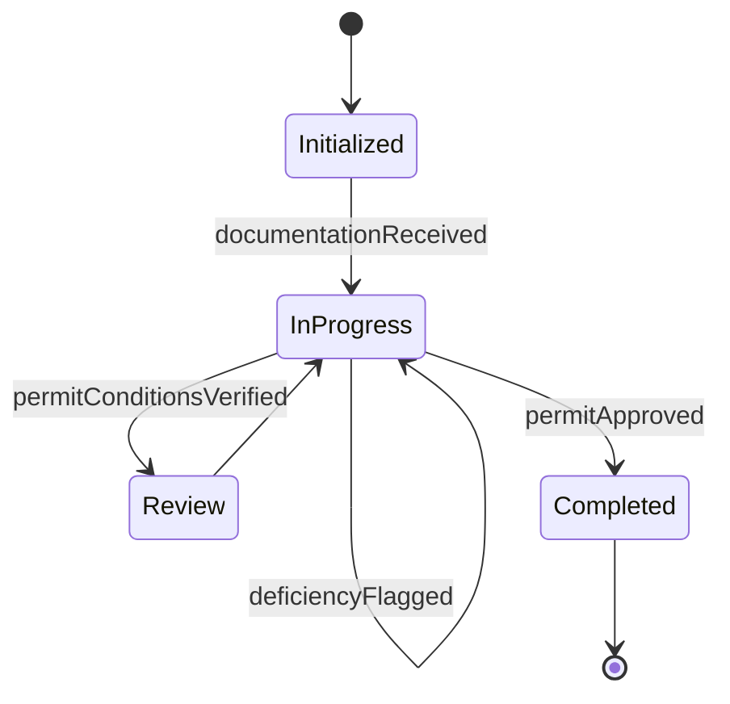
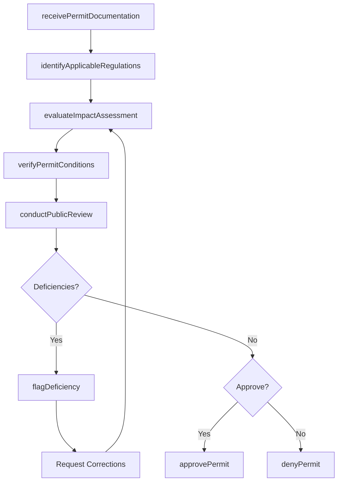
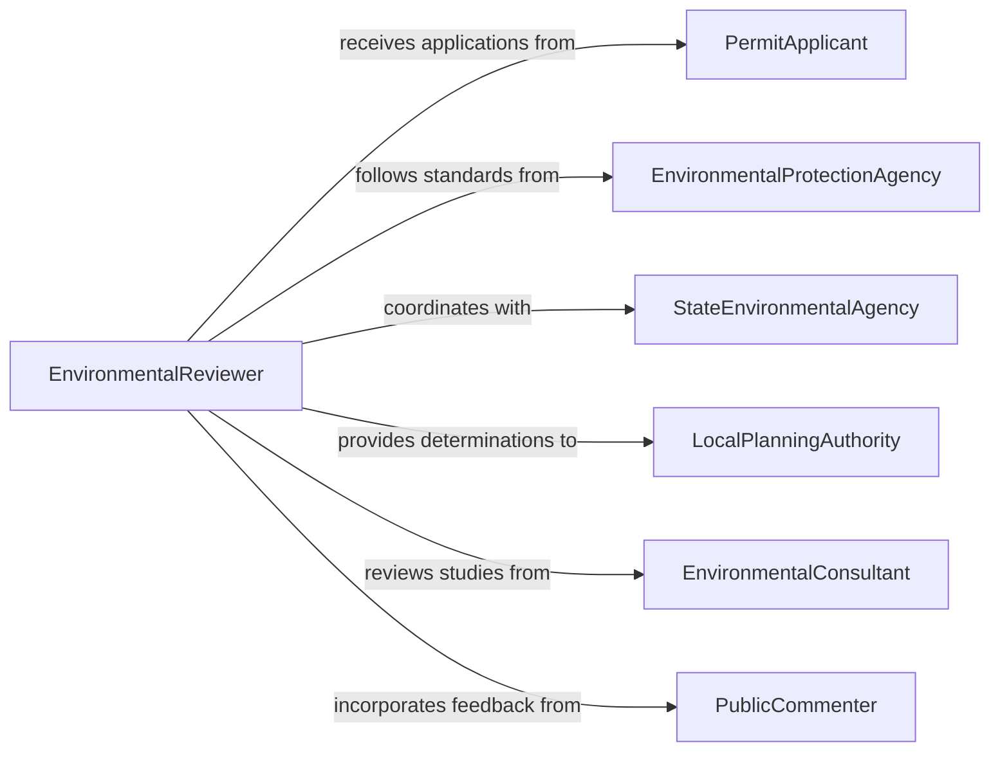

# Review Environmental Permits, Plans, or Reports

> Business-as-Code definition for reviewing environmental permits, plans, and reports. Models the evaluation of environmental impact assessments, discharge permits, remediation plans, and monitoring reports against federal, state, and local environmental regulations.

## Overview

Reviewing environmental permits, plans, or reports involves examining permit applications, environmental impact statements, stormwater management plans, air quality reports, and remediation documentation to verify compliance with EPA, state environmental agency, and local regulatory requirements. This definition provides actions for document intake, regulatory cross-referencing, condition verification, and approval processing. It supports environmental compliance officers, permitting agencies, environmental consultants, and land use planners.

## Actors

| Actor | Description |
|-------|-------------|
| PermitApplicant | Submits permit applications and supporting environmental documentation |
| EnvironmentalProtectionAgency | Sets federal environmental standards and reviews permit compliance |
| StateEnvironmentalAgency | Administers state-level environmental permits and regulations |
| LocalPlanningAuthority | Reviews environmental documentation for zoning and land use decisions |
| EnvironmentalConsultant | Prepares environmental assessments and plans on behalf of applicants |
| PublicCommenter | Provides input during public review periods for environmental permits |

## Roles

| Role | Description |
|------|-------------|
| EnvironmentalReviewer | Evaluates permits, plans, and reports against regulatory standards |
| PermitCoordinator | Manages the permit review workflow and tracks deadlines |
| ComplianceInspector | Verifies that permit conditions are being met in the field |
| SeniorEnvironmentalOfficer | Makes final determinations on permit approvals and enforcement actions |

## Entities

| Entity | Description |
|--------|-------------|
| EnvironmentalPermit | An authorization to conduct activities that affect the environment |
| ImpactAssessment | A study evaluating potential environmental effects of a proposed project |
| RemediationPlan | A document outlining steps to clean up contaminated sites |
| MonitoringReport | Periodic data submissions demonstrating ongoing permit compliance |
| PermitCondition | A specific requirement attached to an environmental authorization |
| PublicNotice | A formal announcement of permit activity open for public comment |
| ComplianceDeficiency | An identified failure to meet a permit condition or regulation |

## Actions

| Action | Description |
|--------|-------------|
| receivePermitDocumentation | Accept environmental permits, plans, or reports for review |
| identifyApplicableRegulations | Determine which federal, state, and local regulations apply |
| evaluateImpactAssessment | Review environmental impact studies for completeness and accuracy |
| verifyPermitConditions | Confirm that permit conditions align with regulatory requirements |
| conductPublicReview | Open the permit documentation for public comment |
| flagDeficiency | Document a regulatory gap or non-compliant element |
| approvePermit | Grant the environmental permit with applicable conditions |
| denyPermit | Reject the permit application with documented reasons |

## Events

| Event | Description |
|-------|-------------|
| documentationReceived | Environmental permit documentation has been submitted for review |
| regulationsIdentified | Applicable environmental regulations have been determined |
| impactAssessmentEvaluated | The environmental impact study has been reviewed |
| permitConditionsVerified | Permit conditions have been checked against regulations |
| publicReviewOpened | The permit documentation has been made available for public comment |
| deficiencyFlagged | A regulatory gap or non-compliance has been identified |
| permitApproved | The environmental permit has been granted |
| permitDenied | The permit application has been rejected |

## Searches

| Search | Description |
|--------|-------------|
| findPermitReviews | List permit reviews by applicant, type, date, or status |
| getDeficiencies | Retrieve flagged deficiencies by regulation or project |
| getPendingPublicComments | Find permits currently in public review period |
| getPermitConditions | View conditions attached to a specific permit |
| getComplianceHistory | Track permit compliance records for a specific facility or project |


## Entity Relationships



## State Diagram


## Workflow



## Actor Relationships



## Usage

### Calling Actions

```typescript
import { reviewEnvironmentalPermitsPlansReports } from '@headlessly/review-environmental-permits-plans-reports'

const reviewer = reviewEnvironmentalPermitsPlansReports()

// Receive permit documentation
const review = await reviewer.receivePermitDocumentation({
  applicantId: 'greenfield-development-corp',
  permitType: 'stormwater-discharge',
  projectName: 'Riverside Industrial Park Phase 2',
  documents: ['impact-assessment', 'drainage-plan', 'water-quality-monitoring-plan']
})

// Identify regulations and evaluate
await reviewer.identifyApplicableRegulations({
  reviewId: review.id,
  regulations: ['CWA-NPDES', 'state-stormwater-general-permit', 'local-watershed-ordinance']
})

await reviewer.evaluateImpactAssessment({ reviewId: review.id })

// Approve with conditions
await reviewer.approvePermit({
  reviewId: review.id,
  conditions: ['quarterly-monitoring-reports', 'best-management-practices-installation']
})
```

### Event-Driven Automation

```typescript
// Notify applicant of deficiencies
reviewer.deficiencyFlagged(async ({ reviewId, applicantId, deficiencyType }) => {
  await notify({
    to: applicantId,
    message: `Environmental permit deficiency: ${deficiencyType}. Please submit corrections.`
  })
})

// Schedule compliance inspection after permit approval
reviewer.permitApproved(async ({ reviewId, permitId }) => {
  await scheduleInspection({ permitId, type: 'initial-compliance', daysFromNow: 90 })
})
```
