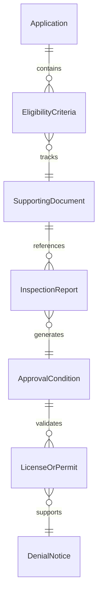
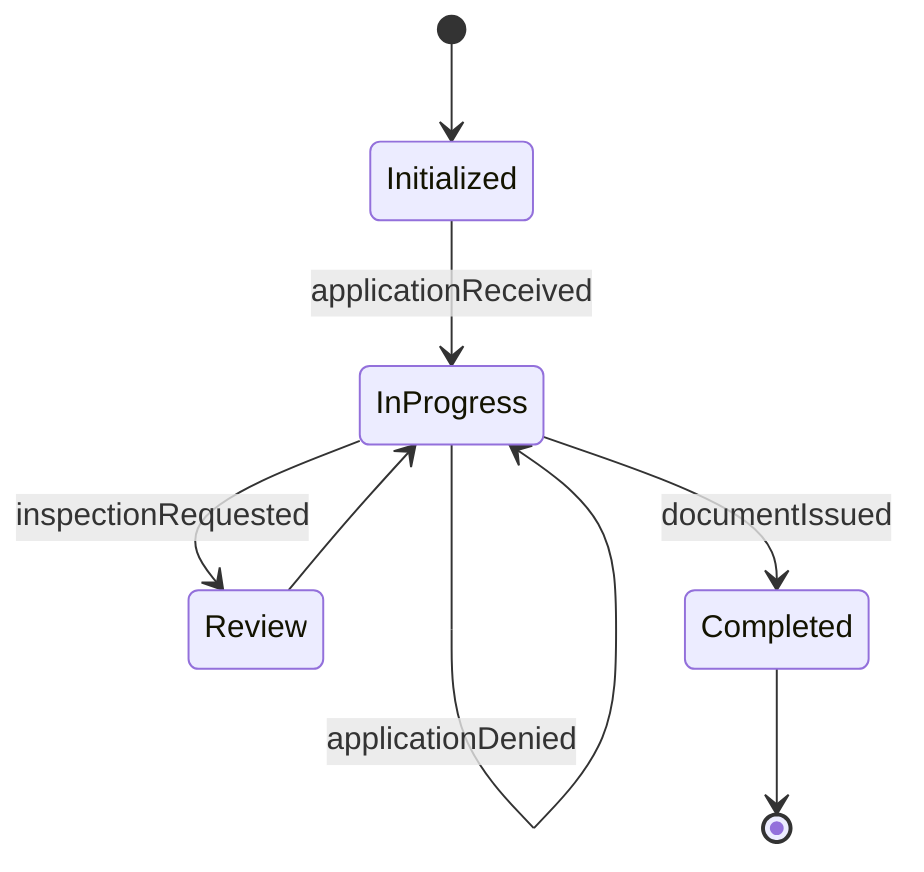
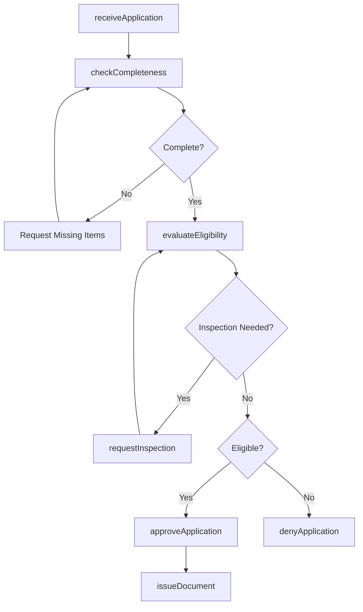
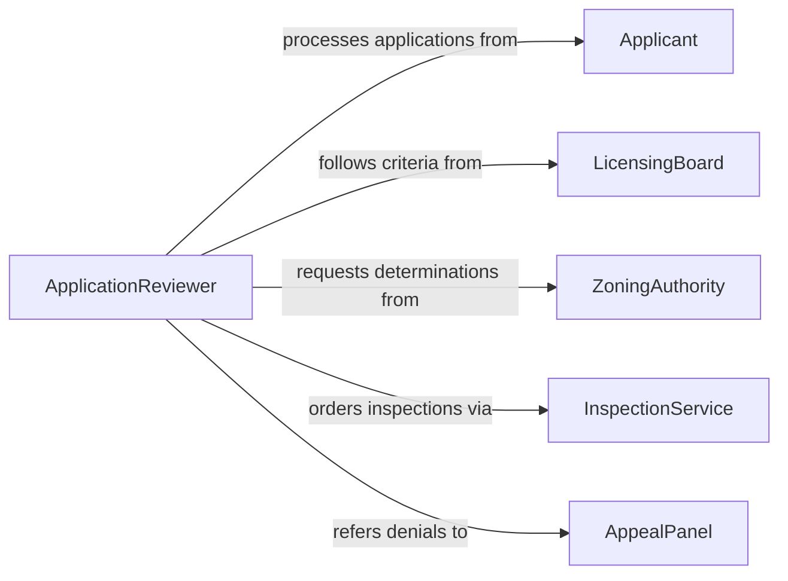

# Review License or Permit Applications

> Business-as-Code definition for reviewing license and permit applications. Models the intake, evaluation, and adjudication of applications for business licenses, building permits, professional certifications, and other regulated authorizations.

## Overview

Reviewing license or permit applications involves receiving applications, verifying submitted documentation, evaluating eligibility against statutory or regulatory criteria, and issuing approval or denial decisions. This definition provides actions for application intake, completeness checking, criteria evaluation, conditional approval, and issuance. It supports licensing boards, municipal permitting offices, professional certification bodies, and regulatory agencies.

## Actors

| Actor | Description |
|-------|-------------|
| Applicant | Submits an application for a license or permit |
| LicensingBoard | Establishes eligibility criteria and issues licenses |
| ZoningAuthority | Provides land use and zoning determinations for permit reviews |
| InspectionService | Conducts site inspections required before permit issuance |
| AppealPanel | Reviews contested application decisions |
| FeeCollectionOffice | Processes application and issuance fees |

## Roles

| Role | Description |
|------|-------------|
| ApplicationReviewer | Evaluates applications against eligibility criteria |
| PermitCoordinator | Manages the application workflow and tracks milestones |
| LicensingOfficer | Makes final issuance or denial decisions |
| ComplianceExaminer | Verifies that applicants meet all regulatory prerequisites |

## Entities

| Entity | Description |
|--------|-------------|
| Application | A formal request for a license or permit with supporting documents |
| EligibilityCriteria | The statutory or regulatory requirements for approval |
| SupportingDocument | Plans, certificates, or records submitted with the application |
| InspectionReport | Findings from a required site or facility inspection |
| ApprovalCondition | A stipulation that must be met before or after issuance |
| LicenseOrPermit | The issued authorization document |
| DenialNotice | A formal communication of application rejection with reasons |

## Actions

| Action | Description |
|--------|-------------|
| receiveApplication | Accept and log a new license or permit application |
| checkCompleteness | Verify that all required documents and fees have been submitted |
| evaluateEligibility | Assess the application against statutory criteria |
| requestInspection | Order a site or facility inspection as part of the review |
| approveApplication | Grant the license or permit, with or without conditions |
| denyApplication | Reject the application with documented reasons |
| issueDocument | Generate and deliver the official license or permit document |

## Events

| Event | Description |
|-------|-------------|
| applicationReceived | A new application has been logged for review |
| completenessChecked | The application has been assessed for required materials |
| eligibilityEvaluated | The application has been compared against approval criteria |
| inspectionRequested | A site inspection has been ordered for the application |
| applicationApproved | The license or permit has been granted |
| applicationDenied | The application has been rejected |
| documentIssued | The official license or permit has been generated and delivered |

## Searches

| Search | Description |
|--------|-------------|
| findApplications | List applications by type, applicant, date, or status |
| getPendingReviews | Retrieve applications awaiting eligibility evaluation |
| getInspectionStatus | Check the status of inspections associated with applications |
| getDenials | Find denied applications by reason or period |
| getIssuedLicenses | List active licenses or permits by type, holder, or expiration |


## Entity Relationships



## State Diagram


## Workflow



## Actor Relationships



## Usage

### Calling Actions

```typescript
import { reviewLicensePermitApplications } from '@headlessly/review-license-permit-applications'

const reviewer = reviewLicensePermitApplications()

// Receive a building permit application
const app = await reviewer.receiveApplication({
  type: 'commercial-building-permit',
  applicantId: 'builder-apex-022',
  projectAddress: '1400 Industrial Blvd',
  documents: ['site-plan', 'structural-drawings', 'environmental-assessment']
})

// Check completeness and evaluate
await reviewer.checkCompleteness({ applicationId: app.id })
await reviewer.evaluateEligibility({
  applicationId: app.id,
  criteria: ['zoning-commercial', 'setback-requirements', 'fire-code']
})

// Approve and issue
await reviewer.approveApplication({
  applicationId: app.id,
  conditions: ['complete-final-inspection-before-occupancy']
})
await reviewer.issueDocument({ applicationId: app.id })
```

### Event-Driven Automation

```typescript
// Schedule inspection when eligibility evaluation requires it
reviewer.eligibilityEvaluated(async ({ applicationId, inspectionRequired }) => {
  if (inspectionRequired) {
    await reviewer.requestInspection({ applicationId, type: 'site-visit' })
  }
})

// Notify applicant of decision
reviewer.applicationApproved(async ({ applicationId, applicantId }) => {
  await notify({ to: applicantId, message: 'Your permit application has been approved.' })
})

reviewer.applicationDenied(async ({ applicationId, applicantId, reasons }) => {
  await notify({ to: applicantId, message: `Permit denied: ${reasons.join(', ')}` })
})
```
