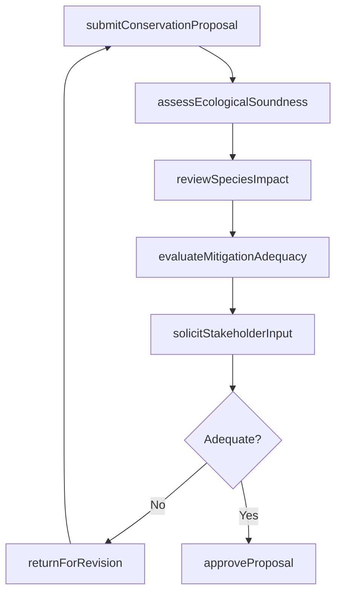
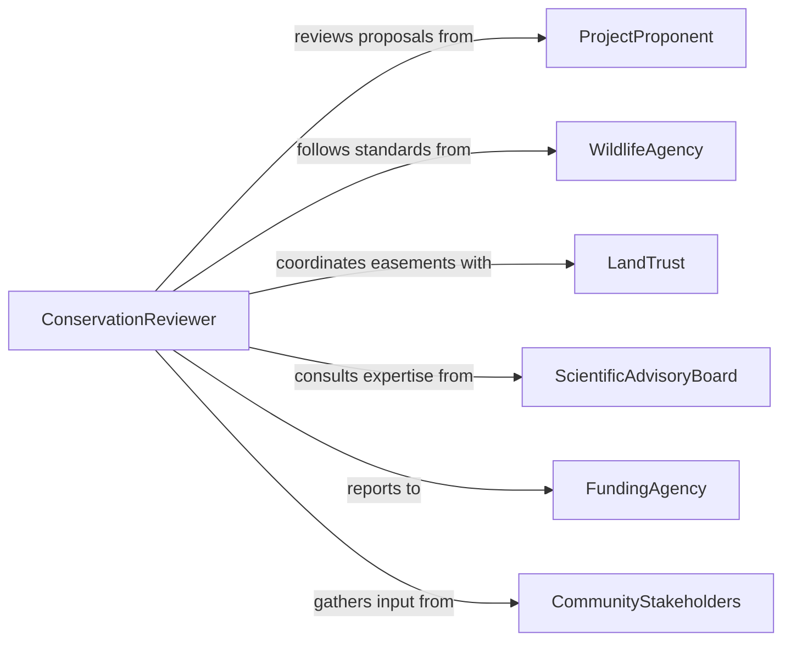

# Review Plans or Proposals for Environmental Conservation

> Business-as-Code definition for reviewing plans and proposals for environmental conservation. Models the evaluation of habitat restoration plans, species protection proposals, land conservation strategies, and natural resource management plans against ecological standards and regulatory frameworks.

## Overview

Reviewing plans or proposals for environmental conservation involves evaluating habitat management plans, wildlife corridor proposals, wetland mitigation strategies, and conservation easement applications for ecological soundness, regulatory compliance, and implementation feasibility. This definition provides actions for proposal intake, scientific review, stakeholder consultation, and approval determination. It supports conservation biologists, natural resource managers, land trusts, and environmental regulatory agencies.

## Actors

| Actor | Description |
|-------|-------------|
| ProjectProponent | Submits conservation plans or proposals for review |
| WildlifeAgency | Sets species protection standards and reviews habitat plans |
| LandTrust | Manages conservation easements and land protection programs |
| ScientificAdvisoryBoard | Provides ecological expertise for plan evaluation |
| FundingAgency | Finances conservation projects and requires plan approval |
| CommunityStakeholders | Local residents and organizations affected by conservation proposals |

## Roles

| Role | Description |
|------|-------------|
| ConservationReviewer | Evaluates plans against ecological and regulatory criteria |
| EcologicalSpecialist | Assesses scientific validity of conservation approaches |
| PolicyAnalyst | Reviews proposals for alignment with conservation policy mandates |
| ProgramDirector | Makes final approval decisions on conservation plans |

## Entities

| Entity | Description |
|--------|-------------|
| ConservationPlan | A detailed strategy for protecting or restoring natural resources |
| HabitatAssessment | A scientific evaluation of ecological conditions in a target area |
| SpeciesImpactAnalysis | A study of how proposed actions affect threatened or endangered species |
| MitigationStrategy | A plan to offset unavoidable environmental impacts |
| ConservationEasement | A legal agreement restricting land use to protect ecological values |
| StakeholderComment | Input from community members or organizations on a proposal |
| ReviewDetermination | The formal outcome of the conservation plan evaluation |

## Actions

| Action | Description |
|--------|-------------|
| submitConservationProposal | Accept a conservation plan or proposal for review |
| assessEcologicalSoundness | Evaluate the scientific basis and feasibility of the plan |
| reviewSpeciesImpact | Analyze effects on threatened, endangered, or sensitive species |
| evaluateMitigationAdequacy | Determine if proposed mitigation measures are sufficient |
| solicitStakeholderInput | Gather community and expert feedback on the proposal |
| approveProposal | Grant approval for the conservation plan with conditions |
| returnForRevision | Send the proposal back with required modifications |

## Events

| Event | Description |
|-------|-------------|
| proposalSubmitted | A conservation plan has been received for review |
| ecologicalSoundnessAssessed | The scientific basis of the plan has been evaluated |
| speciesImpactReviewed | Effects on protected species have been analyzed |
| mitigationAdequacyEvaluated | Proposed mitigation measures have been assessed |
| stakeholderInputCollected | Community and expert feedback has been gathered |
| proposalApproved | The conservation plan has been approved |
| proposalReturnedForRevision | The proposal has been sent back for modifications |

## Searches

| Search | Description |
|--------|-------------|
| findProposals | List conservation proposals by proponent, type, or status |
| getSpeciesImpacts | Retrieve species impact analyses by species or project area |
| getPendingReviews | Find proposals awaiting ecological or policy review |
| getStakeholderComments | View community input for a specific proposal |
| getApprovedPlans | List approved conservation plans by region or program |

## Workflow



## Actor Relationships



## Usage

### Calling Actions

```typescript
import { reviewPlansProposalsEnvironmentalConservation } from '@headlessly/review-plans-proposals-environmental-conservation'

const reviewer = reviewPlansProposalsEnvironmentalConservation()

// Submit a habitat restoration proposal
const proposal = await reviewer.submitConservationProposal({
  title: 'Elk Creek Riparian Corridor Restoration',
  proponentId: 'watershed-council-northwest',
  type: 'habitat-restoration',
  targetArea: 'elk-creek-watershed-unit-7',
  documents: ['restoration-plan', 'habitat-assessment', 'species-survey']
})

// Evaluate ecological soundness and species impact
await reviewer.assessEcologicalSoundness({ proposalId: proposal.id })
await reviewer.reviewSpeciesImpact({
  proposalId: proposal.id,
  species: ['steelhead-trout', 'western-pond-turtle']
})

// Approve the proposal
await reviewer.approveProposal({
  proposalId: proposal.id,
  conditions: ['annual-monitoring-for-5-years', 'native-plant-revegetation']
})
```

### Event-Driven Automation

```typescript
// Notify funding agency when proposal is approved
reviewer.proposalApproved(async ({ proposalId, title }) => {
  await notify({
    to: 'conservation-grant-program',
    message: `Conservation plan approved: ${title}. Ready for funding release.`
  })
})

// Alert proponent when revisions are needed
reviewer.proposalReturnedForRevision(async ({ proposalId, proponentId, issues }) => {
  await notify({
    to: proponentId,
    message: `Proposal requires revisions: ${issues.join(', ')}`
  })
})
```
