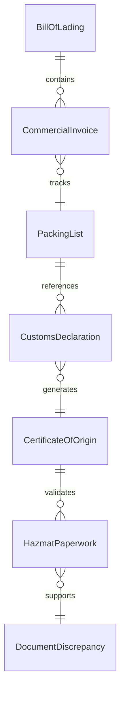
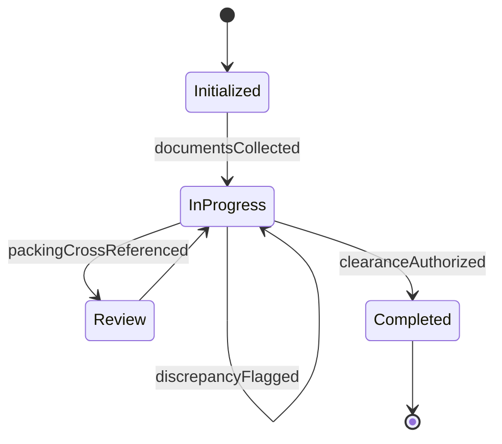
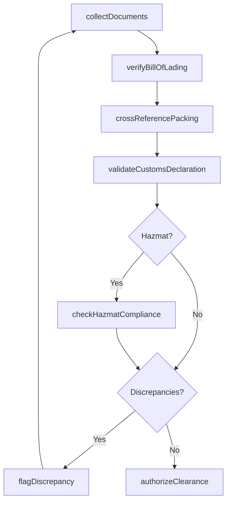
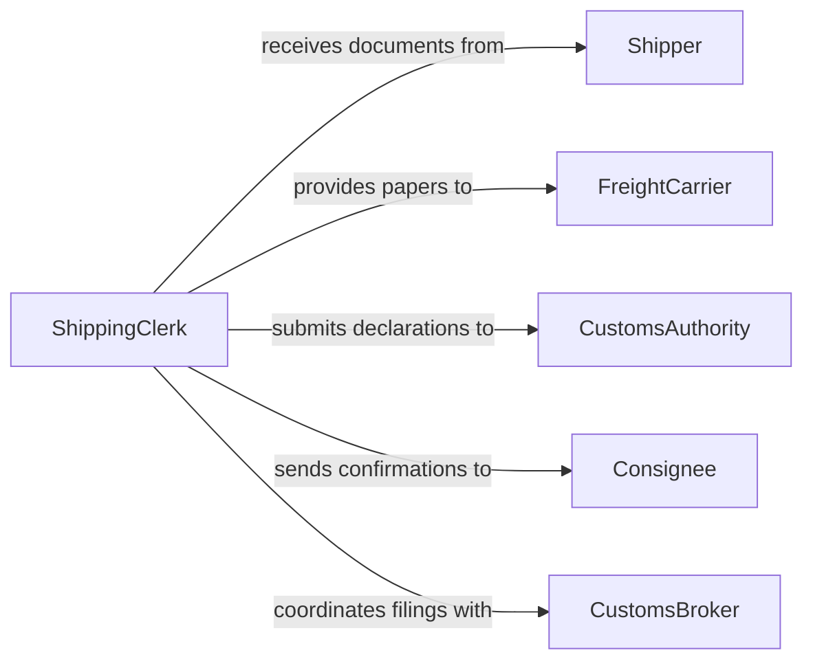

# Verify Shipping Documentation

> Business-as-Code definition for verifying shipping documentation. Models the examination of bills of lading, customs declarations, packing lists, and certificates of origin to ensure accuracy, completeness, and regulatory compliance for domestic and international shipments.

## Overview

Verifying shipping documentation involves checking bills of lading, commercial invoices, packing lists, customs declarations, and hazardous materials paperwork against shipment contents, trade regulations, and carrier requirements. This definition provides actions for document collection, content verification, discrepancy identification, and clearance authorization. It supports logistics coordinators, customs brokers, freight forwarders, and trade compliance teams.

## Actors

| Actor | Description |
|-------|-------------|
| Shipper | Originates the shipment and provides initial documentation |
| FreightCarrier | Transports goods and requires compliant shipping papers |
| CustomsAuthority | Reviews documentation for import and export compliance |
| Consignee | Receives the shipment and needs accurate delivery documentation |
| CustomsBroker | Prepares and submits customs documentation on behalf of the shipper |
| InsuranceUnderwriter | Requires shipping documentation for cargo coverage |

## Roles

| Role | Description |
|------|-------------|
| ShippingClerk | Collects and reviews shipping documents for accuracy |
| TradeComplianceOfficer | Ensures documentation meets international trade regulations |
| DocumentationSpecialist | Prepares and formats shipping papers to carrier and regulatory standards |
| WarehouseSupervisor | Verifies packing lists against actual shipment contents |

## Entities

| Entity | Description |
|--------|-------------|
| BillOfLading | A carrier-issued document detailing the shipment contents and terms |
| CommercialInvoice | A document stating the value and description of goods for customs |
| PackingList | An itemized listing of the contents of each package in a shipment |
| CustomsDeclaration | A form declaring goods for import or export clearance |
| CertificateOfOrigin | Documentation certifying the country where goods were manufactured |
| HazmatPaperwork | Documentation for hazardous materials classification and handling |
| DocumentDiscrepancy | A mismatch between shipping documents and actual shipment data |

## Actions

| Action | Description |
|--------|-------------|
| collectDocuments | Gather all shipping documents for a specific shipment |
| verifyBillOfLading | Check bill of lading details against shipment contents and terms |
| validateCustomsDeclaration | Confirm customs paperwork meets import or export requirements |
| crossReferencePacking | Compare packing list against physical shipment or inventory records |
| checkHazmatCompliance | Verify hazardous materials documentation meets DOT or IATA standards |
| flagDiscrepancy | Document a mismatch between shipping papers and actual shipment |
| authorizeClearance | Approve the documentation package for carrier pickup or customs release |

## Events

| Event | Description |
|-------|-------------|
| documentsCollected | All shipping documents have been gathered for the shipment |
| billOfLadingVerified | Bill of lading details have been confirmed as accurate |
| customsDeclarationValidated | Customs paperwork has been approved for regulatory compliance |
| packingCrossReferenced | Packing list has been matched against shipment contents |
| hazmatComplianceChecked | Hazardous materials documentation has been verified |
| discrepancyFlagged | A mismatch in shipping documentation has been identified |
| clearanceAuthorized | The documentation package has been approved for release |

## Searches

| Search | Description |
|--------|-------------|
| findShipmentDocuments | List documents by shipment ID, carrier, or date |
| getDiscrepancies | Retrieve flagged documentation mismatches by type or shipment |
| getPendingClearances | Find shipments awaiting documentation approval |
| getCustomsStatus | Check customs clearance status for a shipment |
| getHazmatShipments | Locate shipments with hazardous materials documentation |


## Entity Relationships



## State Diagram


## Workflow



## Actor Relationships



## Usage

### Calling Actions

```typescript
import { verifyShippingDocumentation } from '@headlessly/verify-shipping-documentation'

const verifier = verifyShippingDocumentation()

// Collect all documents for a shipment
const docs = await verifier.collectDocuments({
  shipmentId: 'SHP-2026-02-05-0041',
  documents: ['bill-of-lading', 'commercial-invoice', 'packing-list', 'certificate-of-origin']
})

// Verify bill of lading and cross-reference packing
await verifier.verifyBillOfLading({
  shipmentId: docs.shipmentId,
  expectedContainers: 2,
  expectedWeight: 18400
})

await verifier.crossReferencePacking({
  shipmentId: docs.shipmentId,
  warehouseInventoryId: 'inv-dock-12'
})

// Authorize clearance
await verifier.authorizeClearance({ shipmentId: docs.shipmentId })
```

### Event-Driven Automation

```typescript
// Hold shipment on documentation discrepancy
verifier.discrepancyFlagged(async ({ shipmentId, discrepancyType }) => {
  await holdShipment({ shipmentId })
  await notify({
    to: 'trade-compliance',
    message: `Shipping doc discrepancy on ${shipmentId}: ${discrepancyType}`
  })
})

// Notify carrier when clearance is granted
verifier.clearanceAuthorized(async ({ shipmentId }) => {
  await notify({ to: 'freight-carrier', message: `Shipment ${shipmentId} cleared for pickup` })
})
```
