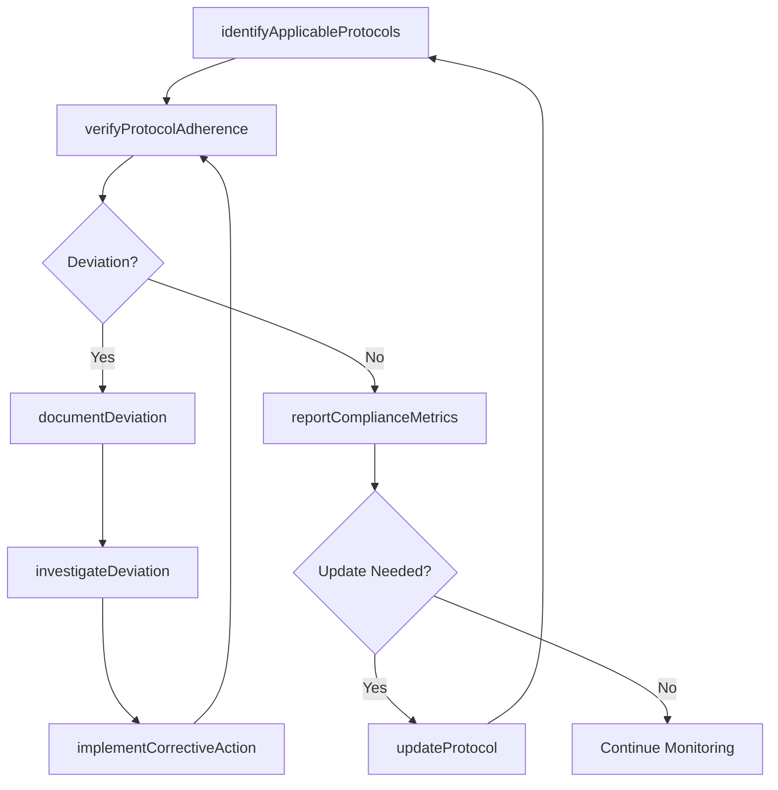
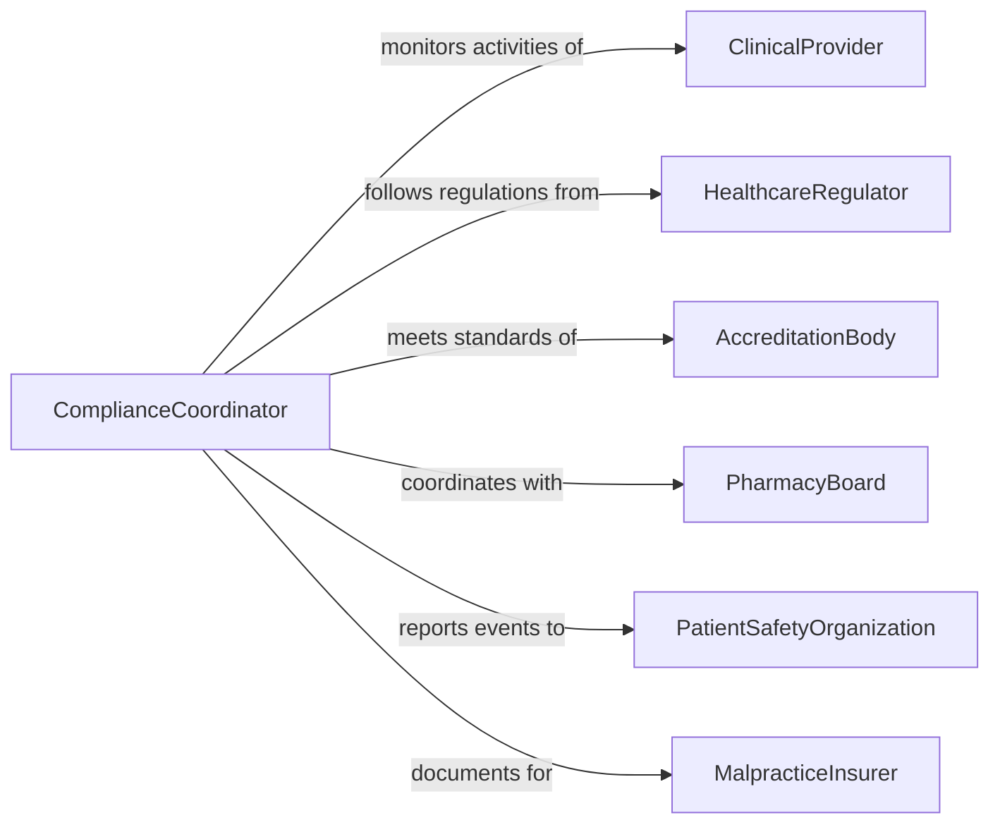

# Follow Protocols or Regulations for Healthcare Activities

> Business-as-Code definition for following protocols and regulations for healthcare activities. Models the adherence to clinical guidelines, safety procedures, HIPAA requirements, infection control standards, and accreditation mandates across healthcare operations.

## Overview

Following protocols or regulations for healthcare activities involves ensuring that clinical procedures, patient handling, medication administration, infection control, and documentation practices conform to established guidelines, regulatory requirements, and accreditation standards. This definition provides actions for protocol identification, compliance verification, deviation reporting, and continuous improvement. It supports clinical managers, compliance officers, quality improvement teams, and healthcare administrators.

## Actors

| Actor | Description |
|-------|-------------|
| ClinicalProvider | Delivers patient care and must follow clinical protocols |
| HealthcareRegulator | Enforces federal and state healthcare regulations such as CMS and HIPAA |
| AccreditationBody | Sets quality and safety standards for healthcare facility accreditation |
| PharmacyBoard | Establishes medication handling and dispensing protocols |
| PatientSafetyOrganization | Receives and analyzes patient safety event reports |
| MalpracticeInsurer | Requires protocol adherence as a condition of liability coverage |

## Roles

| Role | Description |
|------|-------------|
| ComplianceCoordinator | Monitors and documents adherence to healthcare protocols |
| ClinicalProtocolManager | Develops, updates, and distributes clinical practice guidelines |
| QualityImprovementSpecialist | Analyzes protocol adherence data to identify improvement opportunities |
| RegulatoryAffairsOfficer | Tracks regulatory changes and updates organizational compliance requirements |

## Entities

| Entity | Description |
|--------|-------------|
| ClinicalProtocol | A standardized procedure for delivering specific types of patient care |
| RegulatoryRequirement | A mandated healthcare standard from a federal, state, or accrediting body |
| ComplianceChecklist | A structured list of protocol elements verified during compliance reviews |
| ProtocolDeviation | A documented instance where a healthcare activity did not follow protocol |
| CorrectiveAction | A step taken to prevent recurrence of a protocol deviation |
| ComplianceDashboard | A real-time view of protocol adherence metrics across departments |
| PolicyUpdate | A revision to a clinical protocol based on new evidence or regulations |

## Actions

| Action | Description |
|--------|-------------|
| identifyApplicableProtocols | Determine which clinical protocols apply to a specific healthcare activity |
| verifyProtocolAdherence | Confirm that a healthcare activity was performed according to protocol |
| documentDeviation | Record an instance where protocol was not followed |
| investigateDeviation | Determine the root cause of a protocol deviation |
| implementCorrectiveAction | Put measures in place to prevent recurrence of a deviation |
| updateProtocol | Revise a clinical protocol based on new evidence or regulatory changes |
| reportComplianceMetrics | Generate compliance adherence data for regulatory or accreditation review |

## Events

| Event | Description |
|-------|-------------|
| protocolsIdentified | Applicable clinical protocols have been determined |
| protocolAdherenceVerified | A healthcare activity has been confirmed as protocol-compliant |
| deviationDocumented | A protocol deviation has been formally recorded |
| deviationInvestigated | The root cause of a protocol deviation has been determined |
| correctiveActionImplemented | Measures to prevent deviation recurrence have been put in place |
| protocolUpdated | A clinical protocol has been revised |
| complianceMetricsReported | Protocol adherence data has been generated for review |

## Searches

| Search | Description |
|--------|-------------|
| findDeviations | List protocol deviations by department, protocol, or date |
| getComplianceRates | View protocol adherence rates by unit, provider, or period |
| getPendingCorrectiveActions | Find open corrective actions awaiting implementation |
| getProtocolUpdates | Retrieve recent protocol revisions by effective date |
| getAccreditationReadiness | Assess compliance status for upcoming accreditation surveys |

## Workflow



## Actor Relationships



## Usage

### Calling Actions

```typescript
import { followProtocolsRegulationsHealthcareActivities } from '@headlessly/follow-protocols-regulations-healthcare-activities'

const compliance = followProtocolsRegulationsHealthcareActivities()

// Identify protocols for a clinical activity
const protocols = await compliance.identifyApplicableProtocols({
  activityType: 'central-line-insertion',
  department: 'critical-care',
  regulations: ['CMS-CoP-infection-control', 'joint-commission-NPSG']
})

// Verify adherence
await compliance.verifyProtocolAdherence({
  activityId: 'procedure-2026-02-05-0198',
  protocolId: protocols[0].id,
  checklist: ['hand-hygiene', 'full-barrier-precautions', 'chlorhexidine-prep', 'sterile-dressing']
})

// Report compliance metrics
await compliance.reportComplianceMetrics({
  department: 'critical-care',
  period: 'Q1-2026',
  protocols: ['central-line-bundle', 'hand-hygiene', 'fall-prevention']
})
```

### Event-Driven Automation

```typescript
// Escalate critical protocol deviations
compliance.deviationDocumented(async ({ deviationId, protocol, severity, department }) => {
  if (severity === 'critical') {
    await notify({
      to: 'chief-medical-officer',
      message: `Critical protocol deviation in ${department}: ${protocol}`
    })
  }
})

// Distribute updated protocols
compliance.protocolUpdated(async ({ protocolId, protocolName, effectiveDate }) => {
  await distribute({
    document: protocolId,
    recipients: ['all-clinical-staff'],
    message: `Updated protocol: ${protocolName}. Effective ${effectiveDate}.`
  })
})
```
