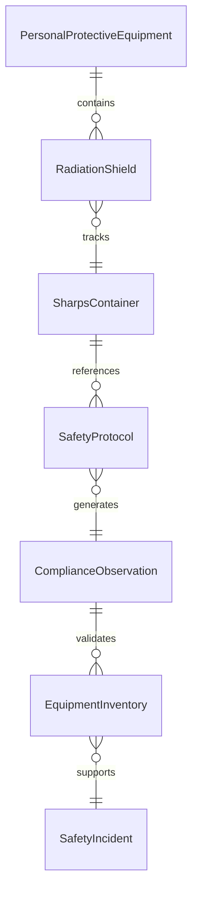
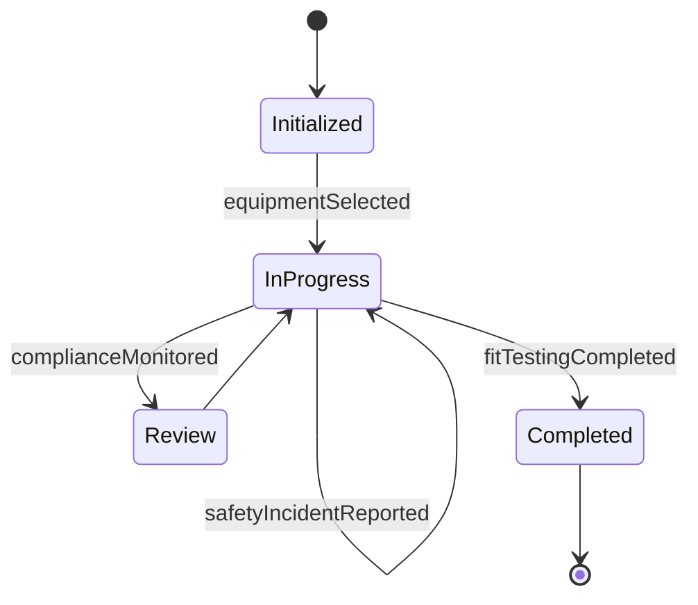
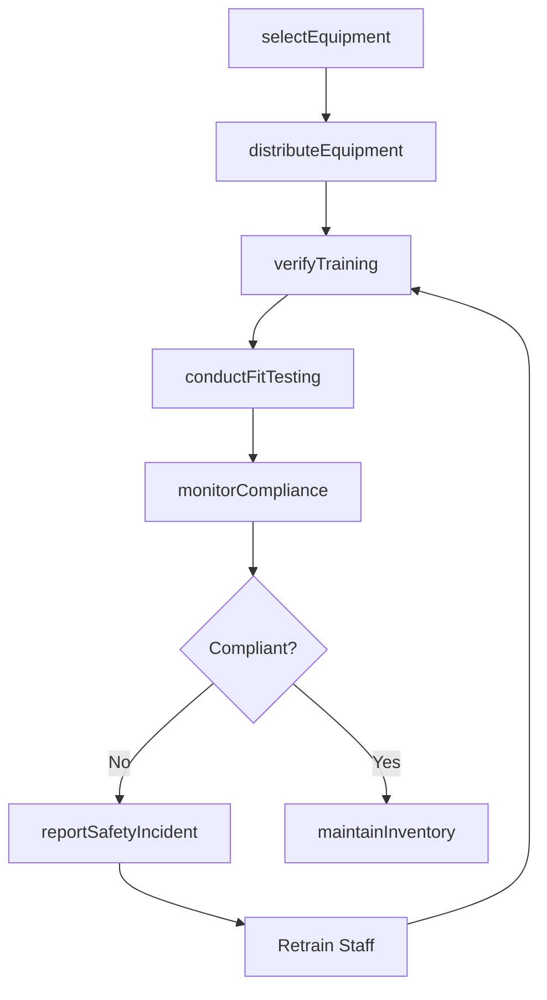
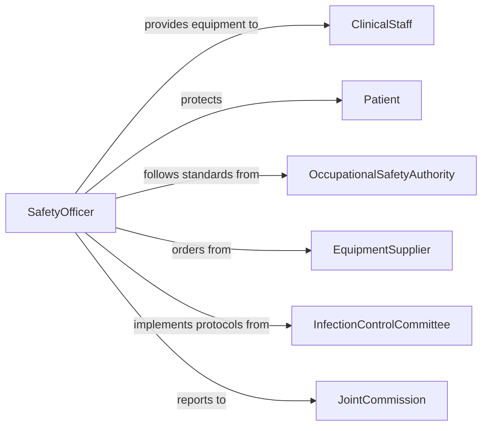

# Protect Patients or Staff Members Using Safety Equipment

> Business-as-Code definition for protecting patients and staff members using safety equipment. Models the selection, deployment, maintenance, and compliance monitoring of personal protective equipment, radiation shielding, sharps containers, and other safety devices in healthcare settings.

## Overview

Protecting patients or staff members using safety equipment involves selecting appropriate protective devices, ensuring proper usage, maintaining equipment readiness, and monitoring compliance with safety protocols. This definition provides actions for equipment selection, distribution, training verification, usage monitoring, and incident reporting. It supports infection control teams, occupational health departments, radiation safety officers, and clinical safety coordinators.

## Actors

| Actor | Description |
|-------|-------------|
| ClinicalStaff | Healthcare workers who use safety equipment during patient care |
| Patient | Individuals receiving care who may require protective equipment |
| OccupationalSafetyAuthority | Enforces workplace safety standards such as OSHA requirements |
| EquipmentSupplier | Provides personal protective equipment and safety devices |
| InfectionControlCommittee | Establishes protocols for infection prevention equipment usage |
| JointCommission | Accredits healthcare facilities based on safety compliance |

## Roles

| Role | Description |
|------|-------------|
| SafetyOfficer | Oversees the safety equipment program and compliance monitoring |
| InfectionControlNurse | Ensures proper PPE selection and usage for infection prevention |
| RadiationSafetyOfficer | Manages protective equipment for radiological procedures |
| EquipmentCoordinator | Manages inventory, distribution, and maintenance of safety devices |

## Entities

| Entity | Description |
|--------|-------------|
| PersonalProtectiveEquipment | Gloves, gowns, masks, and eye protection used during care |
| RadiationShield | Lead aprons, thyroid collars, and barriers for radiological protection |
| SharpsContainer | A disposal unit for needles and other sharp medical instruments |
| SafetyProtocol | A documented procedure for equipment selection and usage |
| ComplianceObservation | A recorded instance of safety equipment usage or non-usage |
| EquipmentInventory | A count of available safety equipment by type and location |
| SafetyIncident | An event where inadequate safety equipment use led to exposure |

## Actions

| Action | Description |
|--------|-------------|
| selectEquipment | Choose the appropriate safety equipment based on procedure and risk |
| distributeEquipment | Provide safety equipment to clinical areas and staff |
| verifyTraining | Confirm staff have completed safety equipment training |
| monitorCompliance | Observe and record adherence to safety equipment protocols |
| maintainInventory | Track safety equipment stock levels and reorder as needed |
| reportSafetyIncident | Document an exposure event related to safety equipment |
| conductFitTesting | Perform respirator or PPE fit testing for clinical staff |

## Events

| Event | Description |
|-------|-------------|
| equipmentSelected | Appropriate safety equipment has been chosen for a procedure |
| equipmentDistributed | Safety equipment has been provided to clinical areas |
| trainingVerified | Staff safety equipment training has been confirmed |
| complianceMonitored | Safety equipment usage has been observed and recorded |
| inventoryMaintained | Safety equipment stock levels have been updated |
| safetyIncidentReported | An exposure event has been documented |
| fitTestingCompleted | Respirator or PPE fit testing has been performed |

## Searches

| Search | Description |
|--------|-------------|
| findComplianceRecords | List safety equipment compliance observations by unit or period |
| getIncidentReports | Retrieve safety incidents by type, severity, or department |
| getInventoryLevels | View safety equipment stock by type and location |
| getPendingFitTests | Find staff members due for respirator fit testing |
| getTrainingStatus | Check safety equipment training completion by department |


## Entity Relationships



## State Diagram


## Workflow



## Actor Relationships



## Usage

### Calling Actions

```typescript
import { protectPatientsStaffMembersUsing } from '@headlessly/protect-patients-staff-members-using'

const safety = protectPatientsStaffMembersUsing()

// Select equipment for a procedure
const selection = await safety.selectEquipment({
  procedureType: 'aerosol-generating-procedure',
  riskLevel: 'high',
  requiredPPE: ['N95-respirator', 'face-shield', 'isolation-gown', 'double-gloves']
})

// Distribute and verify training
await safety.distributeEquipment({
  unit: 'intensive-care-unit-3',
  equipment: selection.requiredPPE,
  quantity: 200
})

await safety.verifyTraining({ staffIds: ['rn-smith', 'rn-chen', 'rt-patel'], equipment: 'N95-respirator' })
await safety.conductFitTesting({ staffId: 'rn-smith', respiratorModel: 'N95-1860' })
```

### Event-Driven Automation

```typescript
// Escalate safety incidents
safety.safetyIncidentReported(async ({ incidentId, department, exposureType }) => {
  await notify({
    to: 'occupational-health',
    message: `Safety incident in ${department}: ${exposureType}. Immediate follow-up required.`
  })
})

// Auto-reorder when inventory is low
safety.inventoryMaintained(async ({ equipmentType, currentStock, reorderPoint }) => {
  if (currentStock < reorderPoint) {
    await createPurchaseOrder({ equipmentType, quantity: reorderPoint * 2 })
  }
})
```
