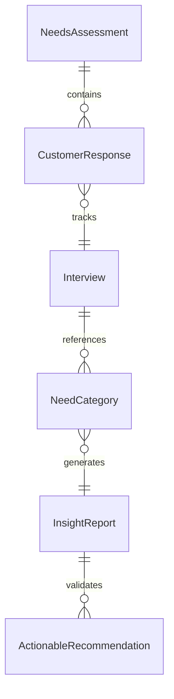
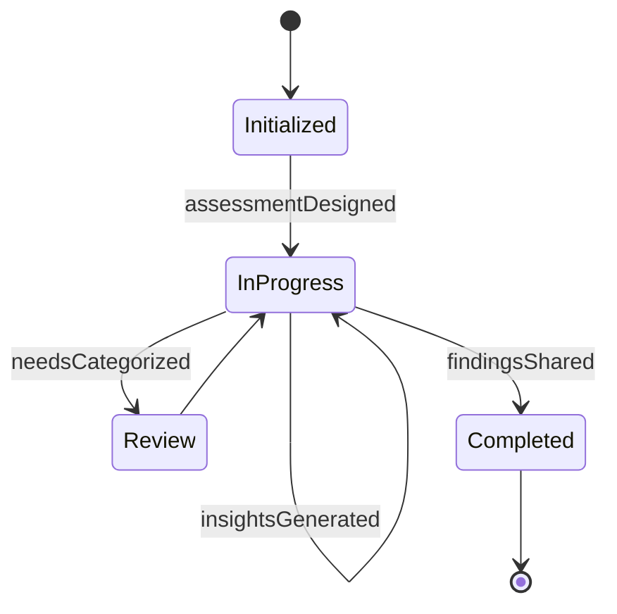
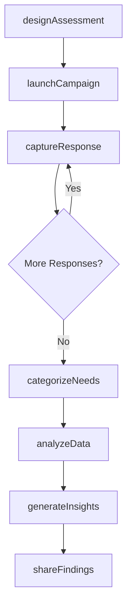
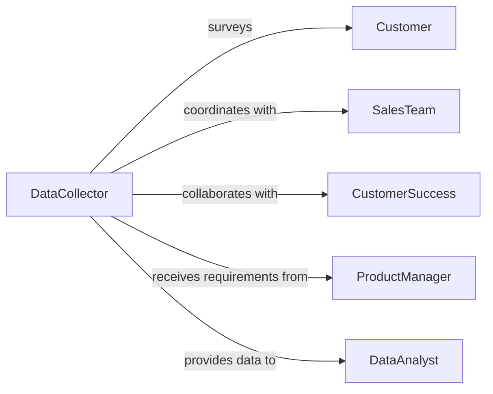

# Collect Data About Customer Needs

> Business-as-Code definition for systematic customer needs collection. Models the process of gathering requirements, preferences, and pain points through interviews, feedback forms, and behavioral analysis to inform product and service development.

## Overview

Customer needs data collection involves designing data collection instruments, conducting outreach campaigns, capturing structured feedback, and analyzing responses to identify patterns and priorities. This definition exposes actions for survey creation, data capture, and insight generation with events for real-time response tracking.

## Actors

| Actor | Description |
|-------|-------------|
| Customer | Provides feedback on needs and preferences |
| SalesTeam | Captures needs during prospect conversations |
| CustomerSuccess | Gathers ongoing feedback from active accounts |
| ProductManager | Defines questions to guide development priorities |
| MarketResearcher | Designs data collection methodology |
| DataAnalyst | Processes responses to extract insights |

## Roles

| Role | Description |
|------|-------------|
| DataCollector | Administers surveys and interviews |
| Interviewer | Conducts one-on-one customer conversations |
| Analyst | Identifies patterns and trends in collected data |
| Stakeholder | Uses insights to inform strategic decisions |

## Entities

| Entity | Description |
|--------|-------------|
| NeedsAssessment | Structured data collection initiative |
| CustomerResponse | Individual feedback submission |
| Interview | Qualitative conversation capturing detailed needs |
| NeedCategory | Thematic grouping of customer requirements |
| InsightReport | Analysis summary with prioritized findings |
| ActionableRecommendation | Suggested product or service changes |

## Actions

| Action | Description |
|--------|-------------|
| designAssessment | Create data collection instrument and methodology |
| launchCampaign | Initiate outreach to target customer segments |
| captureResponse | Record customer feedback or interview data |
| categorizeNeeds | Group responses into thematic categories |
| analyzeData | Identify patterns and prioritize needs |
| generateInsights | Produce actionable recommendations from data |
| shareFindings | Distribute insights to stakeholders |

## Events

| Event | Description |
|-------|-------------|
| assessmentDesigned | Data collection instrument has been created |
| campaignLaunched | Outreach to customers has begun |
| responseCaptured | Customer feedback has been recorded |
| needsCategorized | Responses have been grouped thematically |
| dataAnalyzed | Patterns and priorities have been identified |
| insightsGenerated | Actionable recommendations are available |
| findingsShared | Insights have been distributed to stakeholders |

## Searches

| Search | Description |
|--------|-------------|
| findAssessments | List needs collection initiatives by date or status |
| getResponses | Retrieve customer feedback by segment or category |
| getInsights | Search analysis reports by product or date |
| getRecommendations | Find actionable suggestions by priority |


## Entity Relationships



## State Diagram


## Workflow



## Actor Relationships



## Usage

### Calling Actions

```typescript
import { collectDataAboutCustomerNeeds } from '@headlessly/collect-data-about-customer-needs'

const needs = collectDataAboutCustomerNeeds()

// Design customer needs assessment
const assessment = await needs.designAssessment({
  title: 'Q1 2026 Product Enhancement Survey',
  targetSegment: 'enterprise-customers',
  questions: [
    { id: 'q1', text: 'What features would improve your workflow?', type: 'open-ended' },
    { id: 'q2', text: 'Rate current reporting capabilities (1-5)', type: 'scale' },
    { id: 'q3', text: 'Which integrations are most important?', type: 'multiple-choice' }
  ]
})

// Launch campaign
await needs.launchCampaign({
  assessmentId: assessment.id,
  channels: ['email', 'in-app'],
  targetCount: 500,
  incentive: '25-dollar-gift-card'
})

// Capture customer response
await needs.captureResponse({
  assessmentId: assessment.id,
  customerId: 'cust-12847',
  responses: {
    q1: 'Bulk export to Excel with custom templates',
    q2: 3,
    q3: ['salesforce', 'tableau']
  }
})
```

### Event-Driven Automation

```typescript
// Auto-categorize responses as they arrive
needs.responseCaptured(async ({ response, assessmentId }) => {
  const categories = await categorizeText(response.responses.q1)
  await needs.categorizeNeeds({
    assessmentId,
    responseId: response.id,
    categories
  })
})

// Trigger analysis when target responses reached
needs.responseCaptured(async ({ assessmentId }) => {
  const count = await needs.getResponses({ assessmentId, status: 'completed' })
  if (count.total >= 500) {
    await needs.analyzeData({ assessmentId })
  }
})
```
