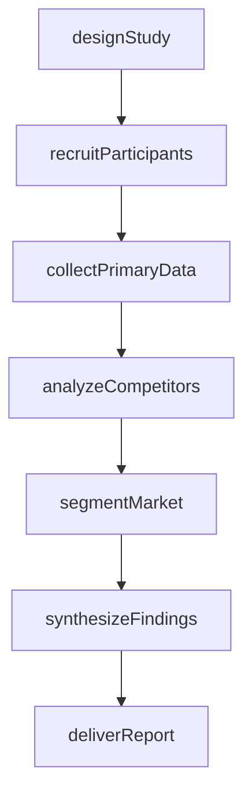
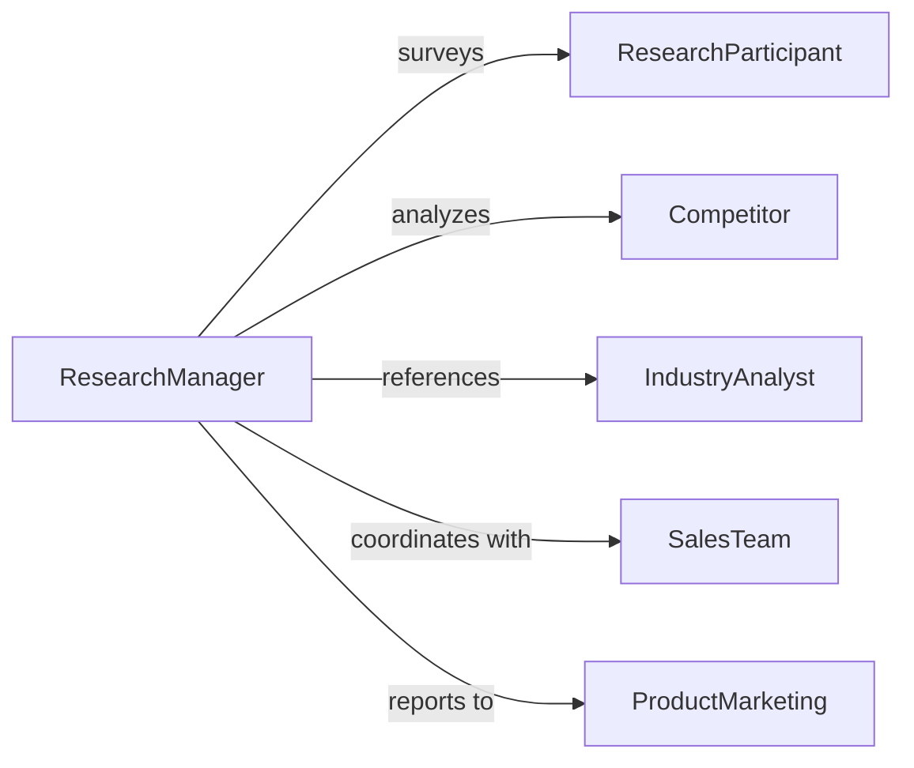

# Conduct Market Research

> Business-as-Code definition for comprehensive market research execution. Models primary and secondary research activities including competitor analysis, market sizing, trend identification, and customer segmentation studies.

## Overview

Market research encompasses designing studies, collecting primary data through surveys and focus groups, analyzing secondary sources like industry reports, and synthesizing findings into strategic recommendations. This definition exposes actions for research planning, data collection, competitive intelligence, and insight delivery.

## Actors

| Actor | Description |
|-------|-------------|
| ResearchParticipant | Provides survey responses and focus group input |
| Competitor | Subject of competitive analysis and benchmarking |
| IndustryAnalyst | Publishes reports and market forecasts |
| SalesTeam | Contributes field intelligence on customer behavior |
| ProductMarketing | Defines research questions and uses findings |
| ExecutiveTeam | Receives strategic recommendations from research |

## Roles

| Role | Description |
|------|-------------|
| ResearchManager | Oversees study design and execution |
| DataCollector | Administers surveys and interviews |
| CompetitiveAnalyst | Monitors competitor activities and positioning |
| InsightsAnalyst | Synthesizes findings into actionable recommendations |

## Entities

| Entity | Description |
|--------|-------------|
| ResearchStudy | Planned investigation with defined scope and methodology |
| SurveyInstrument | Questionnaire for primary data collection |
| FocusGroup | Qualitative discussion with target customers |
| CompetitorProfile | Analysis of rival product and market strategy |
| MarketSegment | Distinct customer group with shared characteristics |
| ResearchFinding | Insight extracted from data analysis |

## Actions

| Action | Description |
|--------|-------------|
| designStudy | Define research objectives, scope, and methodology |
| recruitParticipants | Identify and engage survey respondents or focus group members |
| collectPrimaryData | Administer surveys, interviews, or focus groups |
| analyzeCompetitors | Assess rival offerings, pricing, and market position |
| segmentMarket | Identify distinct customer groups and their characteristics |
| synthesizeFindings | Extract insights and strategic implications |
| deliverReport | Present research results to stakeholders |

## Events

| Event | Description |
|-------|-------------|
| studyDesigned | Research plan has been created |
| participantsRecruited | Survey or focus group members have been enrolled |
| primaryDataCollected | Responses from participants have been gathered |
| competitorsAnalyzed | Competitive intelligence has been compiled |
| marketSegmented | Customer groups have been identified and profiled |
| findingsSynthesized | Insights have been extracted from data |
| reportDelivered | Research results have been presented |

## Searches

| Search | Description |
|--------|-------------|
| findStudies | List research initiatives by date, status, or topic |
| getParticipants | Retrieve respondent profiles by segment or study |
| getCompetitorProfiles | Search competitive analysis by company or date |
| getFindings | Find insights by topic, segment, or study |

## Workflow



## Actor Relationships



## Usage

### Calling Actions

```typescript
import { conductMarketResearch } from '@headlessly/conduct-market-research'

const research = conductMarketResearch()

// Design a market sizing study
const study = await research.designStudy({
  title: 'Cloud Infrastructure Market Opportunity 2026',
  objectives: ['Size addressable market', 'Identify growth segments', 'Map competitive landscape'],
  methodology: 'mixed-methods',
  timeline: { start: '2026-02-01', end: '2026-04-30' }
})

// Recruit survey participants
await research.recruitParticipants({
  studyId: study.id,
  targetSegments: ['enterprise-it', 'devops-teams'],
  sampleSize: 300,
  criteria: { companySize: 'over-500-employees', role: 'technical-decision-maker' }
})

// Collect primary data
await research.collectPrimaryData({
  studyId: study.id,
  method: 'online-survey',
  instrument: 'market-needs-questionnaire-v2',
  distributionChannels: ['email', 'linkedin-ads']
})

// Analyze competitors
await research.analyzeCompetitors({
  studyId: study.id,
  competitors: ['aws', 'azure', 'gcp'],
  dimensions: ['pricing', 'feature-set', 'market-share', 'customer-satisfaction']
})
```

### Event-Driven Automation

```typescript
// Trigger analysis when response threshold is met
research.primaryDataCollected(async ({ studyId }) => {
  const responses = await research.getParticipants({ studyId, status: 'completed' })
  if (responses.total >= 250) {
    await research.segmentMarket({ studyId })
  }
})

// Auto-deliver report when synthesis is complete
research.findingsSynthesized(async ({ studyId, findings }) => {
  await research.deliverReport({
    studyId,
    recipients: ['product-vp', 'marketing-vp', 'ceo'],
    format: 'executive-summary'
  })
})
```
