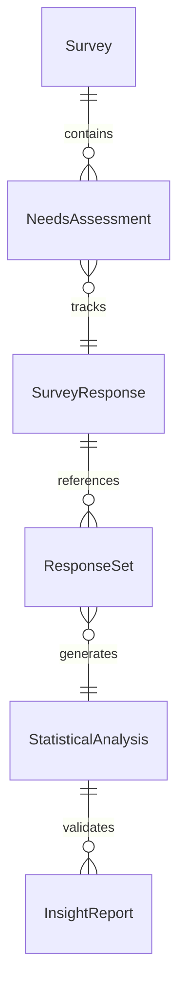
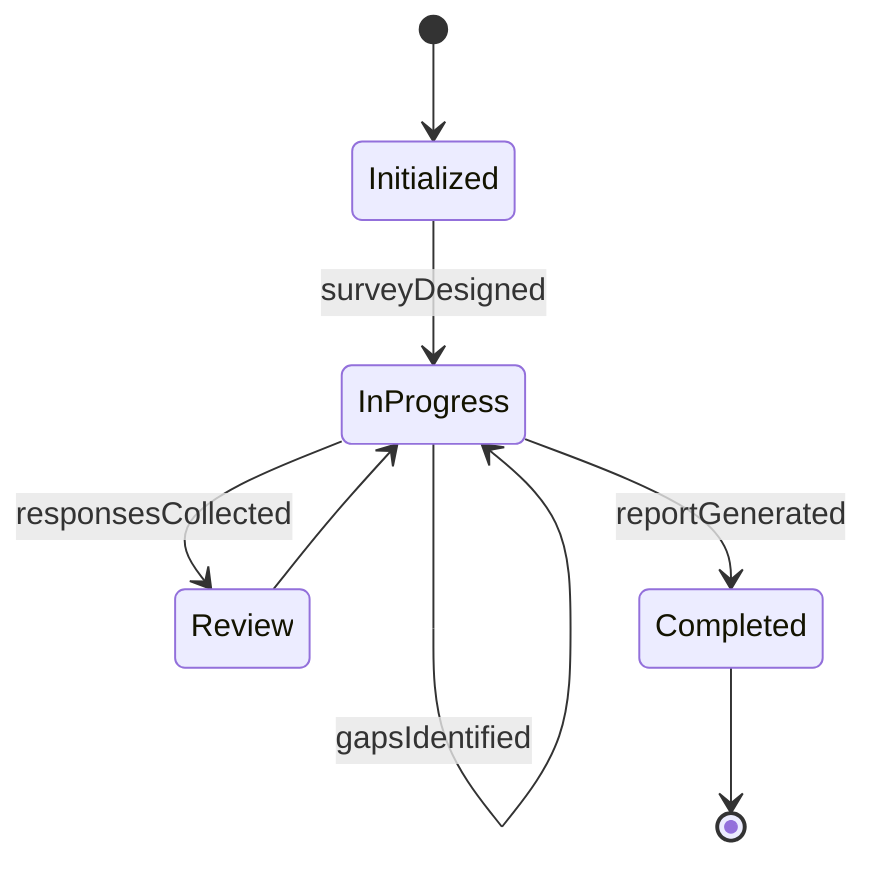
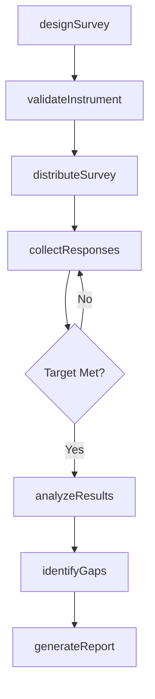
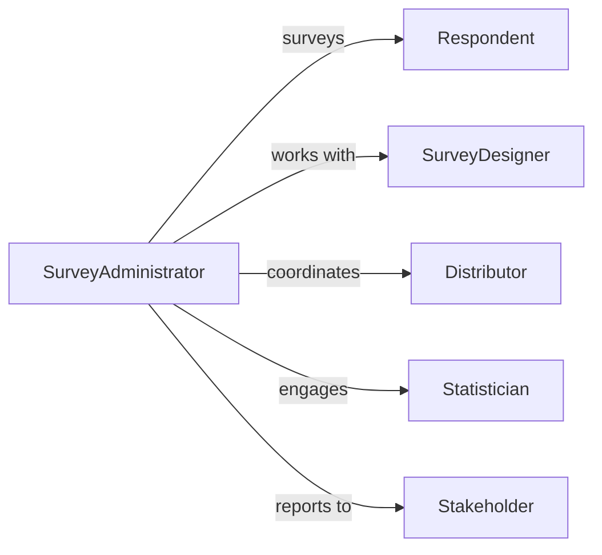

# Conduct Opinion Surveys Needs Assessments

> Business-as-Code definition for structured opinion gathering and needs analysis. Models survey design, distribution, response collection, and statistical analysis to quantify stakeholder preferences and requirements.

## Overview

Opinion surveys and needs assessments involve designing questionnaires, targeting respondent populations, collecting structured feedback, analyzing response patterns, and reporting findings with statistical confidence. This definition exposes actions for survey lifecycle management from design through insight delivery.

## Actors

| Actor | Description |
|-------|-------------|
| Respondent | Completes surveys providing opinions and needs data |
| SurveyDesigner | Creates questionnaires and sampling methodology |
| Distributor | Delivers surveys through appropriate channels |
| Statistician | Performs quantitative analysis on response data |
| Stakeholder | Receives insights to inform strategic decisions |
| PanelProvider | Supplies access to targeted respondent populations |

## Roles

| Role | Description |
|------|-------------|
| SurveyAdministrator | Manages end-to-end survey execution |
| Analyst | Processes responses and extracts insights |
| ReportAuthor | Documents findings and recommendations |
| Validator | Ensures statistical rigor and sample quality |

## Entities

| Entity | Description |
|--------|-------------|
| Survey | Questionnaire with defined questions and logic |
| NeedsAssessment | Study measuring gaps between current and desired state |
| SurveyResponse | Individual participant submission |
| ResponseSet | Aggregated data from all participants |
| StatisticalAnalysis | Quantitative evaluation of response patterns |
| InsightReport | Summary of findings with recommendations |

## Actions

| Action | Description |
|--------|-------------|
| designSurvey | Create questionnaire and define sampling strategy |
| validateInstrument | Test survey for clarity and bias |
| distributeSurvey | Launch survey through targeted channels |
| collectResponses | Gather completed submissions |
| analyzeResults | Perform statistical analysis on response data |
| identifyGaps | Determine unmet needs or opinion divergence |
| generateReport | Produce insights document with recommendations |

## Events

| Event | Description |
|-------|-------------|
| surveyDesigned | Questionnaire has been created |
| instrumentValidated | Survey has been tested and approved |
| surveyDistributed | Survey has been sent to target respondents |
| responsesCollected | Submissions have been gathered |
| resultsAnalyzed | Statistical analysis is complete |
| gapsIdentified | Unmet needs have been determined |
| reportGenerated | Insights document has been produced |

## Searches

| Search | Description |
|--------|-------------|
| findSurveys | List surveys by topic, date, or status |
| getResponses | Retrieve submissions by survey or respondent segment |
| getAnalyses | Search statistical reports by survey or date |
| getGaps | Find identified needs by priority or category |


## Entity Relationships



## State Diagram


## Workflow



## Actor Relationships



## Usage

### Calling Actions

```typescript
import { conductOpinionSurveysNeedsAssessments } from '@headlessly/conduct-opinion-surveys-needs-assessments'

const surveys = conductOpinionSurveysNeedsAssessments()

// Design employee satisfaction survey
const survey = await surveys.designSurvey({
  title: 'Q1 2026 Employee Engagement Survey',
  type: 'opinion-survey',
  targetPopulation: 'all-employees',
  questions: [
    { id: 'q1', text: 'How satisfied are you with professional development opportunities?', type: 'likert-5' },
    { id: 'q2', text: 'Rate your work-life balance', type: 'scale-1-10' },
    { id: 'q3', text: 'What improvements would most enhance your experience?', type: 'open-ended' }
  ],
  sampling: { method: 'census', targetSize: 850 }
})

// Validate survey instrument
await surveys.validateInstrument({
  surveyId: survey.id,
  pilotGroup: 'hr-team',
  validationCriteria: ['clarity', 'neutrality', 'completion-time']
})

// Distribute to target population
await surveys.distributeSurvey({
  surveyId: survey.id,
  channels: ['email', 'slack-bot'],
  schedule: { start: '2026-02-10T09:00:00Z', end: '2026-02-24T17:00:00Z' }
})
```

### Event-Driven Automation

```typescript
// Send reminders to non-respondents
surveys.surveyDistributed(async ({ surveyId, schedule }) => {
  const reminderDate = new Date(schedule.end)
  reminderDate.setDate(reminderDate.getDate() - 3)

  setTimeout(async () => {
    const nonRespondents = await surveys.getResponses({ surveyId, status: 'pending' })
    await notify({
      to: nonRespondents.emails,
      message: 'Reminder: Employee survey closes in 3 days'
    })
  }, reminderDate.getTime() - Date.now())
})

// Trigger analysis when response rate threshold is met
surveys.responsesCollected(async ({ surveyId }) => {
  const responses = await surveys.getResponses({ surveyId, status: 'completed' })
  const target = await surveys.findSurveys({ id: surveyId })

  if (responses.total / target.sampling.targetSize >= 0.70) {
    await surveys.analyzeResults({ surveyId })
  }
})
```
