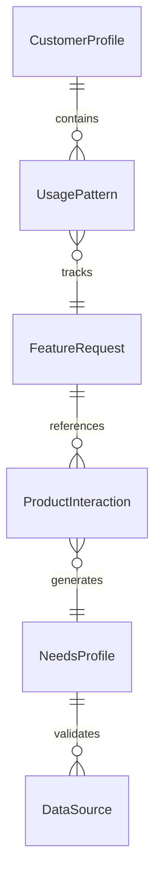
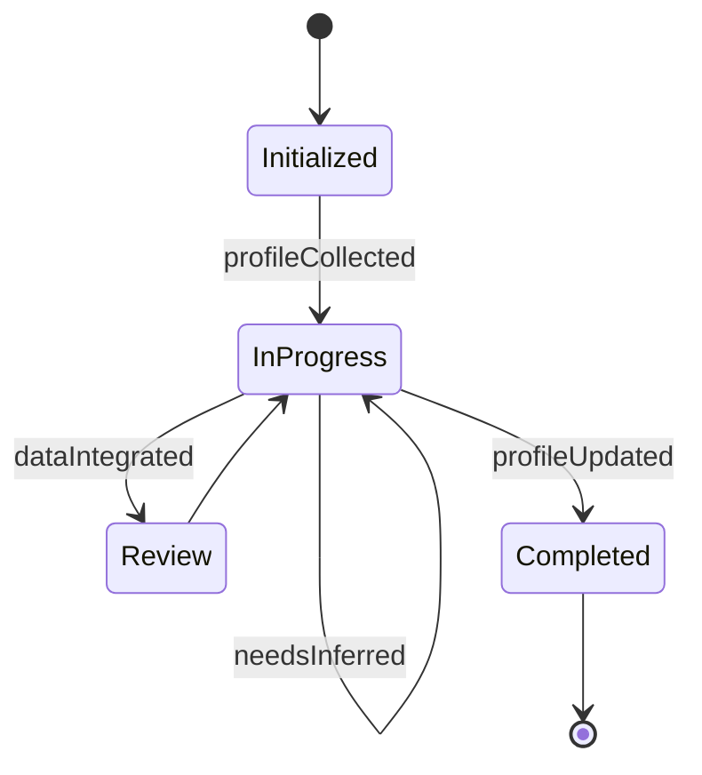
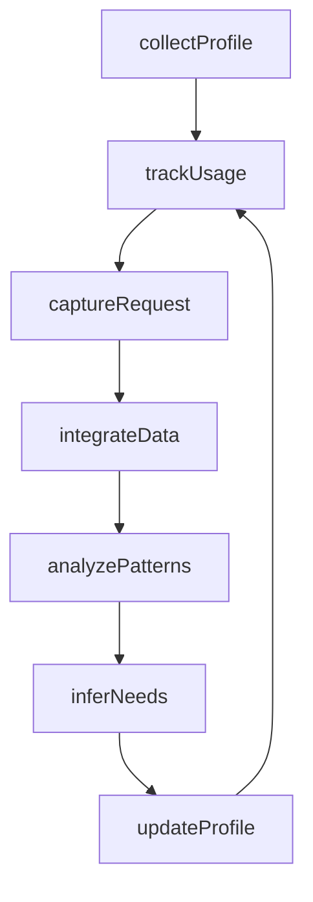
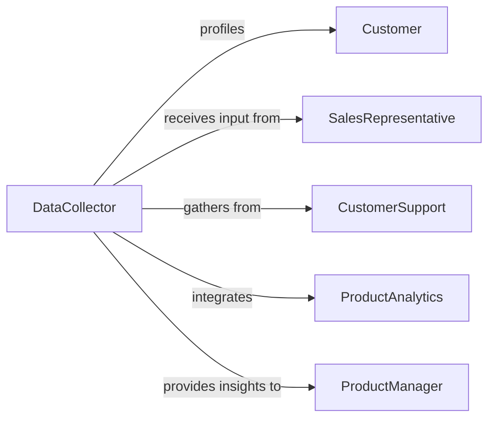

# Gather Customer Product Information Determine

> Business-as-Code definition for customer intelligence and product usage analysis. Models the systematic collection of customer demographics, usage patterns, and product preferences to identify unmet needs and inform product development.

## Overview

Gathering customer and product information involves aggregating data from multiple touchpoints including CRM systems, product analytics, support tickets, and direct conversations. This definition exposes actions for data integration, pattern recognition, and needs inference with events for continuous intelligence updates.

## Actors

| Actor | Description |
|-------|-------------|
| Customer | Uses products and provides usage data |
| SalesRepresentative | Captures customer profile and requirements during sales cycle |
| CustomerSupport | Documents issues and feature requests from interactions |
| ProductAnalytics | Tracks product usage patterns and behaviors |
| AccountManager | Maintains ongoing relationship and gathers strategic needs |
| ProductManager | Translates customer information into product requirements |

## Roles

| Role | Description |
|------|-------------|
| DataCollector | Aggregates information from multiple sources |
| UsageAnalyst | Interprets product analytics to identify patterns |
| NeedsInterpreter | Translates customer data into actionable requirements |
| InsightsSynthesizer | Combines quantitative and qualitative data for insights |

## Entities

| Entity | Description |
|--------|-------------|
| CustomerProfile | Demographic and firmographic attributes |
| UsagePattern | Behavioral data showing how products are used |
| FeatureRequest | Customer-expressed desire for new capabilities |
| ProductInteraction | Individual touchpoint with the product |
| NeedsProfile | Inferred requirements based on gathered data |
| DataSource | System or channel providing customer information |

## Actions

| Action | Description |
|--------|-------------|
| collectProfile | Gather customer demographic and firmographic data |
| trackUsage | Record product interaction and behavioral patterns |
| captureRequest | Document feature requests or pain points |
| integrateData | Combine information from multiple sources |
| analyzePatterns | Identify trends in usage and preferences |
| inferNeeds | Determine customer requirements from data |
| updateProfile | Enrich customer records with new information |

## Events

| Event | Description |
|-------|-------------|
| profileCollected | Customer demographic data has been gathered |
| usageTracked | Product interaction has been recorded |
| requestCaptured | Feature request has been documented |
| dataIntegrated | Information from multiple sources has been combined |
| patternsAnalyzed | Usage trends have been identified |
| needsInferred | Customer requirements have been determined |
| profileUpdated | Customer record has been enriched |

## Searches

| Search | Description |
|--------|-------------|
| findProfiles | List customers by segment, industry, or attribute |
| getUsagePatterns | Retrieve behavioral data by customer or feature |
| getRequests | Search feature requests by customer or product area |
| getNeedsProfiles | Find inferred requirements by segment or priority |


## Entity Relationships



## State Diagram


## Workflow



## Actor Relationships



## Usage

### Calling Actions

```typescript
import { gatherCustomerProductInformationDetermine } from '@headlessly/gather-customer-product-information-determine'

const intelligence = gatherCustomerProductInformationDetermine()

// Collect customer profile during onboarding
const profile = await intelligence.collectProfile({
  customerId: 'cust-98234',
  demographics: {
    industry: 'healthcare',
    companySize: 1200,
    geography: 'north-america'
  },
  businessContext: {
    primaryUseCase: 'patient-data-management',
    integrationsNeeded: ['epic', 'cerner']
  }
})

// Track product usage
await intelligence.trackUsage({
  customerId: 'cust-98234',
  productArea: 'reporting',
  feature: 'custom-dashboards',
  frequency: 'daily',
  duration: 45
})

// Capture feature request from support ticket
await intelligence.captureRequest({
  customerId: 'cust-98234',
  source: 'support-ticket-4728',
  request: 'Automated report scheduling with email delivery',
  priority: 'high',
  businessImpact: 'Manual exports take 2 hours daily across team'
})

// Infer needs from integrated data
const needs = await intelligence.inferNeeds({
  customerId: 'cust-98234'
})
```

### Event-Driven Automation

```typescript
// Auto-integrate usage data daily
intelligence.usageTracked(async ({ customerId, feature }) => {
  const dailyUsage = await intelligence.getUsagePatterns({
    customerId,
    timeframe: 'last-24-hours'
  })

  if (dailyUsage.interactions >= 50) {
    await intelligence.updateProfile({
      customerId,
      powerUserFlag: true
    })
  }
})

// Alert product team on high-impact feature requests
intelligence.requestCaptured(async ({ request }) => {
  if (request.priority === 'high') {
    await notify({
      to: 'product-team',
      message: `High-priority feature request: ${request.request}`
    })
  }
})
```
