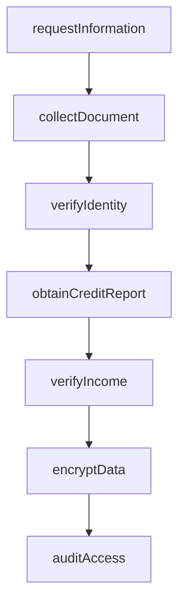
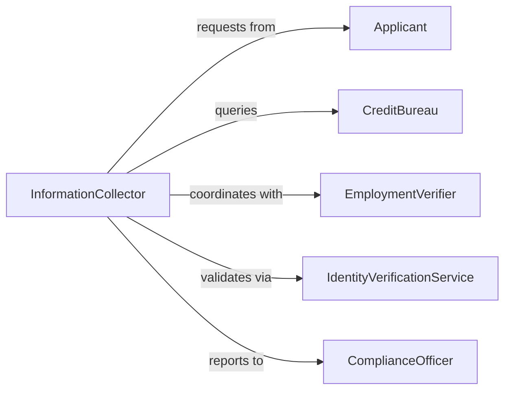

# Obtain Personal Financial Information About

> Business-as-Code definition for secure collection of personal and financial data. Models compliant processes for gathering sensitive information from customers or applicants including identity verification, credit assessment, and income documentation.

## Overview

Obtaining personal and financial information requires secure data collection workflows, regulatory compliance, identity verification, and privacy protection. This definition exposes actions for information requests, document collection, verification, and secure storage with events for audit trails and compliance monitoring.

## Actors

| Actor | Description |
|-------|-------------|
| Applicant | Provides personal and financial information for evaluation |
| CreditBureau | Supplies credit reports and scores |
| EmploymentVerifier | Confirms income and employment status |
| IdentityVerificationService | Validates identity documents |
| ComplianceOfficer | Ensures adherence to privacy and lending regulations |
| UnderwritingTeam | Reviews financial information for decision-making |

## Roles

| Role | Description |
|------|-------------|
| InformationCollector | Requests and gathers required documentation |
| Verifier | Validates authenticity and accuracy of provided data |
| SecurityOfficer | Ensures data protection and encryption standards |
| Approver | Authorizes access to sensitive information |

## Entities

| Entity | Description |
|--------|-------------|
| InformationRequest | Formal ask for specific personal or financial data |
| FinancialDocument | Income statement, tax return, or bank statement |
| IdentityDocument | Government-issued ID or passport |
| CreditReport | Bureau-provided credit history and score |
| VerificationResult | Confirmation of document authenticity |
| SecureRecord | Encrypted storage of sensitive information |

## Actions

| Action | Description |
|--------|-------------|
| requestInformation | Ask applicant to provide specific data or documents |
| collectDocument | Receive and securely store submitted materials |
| verifyIdentity | Validate identity documents against trusted sources |
| obtainCreditReport | Request credit history from bureau |
| verifyIncome | Confirm employment and earnings data |
| encryptData | Apply security controls to sensitive information |
| auditAccess | Log all views or modifications of personal data |

## Events

| Event | Description |
|-------|-------------|
| informationRequested | Request for data has been sent to applicant |
| documentCollected | Submitted materials have been received |
| identityVerified | Identity has been validated |
| creditReportObtained | Credit history has been retrieved |
| incomeVerified | Employment and earnings have been confirmed |
| dataEncrypted | Security controls have been applied |
| accessAudited | Data access has been logged for compliance |

## Searches

| Search | Description |
|--------|-------------|
| findRequests | List information requests by applicant or status |
| getDocuments | Retrieve submitted materials by type or date |
| getVerifications | Search verification results by applicant or outcome |
| getAuditLogs | Find access records for compliance review |

## Workflow



## Actor Relationships



## Usage

### Calling Actions

```typescript
import { obtainPersonalFinancialInformationAbout } from '@headlessly/obtain-personal-financial-information-about'

const financial = obtainPersonalFinancialInformationAbout()

// Request information from loan applicant
const request = await financial.requestInformation({
  applicantId: 'app-82374',
  requestedItems: [
    'government-id',
    'proof-of-income-last-2-years',
    'bank-statements-last-3-months',
    'tax-returns-last-2-years'
  ],
  purpose: 'mortgage-application',
  deadline: '2026-02-15T23:59:59Z'
})

// Collect submitted documents
await financial.collectDocument({
  requestId: request.id,
  documentType: 'government-id',
  format: 'pdf',
  fileHash: 'sha256:a4c8b...',
  uploadedAt: new Date().toISOString()
})

// Verify identity
const verification = await financial.verifyIdentity({
  applicantId: 'app-82374',
  documentId: 'doc-92847',
  method: 'document-verification-service',
  provider: 'trulioo'
})

// Obtain credit report
await financial.obtainCreditReport({
  applicantId: 'app-82374',
  bureau: 'experian',
  reportType: 'full-credit-history',
  consentId: 'consent-47829'
})
```

### Event-Driven Automation

```typescript
// Auto-verify identity when document is collected
financial.documentCollected(async ({ documentType, applicantId }) => {
  if (documentType === 'government-id') {
    await financial.verifyIdentity({
      applicantId,
      method: 'ocr-and-database-match'
    })
  }
})

// Encrypt all collected documents immediately
financial.documentCollected(async ({ documentId }) => {
  await financial.encryptData({
    documentId,
    algorithm: 'AES-256-GCM',
    keyRotationPolicy: 'quarterly'
  })
})

// Audit every access to sensitive data
financial.dataEncrypted(async ({ applicantId, documentId }) => {
  await financial.auditAccess({
    applicantId,
    documentId,
    accessor: 'system-automation',
    action: 'encryption-applied',
    timestamp: new Date().toISOString()
  })
})
```
