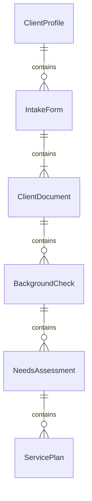
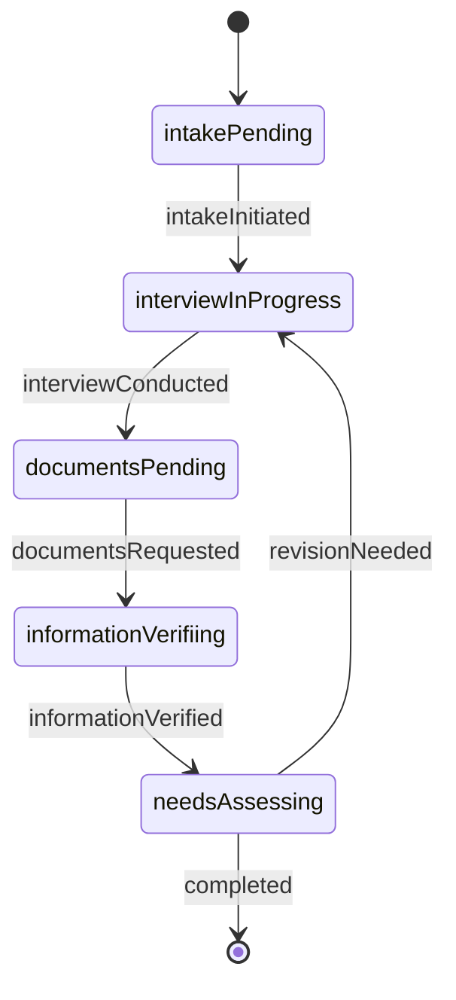
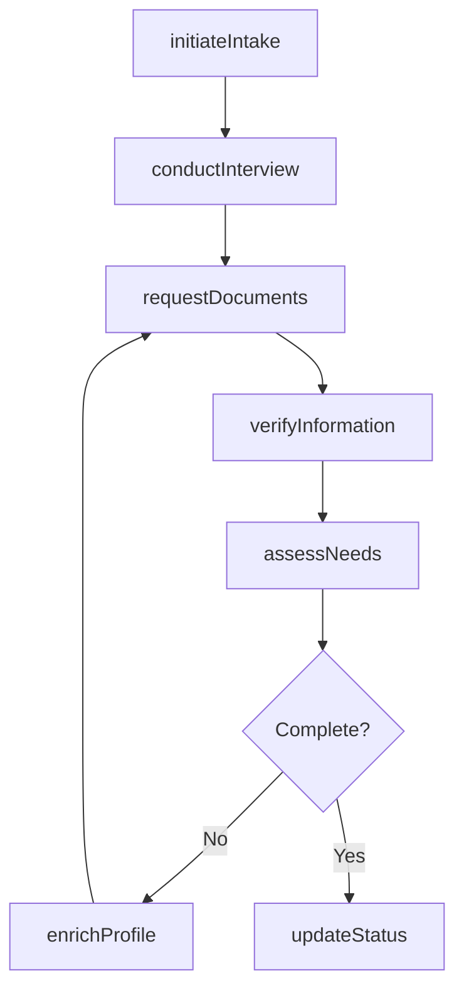
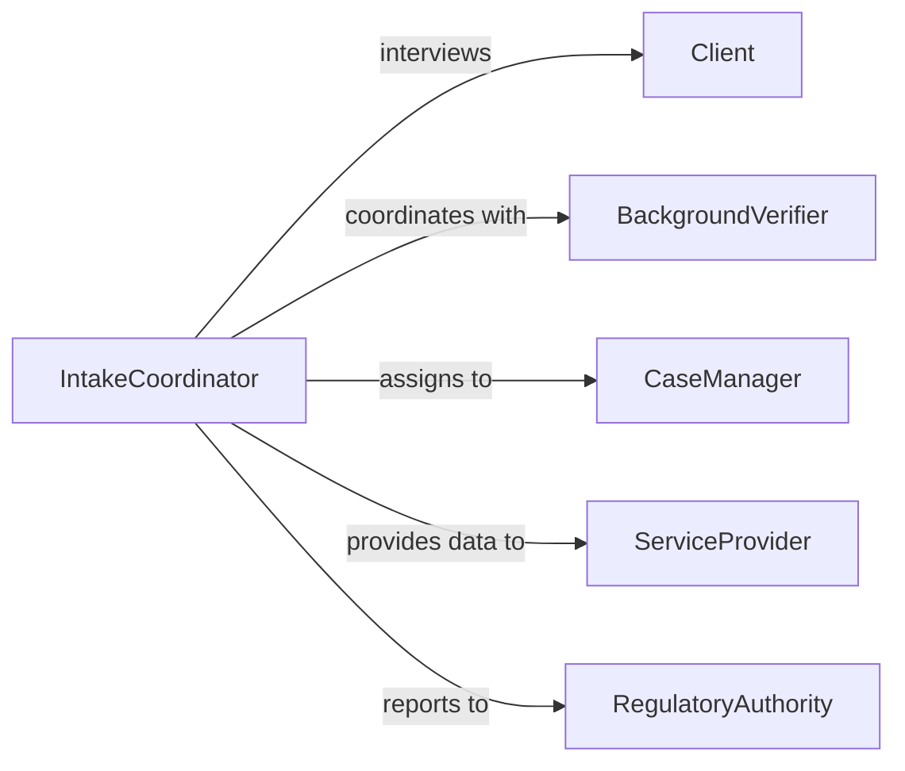

# Collect Information About Clients

> Business-as-Code definition for comprehensive client information gathering. Models intake processes, background research, needs assessment, and ongoing data updates to build complete client profiles for service delivery and relationship management.

## Overview

Client information collection involves structured intake interviews, document requests, reference checks, background research, and continuous profile enrichment. This definition exposes actions for onboarding, documentation, verification, and profile maintenance with events for compliance and service coordination.

## Actors

| Actor | Description |
|-------|-------------|
| Client | Provides personal history, needs, and documentation |
| IntakeSpecialist | Conducts initial information gathering |
| BackgroundVerifier | Validates provided information and credentials |
| CaseManager | Maintains ongoing client relationship and updates |
| ServiceProvider | Delivers services based on client information |
| RegulatoryAuthority | Requires specific documentation for compliance |

## Roles

| Role | Description |
|------|-------------|
| IntakeCoordinator | Manages initial client onboarding process |
| DataCollector | Gathers information through interviews and forms |
| Verifier | Confirms accuracy and completeness of client data |
| ProfileManager | Maintains and updates client records over time |

## Entities

| Entity | Description |
|--------|-------------|
| ClientProfile | Comprehensive record of client information |
| IntakeForm | Structured questionnaire for initial data collection |
| ClientDocument | Supporting materials provided by or about client |
| BackgroundCheck | Verification results for credentials or history |
| NeedsAssessment | Evaluation of client requirements and goals |
| ServicePlan | Tailored approach based on collected information |

## Actions

| Action | Description |
|--------|-------------|
| initiateIntake | Begin client onboarding and information gathering |
| conductInterview | Perform structured conversation to collect data |
| requestDocuments | Ask client to provide supporting materials |
| verifyInformation | Validate accuracy of provided data |
| assessNeeds | Evaluate client requirements and goals |
| enrichProfile | Add new information to existing client record |
| updateStatus | Modify client lifecycle stage or service eligibility |

## Events

| Event | Description |
|-------|-------------|
| intakeInitiated | Client onboarding has begun |
| interviewConducted | Structured data collection conversation completed |
| documentsRequested | Request for supporting materials sent to client |
| informationVerified | Provided data has been validated |
| needsAssessed | Client requirements have been evaluated |
| profileEnriched | New information added to client record |
| statusUpdated | Client lifecycle or eligibility has changed |

## Searches

| Search | Description |
|--------|-------------|
| findClients | List clients by status, service type, or demographics |
| getIntakeForms | Retrieve onboarding questionnaires by date or stage |
| getDocuments | Search client materials by type or submission date |
| getNeedsAssessments | Find evaluations by client or service category |

## Entity Relationships



## State Diagram



## Workflow



## Actor Relationships



## Usage

### Calling Actions

```typescript
import { collectInformationAboutClients } from '@headlessly/collect-information-about-clients'

const clients = collectInformationAboutClients()

// Initiate client intake
const intake = await clients.initiateIntake({
  clientId: 'client-74829',
  intakeType: 'social-services',
  referralSource: 'community-center',
  urgency: 'standard'
})

// Conduct initial interview
const interview = await clients.conductInterview({
  intakeId: intake.id,
  interviewer: 'intake-specialist-3',
  responses: {
    housingStatus: 'unstable-rental',
    employmentStatus: 'part-time',
    dependents: 2,
    primaryNeed: 'housing-assistance',
    secondaryNeeds: ['childcare', 'job-training']
  }
})

// Request supporting documents
await clients.requestDocuments({
  intakeId: intake.id,
  documents: ['proof-of-income', 'rental-agreement', 'birth-certificates'],
  deadline: '2026-02-12T17:00:00Z'
})

// Assess client needs
const assessment = await clients.assessNeeds({
  clientId: 'client-74829',
  assessmentType: 'comprehensive',
  evaluator: 'case-manager-7',
  findings: {
    housingPriority: 'high',
    recommendedServices: ['emergency-rental-assistance', 'employment-counseling']
  }
})
```

### Event-Driven Automation

```typescript
// Auto-request documents after interview completion
clients.interviewConducted(async ({ intakeId, responses }) => {
  const requiredDocs = determineRequiredDocuments(responses)
  await clients.requestDocuments({
    intakeId,
    documents: requiredDocs,
    deadline: new Date(Date.now() + 7 * 24 * 60 * 60 * 1000).toISOString()
  })
})

// Trigger needs assessment when verification complete
clients.informationVerified(async ({ intakeId }) => {
  const intake = await clients.findClients({ intakeId })
  if (intake.documentsComplete) {
    await clients.assessNeeds({
      clientId: intake.clientId,
      assessmentType: 'comprehensive'
    })
  }
})
```
