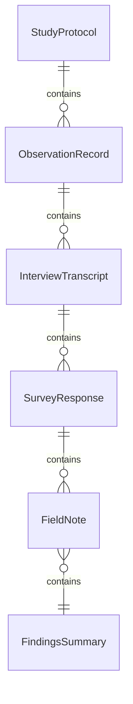
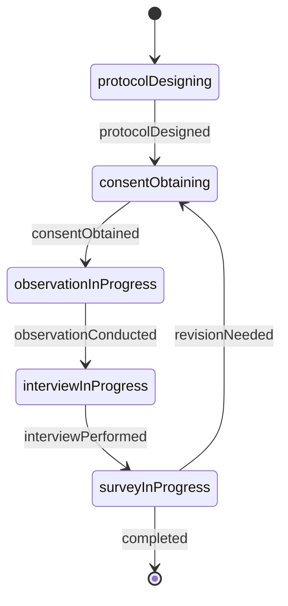
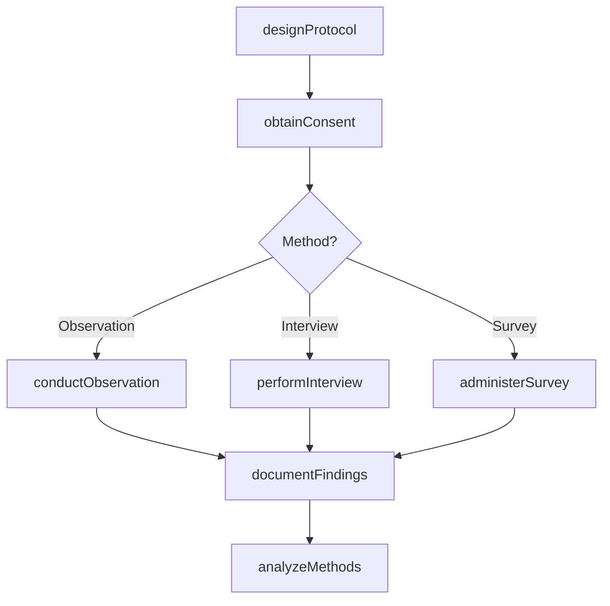
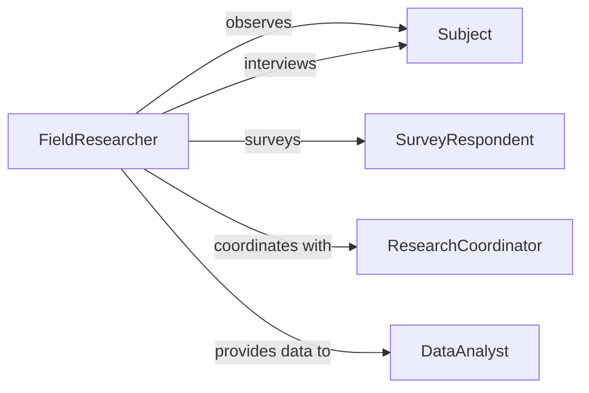

# Collect Information People Through Observation

> Business-as-Code definition for multi-method information gathering from individuals. Models qualitative and quantitative data collection through direct observation, structured interviews, and survey instruments to understand behaviors, needs, and perspectives.

## Overview

Collecting information through observation, interviews, and surveys requires careful methodology design, ethical consent, systematic documentation, and rigorous analysis. This definition exposes actions for planning studies, conducting observations, administering interviews, and analyzing findings with events for quality control and insight delivery.

## Actors

| Actor | Description |
|-------|-------------|
| Subject | Individual being observed, interviewed, or surveyed |
| Observer | Records behavioral data and environmental context |
| Interviewer | Conducts structured or semi-structured conversations |
| SurveyRespondent | Completes questionnaires providing self-reported data |
| ResearchCoordinator | Designs methodology and ensures protocol compliance |
| DataAnalyst | Processes collected information to extract insights |

## Roles

| Role | Description |
|------|-------------|
| FieldResearcher | Conducts observations and interviews in natural settings |
| SurveyAdministrator | Manages questionnaire distribution and collection |
| DataRecorder | Documents observations and transcribes interviews |
| Synthesizer | Integrates findings across multiple collection methods |

## Entities

| Entity | Description |
|--------|-------------|
| StudyProtocol | Methodology defining observation, interview, and survey procedures |
| ObservationRecord | Documented behavioral data from direct observation |
| InterviewTranscript | Verbatim record of interview conversation |
| SurveyResponse | Completed questionnaire from respondent |
| FieldNote | Contextual annotations about observation setting |
| FindingsSummary | Synthesized insights from all collection methods |

## Actions

| Action | Description |
|--------|-------------|
| designProtocol | Define methodology for observation, interviews, and surveys |
| obtainConsent | Secure ethical approval to collect information from subjects |
| conductObservation | Systematically record behaviors and environmental context |
| performInterview | Execute structured conversation to gather perspectives |
| administerSurvey | Distribute and collect questionnaire responses |
| documentFindings | Record observations, transcribe interviews, or log responses |
| analyzeMethods | Synthesize insights across observation, interview, and survey data |

## Events

| Event | Description |
|-------|-------------|
| protocolDesigned | Methodology has been defined |
| consentObtained | Ethical approval secured from subject |
| observationConducted | Behavioral data has been recorded |
| interviewPerformed | Conversation has been completed |
| surveyAdministered | Questionnaire has been distributed |
| findingsDocumented | Data has been recorded or transcribed |
| methodsAnalyzed | Cross-method insights have been synthesized |

## Searches

| Search | Description |
|--------|-------------|
| findProtocols | List study methodologies by type or date |
| getObservations | Retrieve behavioral records by subject or setting |
| getInterviews | Search transcripts by subject or topic |
| getSurveys | Find responses by respondent segment or question |

## Entity Relationships



## State Diagram



## Workflow



## Actor Relationships



## Usage

### Calling Actions

```typescript
import { collectInformationPeopleThroughObservation } from '@headlessly/collect-information-people-through-observation'

const research = collectInformationPeopleThroughObservation()

// Design study protocol combining methods
const protocol = await research.designProtocol({
  studyTitle: 'Retail Customer Journey Analysis',
  objectives: ['Understand shopping behaviors', 'Identify pain points', 'Measure satisfaction'],
  methods: ['observation', 'exit-interview', 'online-survey'],
  setting: 'flagship-store',
  duration: 30
})

// Obtain consent from participant
await research.obtainConsent({
  protocolId: protocol.id,
  subjectId: 'subject-392',
  consentType: 'informed-voluntary',
  dataUsage: 'research-only',
  anonymization: true
})

// Conduct observation
const observation = await research.conductObservation({
  protocolId: protocol.id,
  subjectId: 'subject-392',
  duration: 25,
  setting: 'electronics-department',
  behaviors: [
    { time: '10:15', action: 'examined-product-label', product: 'laptop-model-x' },
    { time: '10:18', action: 'consulted-staff', duration: 5 },
    { time: '10:23', action: 'compared-with-competitor-product' }
  ]
})

// Perform follow-up interview
await research.performInterview({
  protocolId: protocol.id,
  subjectId: 'subject-392',
  interviewType: 'semi-structured',
  questions: [
    { id: 'q1', text: 'What factors influenced your purchase decision?' },
    { id: 'q2', text: 'How could we improve your shopping experience?' }
  ]
})
```

### Event-Driven Automation

```typescript
// Auto-document observations in real-time
research.observationConducted(async ({ observation }) => {
  await research.documentFindings({
    type: 'observation-record',
    data: observation,
    timestamp: new Date().toISOString(),
    recorder: 'field-researcher-4'
  })
})

// Trigger analysis when all methods complete for subject
research.findingsDocumented(async ({ protocolId, subjectId }) => {
  const completed = await checkAllMethodsComplete(protocolId, subjectId)
  if (completed) {
    await research.analyzeMethods({
      protocolId,
      subjectId,
      synthesisType: 'triangulation'
    })
  }
})
```
