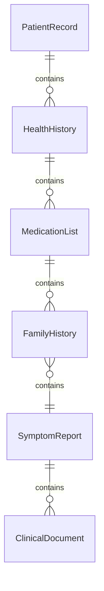
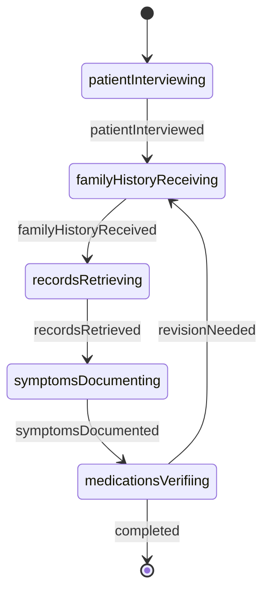
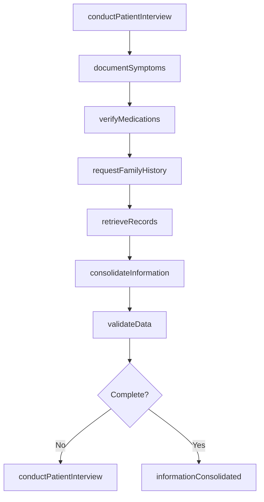
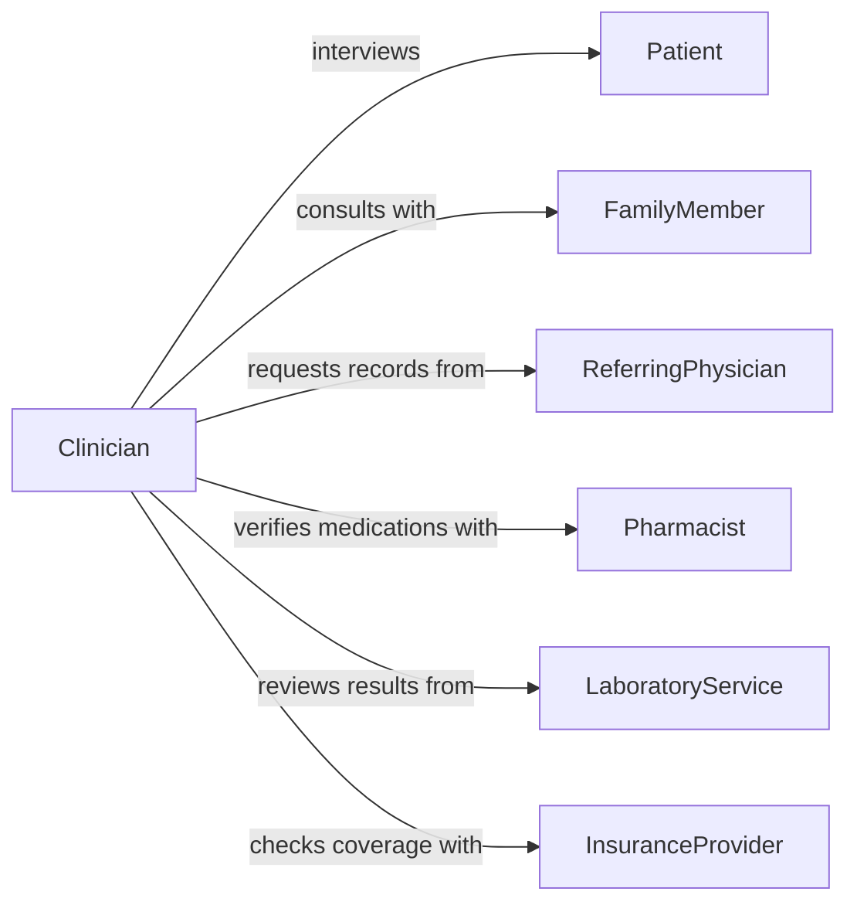

# Collect Medical Information Patients Family

> Business-as-Code definition for collecting medical information from patients, families, and healthcare professionals. Models comprehensive health data gathering for clinical assessment, treatment planning, and care coordination.

## Overview

Collecting medical information from patients, family members, and medical professionals involves obtaining complete health histories, current symptoms, medication lists, family medical backgrounds, and clinical observations. This definition enables structured data collection through patient interviews, family consultations, electronic health record exchanges, and provider-to-provider communications to support accurate diagnosis and effective treatment planning.

## Actors

| Actor | Description |
|-------|-------------|
| Patient | Provides personal health information and current symptoms |
| FamilyMember | Offers family medical history and patient health observations |
| ReferringPhysician | Shares clinical notes and test results from prior care |
| Pharmacist | Provides medication history and interaction information |
| LaboratoryService | Supplies test results and diagnostic findings |
| InsuranceProvider | Shares coverage details and prior authorization records |

## Roles

| Role | Description |
|------|-------------|
| Clinician | Conducts patient interviews and reviews medical histories |
| MedicalRecordsSpecialist | Retrieves and organizes health records from multiple sources |
| CaseCoordinator | Manages information collection across care team members |
| IntakeSpecialist | Gathers initial patient information during registration |

## Entities

| Entity | Description |
|--------|-------------|
| PatientRecord | Comprehensive medical record for an individual patient |
| HealthHistory | Documented past illnesses, surgeries, and treatments |
| MedicationList | Current and past medications with dosages and schedules |
| FamilyHistory | Medical conditions and diseases affecting blood relatives |
| SymptomReport | Patient-described complaints and clinical observations |
| ClinicalDocument | Lab results, imaging reports, and provider notes |

## Actions

| Action | Description |
|--------|-------------|
| conductPatientInterview | Perform structured interview to gather health information |
| requestFamilyHistory | Obtain medical history from family members |
| retrieveRecords | Request and obtain medical records from other providers |
| documentSymptoms | Record current complaints and clinical findings |
| verifyMedications | Confirm medication list with patient and pharmacy |
| consolidateInformation | Merge data from multiple sources into unified record |
| validateData | Check accuracy and completeness of collected information |

## Events

| Event | Description |
|-------|-------------|
| patientInterviewed | Patient interview has been completed and documented |
| familyHistoryReceived | Family medical history has been obtained |
| recordsRetrieved | External medical records have been received |
| symptomsDocumented | Current symptoms have been recorded in the chart |
| medicationsVerified | Medication list has been confirmed and updated |
| informationConsolidated | All collected data has been merged into patient record |
| dataValidated | Information accuracy and completeness have been verified |

## Searches

| Search | Description |
|--------|-------------|
| findPatientRecords | List patient records by name, ID, or date of birth |
| getMedications | Retrieve current medication lists by patient |
| getSymptomHistory | Find documented symptoms by patient and timeframe |
| getFamilyConditions | Search family history for specific conditions or patterns |

## Entity Relationships



## State Diagram



## Workflow



## Actor Relationships



## Usage

### Calling Actions

```typescript
import { collectMedicalInformationPatientsFamily } from '@headlessly/collect-medical-information-patients-family'

const collection = collectMedicalInformationPatientsFamily()

// Conduct patient interview and document symptoms
const interview = await collection.conductPatientInterview({
  patientId: 'PT-89234',
  interviewDate: '2026-02-05T09:30:00Z',
  chiefComplaint: 'persistent headaches and dizziness',
  reviewOfSystems: { neurological: 'headaches, dizziness', cardiovascular: 'none' }
})

await collection.documentSymptoms({
  patientId: 'PT-89234',
  symptoms: [
    { description: 'bilateral frontal headache', severity: 7, duration: '2 weeks' },
    { description: 'intermittent vertigo', severity: 5, duration: '1 week' }
  ]
})

// Request family medical history
await collection.requestFamilyHistory({
  patientId: 'PT-89234',
  familyContact: { name: 'Maria Rodriguez', relationship: 'daughter', phone: '555-0142' }
})

// Retrieve records from referring physician
const records = await collection.retrieveRecords({
  patientId: 'PT-89234',
  providerId: 'PROV-5821',
  recordTypes: ['clinical-notes', 'lab-results', 'imaging']
})

// Verify current medications
await collection.verifyMedications({
  patientId: 'PT-89234',
  pharmacyId: 'PHARM-3012',
  confirmationMethod: 'electronic'
})
```

### Event-Driven Automation

```typescript
// Trigger consolidation when all records are received
collection.recordsRetrieved(async ({ patientId }) => {
  await collection.consolidateInformation({ patientId })
})

// Alert clinician when family history reveals critical conditions
collection.familyHistoryReceived(async ({ patientId, conditions }) => {
  const criticalConditions = conditions.filter(c => c.severity === 'high')
  if (criticalConditions.length > 0) {
    await notify({
      to: 'assigned-clinician',
      message: `Critical family history identified for patient ${patientId}: ${criticalConditions.map(c => c.name).join(', ')}`
    })
  }
})

// Validate data completeness before clinical review
collection.informationConsolidated(async ({ patientId }) => {
  await collection.validateData({ patientId })
})
```
