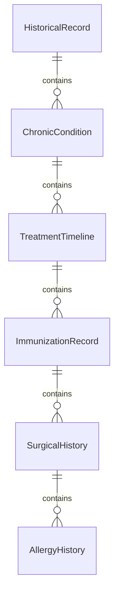
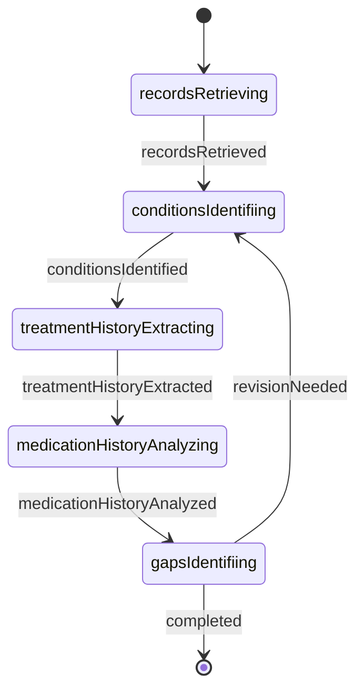
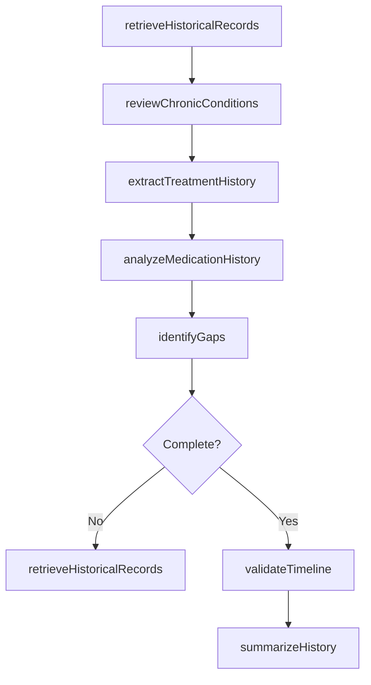
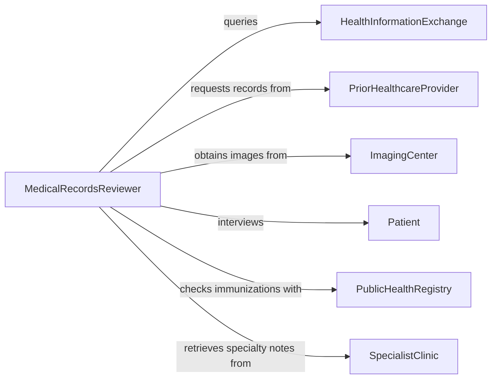

# Gather Medical Information Patient Histories

> Business-as-Code definition for gathering medical information from patient histories. Models systematic review of historical health records, prior treatments, chronic conditions, and longitudinal health data.

## Overview

Gathering medical information from patient histories involves extracting and organizing historical health data from electronic health records, paper charts, health information exchanges, and patient-reported sources. This definition supports comprehensive chart review, identification of chronic conditions, tracking treatment timelines, analyzing medication history, and establishing baseline health status for clinical decision-making and care planning.

## Actors

| Actor | Description |
|-------|-------------|
| HealthInformationExchange | Provides aggregated records from multiple healthcare organizations |
| PriorHealthcareProvider | Holds historical medical records from previous care episodes |
| ImagingCenter | Maintains archived diagnostic imaging and radiology reports |
| Patient | Provides personal health records and self-reported history |
| PublicHealthRegistry | Shares immunization records and disease surveillance data |
| SpecialistClinic | Holds treatment records from specialty care encounters |

## Roles

| Role | Description |
|------|-------------|
| MedicalRecordsReviewer | Analyzes historical records to extract relevant clinical data |
| HealthInformationManager | Coordinates record requests and manages data quality |
| ClinicalDataAbstractor | Extracts specific data elements for research or quality reporting |
| ChronicDiseaseCoordinator | Tracks disease progression and treatment history over time |

## Entities

| Entity | Description |
|--------|-------------|
| HistoricalRecord | Complete medical record from a prior care episode |
| ChronicCondition | Long-term health condition documented across multiple encounters |
| TreatmentTimeline | Chronological sequence of therapies and interventions |
| ImmunizationRecord | Documented vaccination history across lifetime |
| SurgicalHistory | Record of all past surgical procedures and outcomes |
| AllergyHistory | Documented allergic reactions and sensitivities over time |

## Actions

| Action | Description |
|--------|-------------|
| retrieveHistoricalRecords | Obtain patient records from prior healthcare encounters |
| reviewChronicConditions | Identify and document long-term health conditions |
| extractTreatmentHistory | Compile chronological record of therapies and interventions |
| analyzeMedicationHistory | Review past medication use and adverse reactions |
| identifyGaps | Find missing or incomplete historical data elements |
| validateTimeline | Verify chronological accuracy of historical events |
| summarizeHistory | Create concise overview of patient health trajectory |

## Events

| Event | Description |
|-------|-------------|
| recordsRetrieved | Historical medical records have been obtained |
| conditionsIdentified | Chronic health conditions have been documented |
| treatmentHistoryExtracted | Complete treatment timeline has been compiled |
| medicationHistoryAnalyzed | Medication use patterns have been reviewed |
| gapsIdentified | Missing historical data elements have been flagged |
| timelineValidated | Chronological accuracy has been verified |
| historySummarized | Concise patient history summary has been created |

## Searches

| Search | Description |
|--------|-------------|
| findHistoricalRecords | List past medical records by patient, date, or facility |
| getChronicConditions | Retrieve documented chronic conditions by patient |
| getTreatmentHistory | Find all treatments and therapies by condition or timeframe |
| getMedicationHistory | Search past medication use by patient or drug class |

## Entity Relationships



## State Diagram



## Workflow



## Actor Relationships



## Usage

### Calling Actions

```typescript
import { gatherMedicalInformationPatientHistories } from '@headlessly/gather-medical-information-patient-histories'

const histories = gatherMedicalInformationPatientHistories()

// Retrieve all historical records for a patient
const records = await histories.retrieveHistoricalRecords({
  patientId: 'PT-67890',
  dateRange: { start: '2015-01-01', end: '2026-01-01' },
  sources: ['HIE', 'prior-providers', 'patient-portal']
})

// Review chronic conditions from historical data
const conditions = await histories.reviewChronicConditions({
  patientId: 'PT-67890',
  recordIds: records.map(r => r.id)
})

// Extract complete treatment history
const timeline = await histories.extractTreatmentHistory({
  patientId: 'PT-67890',
  conditionIds: conditions.map(c => c.id),
  includeOutcomes: true
})

// Analyze medication history for adverse events
const medHistory = await histories.analyzeMedicationHistory({
  patientId: 'PT-67890',
  focusAreas: ['adverse-reactions', 'drug-interactions', 'compliance']
})

// Identify gaps in historical data
const gaps = await histories.identifyGaps({
  patientId: 'PT-67890',
  requiredElements: ['surgical-history', 'immunizations', 'family-history']
})
```

### Event-Driven Automation

```typescript
// Request additional records when gaps are identified
histories.gapsIdentified(async ({ patientId, gaps }) => {
  for (const gap of gaps) {
    await histories.retrieveHistoricalRecords({
      patientId,
      specificRecordType: gap.type,
      dateRange: gap.expectedPeriod
    })
  }
})

// Alert care team when chronic conditions are identified
histories.conditionsIdentified(async ({ patientId, conditions }) => {
  const highRiskConditions = conditions.filter(c => c.riskLevel === 'high')
  if (highRiskConditions.length > 0) {
    await notify({
      to: 'chronic-disease-coordinator',
      message: `High-risk conditions identified for ${patientId}: ${highRiskConditions.map(c => c.name).join(', ')}`
    })
  }
})

// Validate timeline after medication history is complete
histories.medicationHistoryAnalyzed(async ({ patientId }) => {
  await histories.validateTimeline({ patientId })
})
