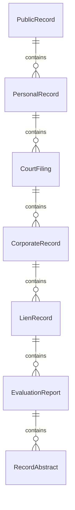
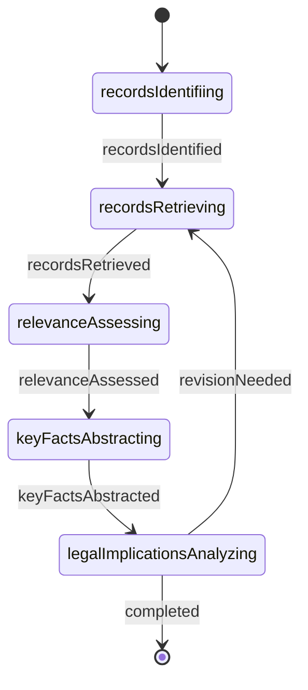
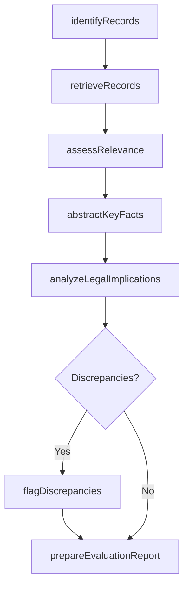
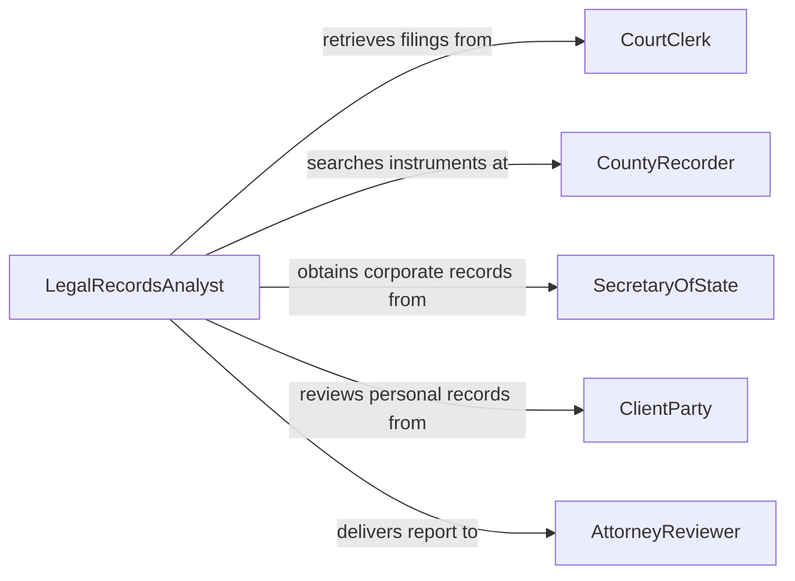

# Evaluate Information Related to Legal Matters

> Business-as-Code definition for evaluating information related to legal matters in public or personal records. Models the workflow from record identification through retrieval, legal relevance assessment, analysis, and findings documentation.

## Overview

Evaluating information related to legal matters in public or personal records involves identifying, retrieving, and analyzing documents from court filings, land records, vital statistics, corporate registrations, and personal files to assess their relevance and implications for legal proceedings, compliance determinations, or due diligence reviews. This definition exposes actions for legal record evaluation, events for assessment milestones, and searches for retrieving evaluated records.

## Actors

| Actor | Description |
|-------|-------------|
| CourtClerk | Maintains case files, judgments, and court orders in the public record |
| CountyRecorder | Holds recorded instruments including deeds, mortgages, and liens |
| SecretaryOfState | Maintains corporate formation documents, annual reports, and UCC filings |
| VitalRecordsOffice | Issues birth certificates, death records, and marriage licenses |
| OpposingCounsel | Provides or disputes records relevant to the legal matter |
| ClientParty | Supplies personal records and authorizes access to private information |

## Roles

| Role | Description |
|------|-------------|
| LegalRecordsAnalyst | Retrieves and evaluates public and personal records for legal relevance |
| ParalegalInvestigator | Gathers documents and prepares summaries for attorney review |
| AttorneyReviewer | Interprets legal significance of evaluated records |
| ComplianceExaminer | Assesses records against regulatory requirements |

## Entities

| Entity | Description |
|--------|-------------|
| PublicRecord | A document filed with a government agency and available for inspection |
| PersonalRecord | A private document such as a contract, will, or financial statement |
| CourtFiling | A pleading, motion, order, or judgment from court proceedings |
| CorporateRecord | A formation document, annual report, or registered agent filing |
| LienRecord | A recorded claim against property for satisfaction of a debt |
| EvaluationReport | A written assessment of the legal relevance and implications of reviewed records |
| RecordAbstract | A condensed summary of key facts extracted from a record |

## Actions

| Action | Description |
|--------|-------------|
| identifyRecords | Determine which public and personal records are relevant to the matter |
| retrieveRecords | Obtain copies of identified records from custodians and repositories |
| assessRelevance | Evaluate each record for its bearing on the legal question |
| abstractKeyFacts | Extract and summarize the essential information from each record |
| analyzeLegalImplications | Determine how the records affect rights, obligations, or liability |
| flagDiscrepancies | Identify inconsistencies or conflicts between records |
| prepareEvaluationReport | Document findings, conclusions, and recommendations |

## Events

| Event | Description |
|-------|-------------|
| recordsIdentified | Relevant public and personal records have been determined |
| recordsRetrieved | Copies of identified records have been obtained |
| relevanceAssessed | Each record has been evaluated for legal bearing |
| keyFactsAbstracted | Essential information has been extracted and summarized |
| legalImplicationsAnalyzed | The effect of records on rights and obligations has been determined |
| discrepanciesFlagged | Inconsistencies between records have been identified |
| evaluationReportPrepared | Findings and recommendations have been documented |

## Searches

| Search | Description |
|--------|-------------|
| findRecords | Search public and personal records by matter, party, or record type |
| getCourtFilings | Retrieve court documents by case number, party, or jurisdiction |
| getCorporateRecords | Locate business filings by entity name, state, or filing type |
| getLienRecords | Find recorded liens by property, debtor, or creditor |
| getEvaluationReports | List completed evaluations by matter, analyst, or date |

## Entity Relationships



## State Diagram



## Workflow



## Actor Relationships



## Usage

### Calling Actions

```typescript
import { evaluateInformationRelatedLegalMatters } from '@headlessly/evaluate-information-related-legal-matters'

const evaluation = evaluateInformationRelatedLegalMatters()

// Identify records relevant to a real estate title dispute
const records = await evaluation.identifyRecords({
  matterId: 'title-dispute-2026-0155',
  parties: ['seller-johnson', 'buyer-martinez'],
  recordTypes: ['deeds', 'mortgages', 'liens', 'courtOrders'],
  jurisdiction: 'cook-county-il'
})

// Retrieve and assess relevance
const retrieved = await evaluation.retrieveRecords({
  recordIds: records.map(r => r.id),
  sources: ['countyRecorder', 'circuitCourt', 'secretaryOfState']
})

await evaluation.assessRelevance({
  matterId: 'title-dispute-2026-0155',
  records: retrieved.map(r => r.id),
  legalQuestion: 'Whether a prior unrecorded easement affects marketable title'
})

// Prepare the evaluation report
await evaluation.prepareEvaluationReport({
  matterId: 'title-dispute-2026-0155',
  sections: ['recordsSummary', 'relevanceAnalysis', 'discrepancies', 'conclusions']
})
```

### Event-Driven Automation

```typescript
// Alert attorney when discrepancies are found
evaluation.discrepanciesFlagged(async ({ matterId, discrepancies }) => {
  await notify({
    to: 'attorney-reviewer',
    message: `${discrepancies.length} discrepancies found in records for matter ${matterId}`
  })
})

// Auto-prepare report when analysis is complete
evaluation.legalImplicationsAnalyzed(async ({ matterId }) => {
  await evaluation.prepareEvaluationReport({ matterId })
})
```
