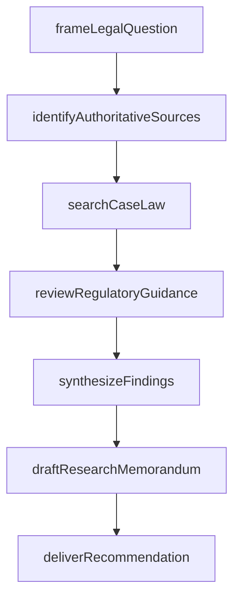
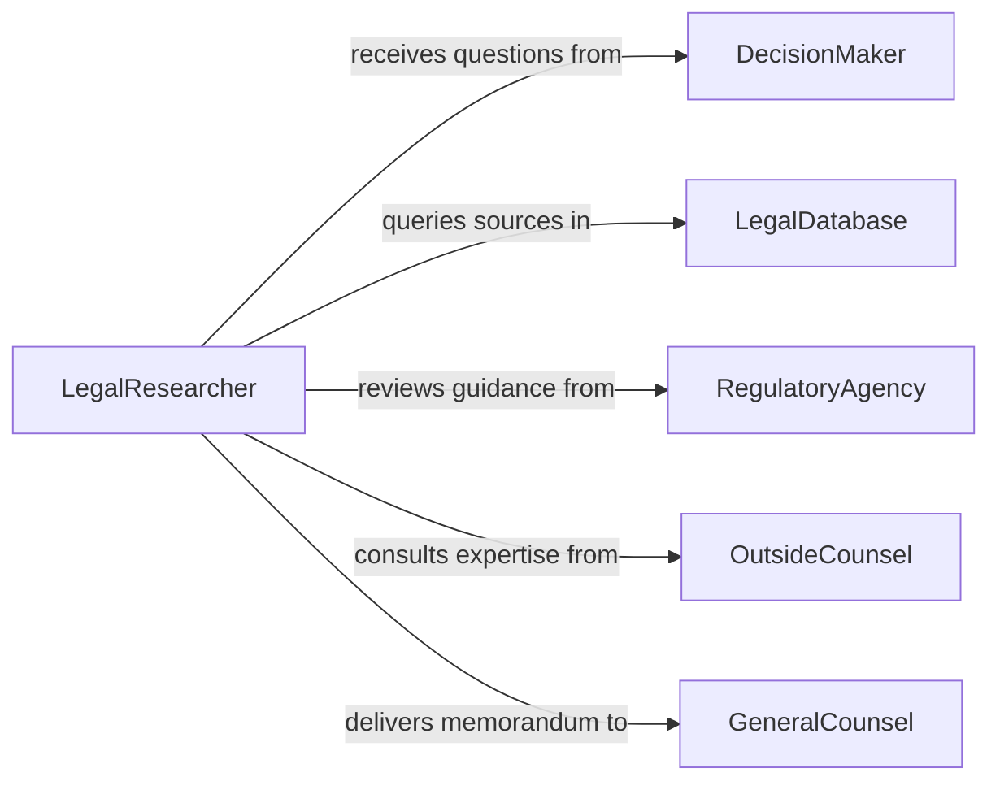

# Research Relevant Legal Materials to Aid Decision Making

> Business-as-Code definition for researching relevant legal materials to aid decision making. Models the workflow from issue framing through source identification, legal research, synthesis, and recommendation delivery.

## Overview

Researching relevant legal materials to aid decision making involves framing the legal question, identifying authoritative sources, conducting systematic research across statutes, regulations, case law, and administrative guidance, synthesizing findings, and presenting actionable recommendations to decision makers. This applies in corporate governance, regulatory compliance, contract negotiations, and policy development. This definition exposes actions for legal research, events for research milestones, and searches for retrieving legal materials and analyses.

## Actors

| Actor | Description |
|-------|-------------|
| DecisionMaker | The executive or official who needs legal guidance for a pending decision |
| LegalDatabase | A commercial or public system hosting statutes, case law, and regulations |
| RegulatoryAgency | Publishes rules, guidance documents, and enforcement actions |
| IndustryAssociation | Issues best practices, model policies, and compliance frameworks |
| OutsideCounsel | Provides specialized legal expertise on complex matters |
| LegislativeBody | Enacts statutes and publishes legislative history |

## Roles

| Role | Description |
|------|-------------|
| LegalResearcher | Conducts systematic research across legal sources |
| PolicyAnalyst | Evaluates how legal findings affect organizational policy |
| GeneralCounsel | Reviews research and formulates recommendations for leadership |
| ResearchAssistant | Assists with citation verification and document retrieval |

## Entities

| Entity | Description |
|--------|-------------|
| LegalQuestion | A specific issue requiring research to support a decision |
| StatutorySource | A federal, state, or local law relevant to the question |
| CaseLawCitation | A judicial decision interpreting or applying the relevant law |
| RegulatoryGuidance | An agency interpretation, advisory opinion, or compliance bulletin |
| LegislativeHistory | Committee reports, floor debates, and amendments illuminating intent |
| ResearchMemorandum | A written summary of legal findings and their implications |
| Recommendation | A proposed course of action based on the research conclusions |

## Actions

| Action | Description |
|--------|-------------|
| frameLegalQuestion | Define the specific issue and scope of research needed |
| identifyAuthoritativeSources | Select the statutes, regulations, and databases to consult |
| searchCaseLaw | Query judicial decisions for relevant precedent |
| reviewRegulatoryGuidance | Examine agency interpretations and compliance advisories |
| synthesizeFindings | Combine statutory, case law, and regulatory research into a coherent analysis |
| draftResearchMemorandum | Prepare a written summary of findings and legal conclusions |
| deliverRecommendation | Present actionable guidance to the decision maker |

## Events

| Event | Description |
|-------|-------------|
| legalQuestionFramed | The research issue and scope have been defined |
| authoritativeSourcesIdentified | Relevant statutes, regulations, and databases have been selected |
| caseLawSearched | Judicial decisions have been queried and reviewed |
| regulatoryGuidanceReviewed | Agency interpretations and advisories have been examined |
| findingsSynthesized | Research from all sources has been combined into a coherent analysis |
| researchMemorandumDrafted | A written summary of findings has been prepared |
| recommendationDelivered | Actionable guidance has been presented to the decision maker |

## Searches

| Search | Description |
|--------|-------------|
| findLegalQuestions | Search research questions by topic, matter, or decision maker |
| getStatutorySources | Retrieve statutes by jurisdiction, topic, or citation |
| getCaseLawCitations | Find judicial decisions by keyword, jurisdiction, or date |
| getRegulatoryGuidance | Locate agency guidance by agency, topic, or issuance date |
| getResearchMemorandums | List completed memorandums by matter, author, or date |

## Workflow



## Actor Relationships



## Usage

### Calling Actions

```typescript
import { researchRelevantLegalMaterialsAid } from '@headlessly/research-relevant-legal-materials-aid'

const research = researchRelevantLegalMaterialsAid()

// Frame the legal question for a corporate acquisition decision
const question = await research.frameLegalQuestion({
  matterId: 'acquisition-review-2026',
  question: 'What antitrust approvals are required for a horizontal merger in the semiconductor industry?',
  jurisdiction: 'federal',
  urgency: 'high'
})

// Identify sources and conduct research
await research.identifyAuthoritativeSources({
  questionId: question.id,
  sources: ['shermanAct', 'claytonAct', 'ftcGuidelines', 'dojMergerReview']
})

const caseLaw = await research.searchCaseLaw({
  questionId: question.id,
  keywords: ['horizontal merger', 'semiconductor', 'market concentration'],
  jurisdictions: ['federal-circuit', 'supreme-court'],
  dateRange: { from: '2015-01-01', to: '2026-02-01' }
})

// Synthesize and deliver
await research.synthesizeFindings({
  questionId: question.id,
  sources: ['statutes', 'caseLaw', 'regulatoryGuidance']
})

await research.draftResearchMemorandum({
  questionId: question.id,
  sections: ['issueStatement', 'applicableLaw', 'analysis', 'recommendation']
})
```

### Event-Driven Automation

```typescript
// Notify general counsel when memorandum is drafted
research.researchMemorandumDrafted(async ({ matterId, questionId }) => {
  await notify({
    to: 'general-counsel',
    message: `Legal research memorandum ready for review on matter ${matterId}`
  })
})

// Alert decision maker when recommendation is delivered
research.recommendationDelivered(async ({ matterId, recommendation }) => {
  await notify({
    to: 'decision-maker',
    message: `Legal recommendation delivered for matter ${matterId}: ${recommendation.summary}`
  })
})
```
