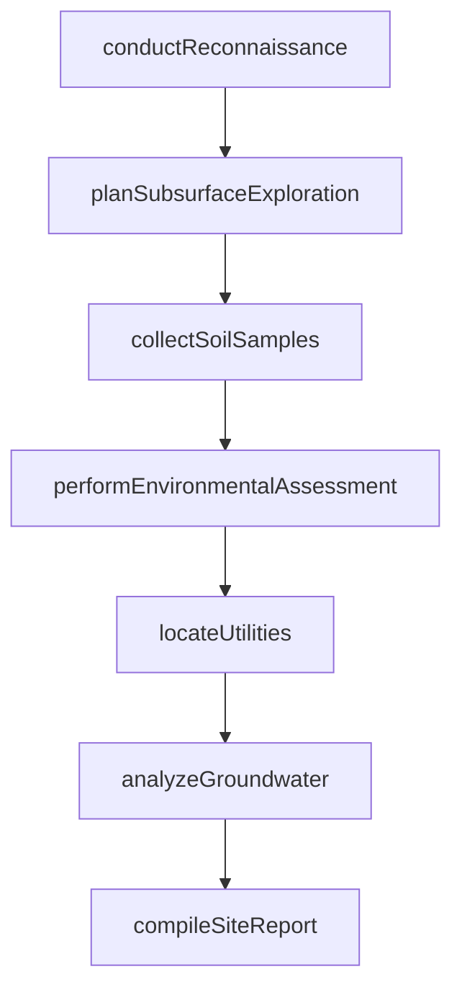
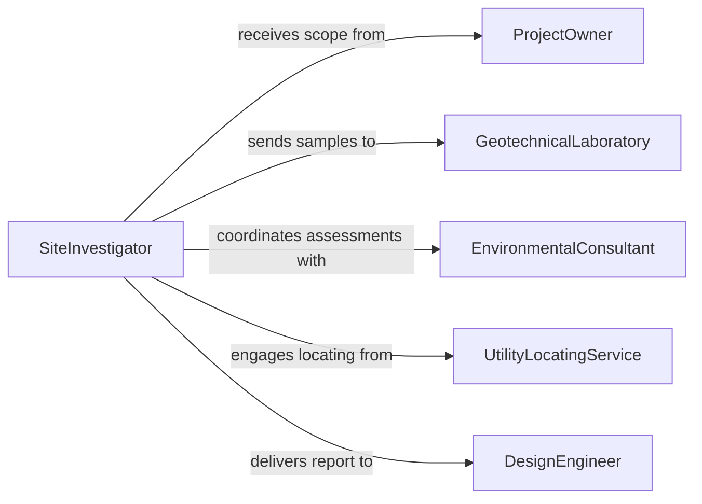

# Collect Data About Project Sites

> Business-as-Code definition for collecting data about project sites. Models the workflow from site reconnaissance through geotechnical investigation, environmental assessment, utility mapping, and site data report production.

## Overview

Collecting data about project sites involves conducting reconnaissance visits, geotechnical investigations, environmental assessments, utility locating, and infrastructure evaluations to compile the information needed for project design, permitting, and construction planning. This activity produces soil reports, environmental clearances, utility maps, and site characterization documents that inform engineering decisions. This definition exposes actions for site data collection, events for investigation milestones, and searches for retrieving site characterization data.

## Actors

| Actor | Description |
|-------|-------------|
| ProjectOwner | Commissions the site investigation and funds the data collection |
| GeotechnicalLaboratory | Performs soil and material testing on collected samples |
| EnvironmentalConsultant | Conducts Phase I and Phase II environmental site assessments |
| UtilityLocatingService | Identifies underground utility locations through electromagnetic or ground-penetrating radar methods |
| PermittingAuthority | Requires site data for development permit applications |
| DesignEngineer | Uses collected site data to develop project plans and specifications |

## Roles

| Role | Description |
|------|-------------|
| SiteInvestigator | Plans and coordinates all data collection activities at the project site |
| GeotechnicalEngineer | Directs subsurface exploration and interprets soil and groundwater data |
| EnvironmentalScientist | Assesses contamination risk and regulatory compliance |
| SiteDataCoordinator | Compiles and organizes all collected data into a comprehensive report |

## Entities

| Entity | Description |
|--------|-------------|
| SiteReconnaissanceReport | Initial observations from a visual inspection of the project site |
| SoilBoring | A subsurface sample extracted for geotechnical or environmental analysis |
| SoilTestResult | Laboratory analysis of soil properties such as bearing capacity and moisture |
| EnvironmentalAssessment | A report evaluating contamination risk and regulatory compliance |
| UtilityMap | A drawing showing the location of underground infrastructure |
| GroundwaterData | Measurements of water table depth, flow direction, and quality |
| SiteCharacterizationReport | A comprehensive document combining all site investigation findings |

## Actions

| Action | Description |
|--------|-------------|
| conductReconnaissance | Perform an initial visual inspection of the project site |
| planSubsurfaceExploration | Define boring locations, depths, and sampling requirements |
| collectSoilSamples | Extract subsurface samples through drilling or test pits |
| performEnvironmentalAssessment | Evaluate the site for contamination and regulatory compliance |
| locateUtilities | Identify the position and depth of underground infrastructure |
| analyzeGroundwater | Measure water table levels, flow patterns, and water quality |
| compileSiteReport | Assemble all investigation data into a comprehensive characterization |

## Events

| Event | Description |
|-------|-------------|
| reconnaissanceConducted | An initial visual inspection of the site has been completed |
| explorationPlanned | Boring locations and sampling requirements have been defined |
| soilSamplesCollected | Subsurface samples have been extracted and sent for analysis |
| environmentalAssessmentPerformed | Contamination risk and compliance have been evaluated |
| utilitiesLocated | Underground infrastructure positions have been identified |
| groundwaterAnalyzed | Water table and groundwater conditions have been measured |
| siteReportCompiled | All investigation data has been assembled into a report |

## Searches

| Search | Description |
|--------|-------------|
| findSiteInvestigations | Search investigations by project, location, or status |
| getSoilTestResults | Retrieve laboratory results by boring, depth, or parameter |
| getEnvironmentalAssessments | Locate assessments by site, date, or contamination type |
| getUtilityMaps | Find utility location data by project or infrastructure type |
| getSiteReports | List completed characterization reports by project or engineer |

## Workflow



## Actor Relationships



## Usage

### Calling Actions

```typescript
import { collectDataAboutProjectSites } from '@headlessly/collect-data-about-project-sites'

const site = collectDataAboutProjectSites()

// Conduct initial reconnaissance
const recon = await site.conductReconnaissance({
  projectId: 'mixed-use-development-2026',
  location: '4500 Riverside Drive, Lot 12',
  observations: ['existingStructures', 'drainage', 'vegetation', 'accessRoutes']
})

// Plan and execute subsurface exploration
await site.planSubsurfaceExploration({
  projectId: recon.projectId,
  borings: [
    { id: 'B-1', location: { x: 100, y: 200 }, depth: 30 },
    { id: 'B-2', location: { x: 250, y: 200 }, depth: 25 },
    { id: 'B-3', location: { x: 175, y: 350 }, depth: 35 }
  ],
  samplingInterval: '5ft'
})

await site.collectSoilSamples({
  projectId: recon.projectId,
  method: 'hollowStemAuger',
  date: '2026-03-05'
})

// Compile the full site report
await site.compileSiteReport({
  projectId: recon.projectId,
  sections: ['geotechnical', 'environmental', 'utilities', 'groundwater']
})
```

### Event-Driven Automation

```typescript
// Notify design engineer when site report is compiled
site.siteReportCompiled(async ({ projectId }) => {
  await notify({
    to: 'design-engineer',
    message: `Site characterization report complete for project ${projectId}`
  })
})

// Alert environmental team when soil samples show contamination risk
site.soilSamplesCollected(async ({ projectId, boringCount }) => {
  await site.performEnvironmentalAssessment({ projectId })
})
```
