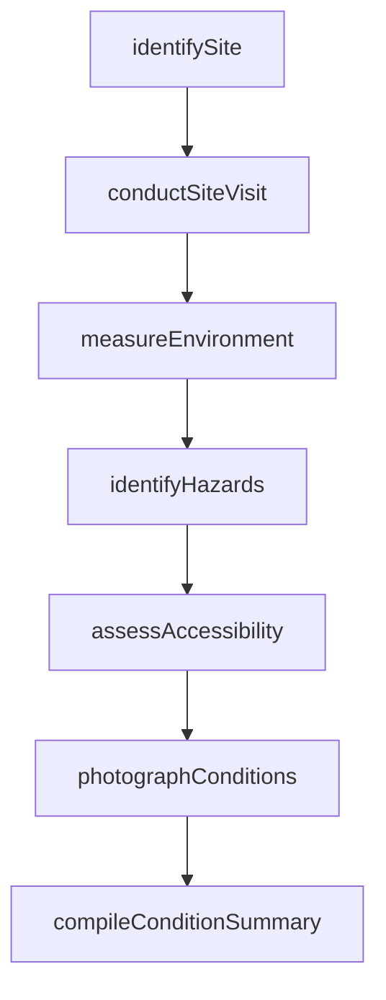
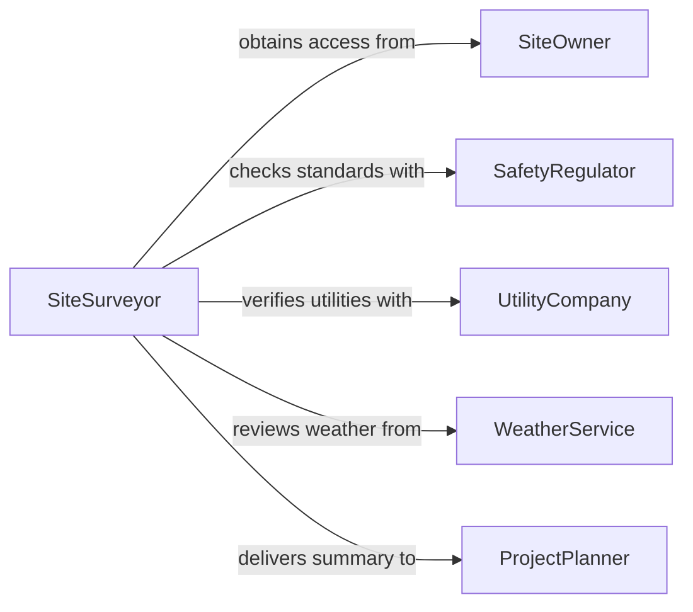

# Gather Information About Work Conditions or Locations

> Business-as-Code definition for gathering information about work conditions or locations. Models the workflow from site identification through condition assessment, hazard identification, environmental measurement, and report compilation.

## Overview

Gathering information about work conditions or locations involves visiting or remotely assessing workplaces, construction sites, facilities, and field locations to document environmental conditions, safety hazards, space constraints, equipment status, and logistical factors that affect how work is performed. This supports project planning, safety compliance, resource allocation, and operational readiness. This definition exposes actions for condition assessment, events for survey milestones, and searches for retrieving site and condition data.

## Actors

| Actor | Description |
|-------|-------------|
| SiteOwner | Grants access to the work location and provides historical information |
| SafetyRegulator | Establishes standards for acceptable work conditions |
| EnvironmentalAgency | Sets requirements for air quality, noise, and hazardous materials |
| UtilityCompany | Provides information about power, water, and telecommunications at the site |
| WeatherService | Supplies forecast and historical climate data for outdoor locations |
| SubcontractorFirm | Requires condition data to plan their scope of work |

## Roles

| Role | Description |
|------|-------------|
| SiteSurveyor | Conducts physical assessments and documents conditions at work locations |
| SafetyOfficer | Evaluates hazards and ensures conditions meet regulatory standards |
| ProjectPlanner | Uses site condition data to develop work plans and schedules |
| FacilitiesCoordinator | Manages information about building systems and infrastructure |

## Entities

| Entity | Description |
|--------|-------------|
| SiteProfile | A comprehensive record of a work location's characteristics and conditions |
| ConditionAssessment | A documented evaluation of environmental and operational conditions |
| HazardReport | A record of identified safety or health hazards at a work location |
| EnvironmentalReading | A measurement of air quality, temperature, noise, or other conditions |
| SitePhotograph | A visual record of conditions at a specific location and time |
| AccessibilityReport | An evaluation of how personnel and equipment can reach and move within a site |
| ConditionSummary | A compiled overview of all findings for planning purposes |

## Actions

| Action | Description |
|--------|-------------|
| identifySite | Confirm the work location and gather basic geographic and access information |
| conductSiteVisit | Physically inspect the location to observe and document conditions |
| measureEnvironment | Take readings of temperature, humidity, air quality, noise, and lighting |
| identifyHazards | Document safety and health risks present at the work location |
| assessAccessibility | Evaluate routes, clearances, and infrastructure for personnel and equipment |
| photographConditions | Capture visual documentation of the site and its conditions |
| compileConditionSummary | Assemble all findings into a report for project planning |

## Events

| Event | Description |
|-------|-------------|
| siteIdentified | The work location has been confirmed with basic information gathered |
| siteVisitConducted | A physical inspection of the location has been completed |
| environmentMeasured | Environmental readings have been recorded |
| hazardsIdentified | Safety and health risks have been documented |
| accessibilityAssessed | Routes, clearances, and infrastructure have been evaluated |
| conditionsPhotographed | Visual documentation of the site has been captured |
| conditionSummaryCompiled | All findings have been assembled into a planning report |

## Searches

| Search | Description |
|--------|-------------|
| findSites | Search work locations by project, address, or status |
| getConditionAssessments | Retrieve assessments by site, date, or surveyor |
| getHazardReports | List identified hazards by site, severity, or type |
| getEnvironmentalReadings | Find measurements by site, parameter, or date range |
| getConditionSummaries | Locate compiled reports by project or site |

## Workflow



## Actor Relationships



## Usage

### Calling Actions

```typescript
import { gatherInformationAboutWorkConditions } from '@headlessly/gather-information-about-work-conditions'

const conditions = gatherInformationAboutWorkConditions()

// Identify the site and conduct a visit
const site = await conditions.identifySite({
  projectId: 'warehouse-renovation-2026',
  address: '2800 Industrial Parkway, Building C',
  type: 'industrialWarehouse',
  accessContact: 'facilities-manager-reed'
})

await conditions.conductSiteVisit({
  siteId: site.id,
  visitDate: '2026-02-15',
  surveyor: 'inspector-martinez',
  checklistItems: ['structural', 'electrical', 'plumbing', 'hvac', 'fireProtection']
})

// Measure environment and identify hazards
await conditions.measureEnvironment({
  siteId: site.id,
  parameters: ['temperature', 'humidity', 'airQuality', 'noiseLevel', 'lighting'],
  zones: ['loadingDock', 'mainFloor', 'mezzanine', 'office']
})

await conditions.identifyHazards({
  siteId: site.id,
  categories: ['electrical', 'structural', 'chemicalExposure', 'fallRisk']
})
```

### Event-Driven Automation

```typescript
// Alert safety officer when hazards are identified
conditions.hazardsIdentified(async ({ siteId, hazards }) => {
  const critical = hazards.filter(h => h.severity === 'high')
  if (critical.length > 0) {
    await notify({
      to: 'safety-officer',
      message: `${critical.length} high-severity hazards found at site ${siteId}`
    })
  }
})

// Auto-compile summary when all assessments complete
conditions.accessibilityAssessed(async ({ siteId }) => {
  await conditions.compileConditionSummary({ siteId })
})
```
