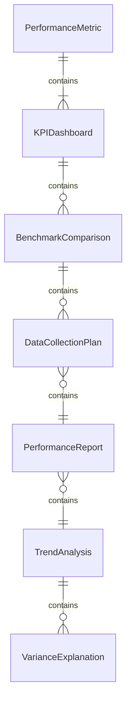
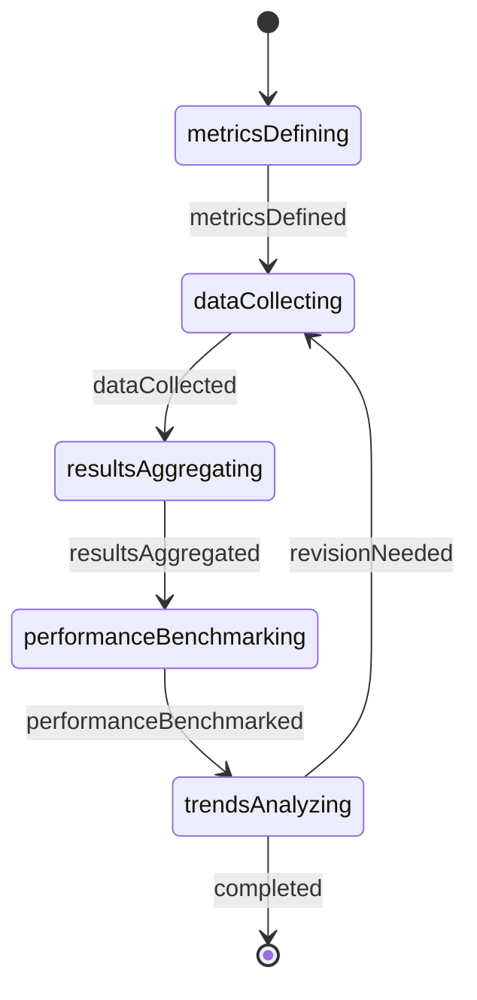
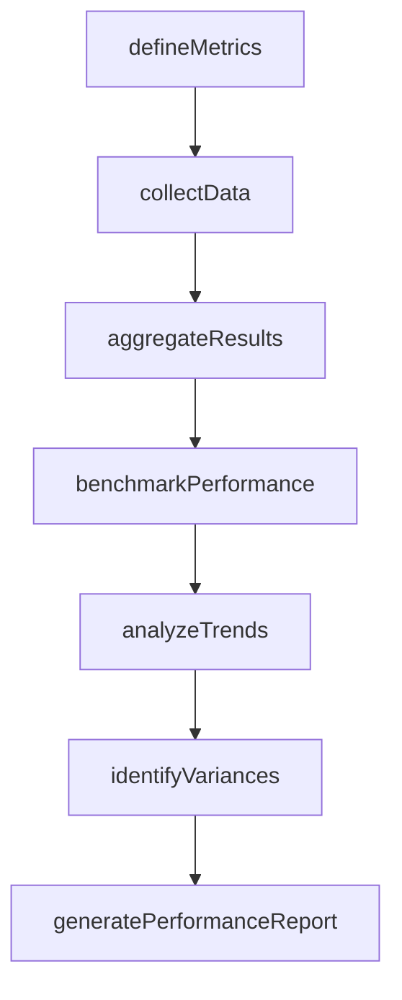
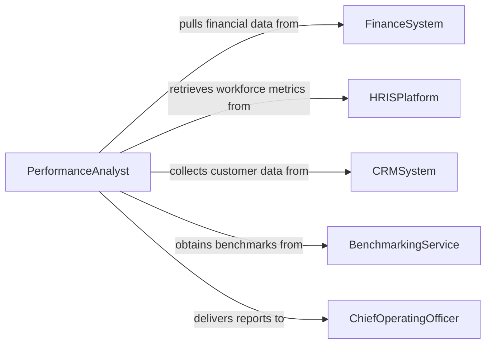

# Gather Organizational Performance Information

> Business-as-Code definition for gathering organizational performance information. Models the workflow from metric identification through data collection, aggregation, benchmarking, and performance report generation.

## Overview

Gathering organizational performance information involves identifying key performance indicators, collecting data from financial systems, operational dashboards, employee records, and customer feedback channels, aggregating results across business units, benchmarking against industry standards, and producing performance reports for management review. This definition exposes actions for performance data collection, events for reporting milestones, and searches for retrieving performance metrics and trends.

## Actors

| Actor | Description |
|-------|-------------|
| FinanceSystem | Provides revenue, cost, and profitability data |
| HRISPlatform | Supplies headcount, turnover, and workforce productivity metrics |
| CRMSystem | Tracks customer acquisition, retention, and satisfaction data |
| OperationsDashboard | Reports throughput, cycle time, and quality metrics |
| BenchmarkingService | Provides industry and peer comparison data |
| BoardOfDirectors | Receives performance reports and sets strategic expectations |

## Roles

| Role | Description |
|------|-------------|
| PerformanceAnalyst | Collects, aggregates, and analyzes organizational performance data |
| BusinessIntelligenceManager | Oversees data collection systems and reporting frameworks |
| DepartmentHead | Provides unit-level data and context for performance metrics |
| ChiefOperatingOfficer | Reviews aggregated performance and directs improvement initiatives |

## Entities

| Entity | Description |
|--------|-------------|
| PerformanceMetric | A quantified measure of organizational effectiveness |
| KPIDashboard | A visual display of key performance indicators and trends |
| BenchmarkComparison | A side-by-side analysis of organizational versus industry performance |
| DataCollectionPlan | A schedule specifying what data to gather, from where, and when |
| PerformanceReport | A periodic document summarizing organizational results |
| TrendAnalysis | A longitudinal view of performance metrics over multiple periods |
| VarianceExplanation | A narrative accounting for deviations from targets or prior periods |

## Actions

| Action | Description |
|--------|-------------|
| defineMetrics | Identify the key performance indicators to track |
| collectData | Retrieve performance data from source systems and departments |
| aggregateResults | Combine data across business units and time periods |
| benchmarkPerformance | Compare organizational results against industry standards |
| analyzeTrends | Examine performance patterns over multiple reporting periods |
| identifyVariances | Flag metrics that deviate significantly from targets |
| generatePerformanceReport | Produce the periodic summary for management review |

## Events

| Event | Description |
|-------|-------------|
| metricsDefined | Key performance indicators have been identified and documented |
| dataCollected | Performance data has been retrieved from source systems |
| resultsAggregated | Data from all business units has been combined |
| performanceBenchmarked | Organizational results have been compared to industry standards |
| trendsAnalyzed | Multi-period performance patterns have been examined |
| variancesIdentified | Significant deviations from targets have been flagged |
| performanceReportGenerated | The periodic summary has been produced |

## Searches

| Search | Description |
|--------|-------------|
| findMetrics | Search performance metrics by category, department, or period |
| getKPIDashboards | Retrieve dashboard views by business unit or time frame |
| getBenchmarks | Locate industry comparison data by metric or sector |
| getTrendAnalyses | Find longitudinal performance views by metric or department |
| getPerformanceReports | List completed reports by period, author, or business unit |

## Entity Relationships



## State Diagram



## Workflow



## Actor Relationships



## Usage

### Calling Actions

```typescript
import { gatherOrganizationalPerformanceInformation } from '@headlessly/gather-organizational-performance-information'

const performance = gatherOrganizationalPerformanceInformation()

// Define the metrics to track
const plan = await performance.defineMetrics({
  reportingPeriod: 'Q4-2025',
  metrics: [
    { name: 'revenue', source: 'financeSystem', target: 12500000 },
    { name: 'customerRetention', source: 'crmSystem', target: 0.92 },
    { name: 'employeeTurnover', source: 'hrisPlatform', target: 0.08 },
    { name: 'productionYield', source: 'operationsDashboard', target: 0.97 }
  ]
})

// Collect and aggregate data
await performance.collectData({
  planId: plan.id,
  sources: ['financeSystem', 'crmSystem', 'hrisPlatform', 'operationsDashboard']
})

await performance.aggregateResults({
  planId: plan.id,
  groupBy: ['department', 'region']
})

// Generate the report
await performance.generatePerformanceReport({
  planId: plan.id,
  format: 'executiveSummary',
  recipients: ['coo', 'board-of-directors']
})
```

### Event-Driven Automation

```typescript
// Alert leadership when variances exceed threshold
performance.variancesIdentified(async ({ reportingPeriod, variances }) => {
  const critical = variances.filter(v => Math.abs(v.percentage) > 10)
  if (critical.length > 0) {
    await notify({
      to: 'coo',
      message: `${critical.length} critical variances detected in ${reportingPeriod}`
    })
  }
})

// Auto-generate report when trends are analyzed
performance.trendsAnalyzed(async ({ planId }) => {
  await performance.generatePerformanceReport({ planId })
})
```
