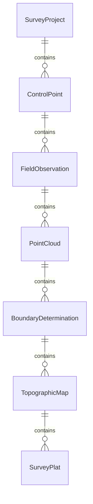
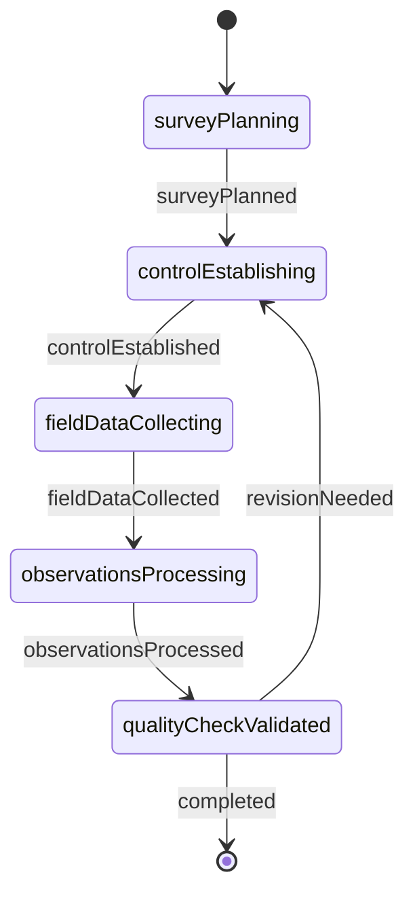
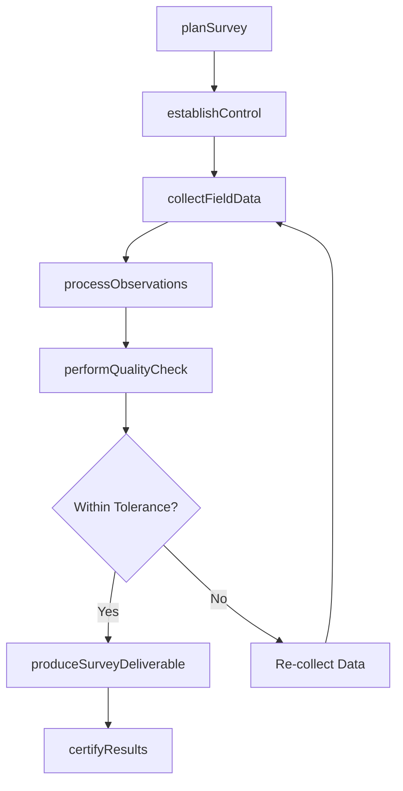
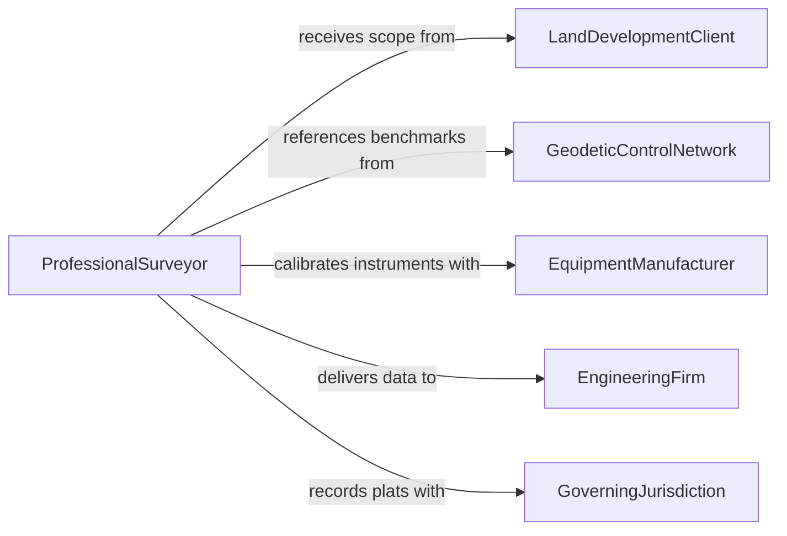

# Gather Physical Survey Data

> Business-as-Code definition for gathering physical survey data. Models the workflow from survey planning through field data collection, measurement processing, quality control, and deliverable production.

## Overview

Gathering physical survey data involves planning and executing land surveys, topographic measurements, boundary determinations, and construction layout using GPS, total stations, LiDAR, and other precision instruments. Surveyors establish control points, collect elevation and positional data, process raw measurements, perform quality checks, and produce plats, maps, and digital terrain models for engineering, construction, and legal purposes. This definition exposes actions for survey data collection, events for field milestones, and searches for retrieving survey records.

## Actors

| Actor | Description |
|-------|-------------|
| LandDevelopmentClient | Commissions the survey for development, transaction, or permitting purposes |
| GoverningJurisdiction | Sets surveying standards and accepts recorded plats |
| GeodeticControlNetwork | Provides reference benchmarks and control point coordinates |
| EquipmentManufacturer | Supplies and calibrates precision survey instruments |
| EngineeringFirm | Uses survey data for design, grading, and construction layout |
| AdjoiningPropertyOwner | May participate in boundary agreement or dispute resolution |

## Roles

| Role | Description |
|------|-------------|
| ProfessionalSurveyor | Plans and directs the survey and certifies the results |
| FieldTechnician | Operates instruments and records measurements in the field |
| SurveyDataProcessor | Reduces raw field data into coordinates and elevations |
| DraftingSpecialist | Produces plats, maps, and digital deliverables from processed data |

## Entities

| Entity | Description |
|--------|-------------|
| SurveyProject | A defined scope of survey work with deliverables and deadlines |
| ControlPoint | A precisely located reference point used as the basis for measurements |
| FieldObservation | A raw measurement of angle, distance, or elevation taken in the field |
| PointCloud | A dense set of three-dimensional coordinates captured by LiDAR or photogrammetry |
| BoundaryDetermination | A professional opinion on the location of property lines |
| TopographicMap | A representation of terrain features, contours, and surface objects |
| SurveyPlat | A legal document depicting property boundaries, dimensions, and easements |

## Actions

| Action | Description |
|--------|-------------|
| planSurvey | Define the scope, methods, equipment, and schedule for the survey |
| establishControl | Set up or recover geodetic control points for measurement reference |
| collectFieldData | Take measurements using GPS, total stations, or LiDAR in the field |
| processObservations | Reduce raw field data into adjusted coordinates and elevations |
| performQualityCheck | Verify measurement accuracy against tolerances and standards |
| produceSurveyDeliverable | Generate plats, maps, or digital terrain models from processed data |
| certifyResults | Review and seal the final survey products with professional certification |

## Events

| Event | Description |
|-------|-------------|
| surveyPlanned | The scope, methods, and schedule have been defined |
| controlEstablished | Geodetic control points have been set up or recovered |
| fieldDataCollected | Measurements have been taken and recorded in the field |
| observationsProcessed | Raw data has been reduced into adjusted coordinates |
| qualityCheckPassed | Measurements have been verified against accuracy standards |
| deliverableProduced | Plats, maps, or digital models have been generated |
| resultsCertified | The professional surveyor has sealed the final products |

## Searches

| Search | Description |
|--------|-------------|
| findSurveyProjects | Search projects by client, location, or status |
| getControlPoints | Retrieve control point data by project, datum, or coordinate system |
| getFieldObservations | List raw measurements by project, date, or instrument |
| getDeliverables | Locate plats, maps, and models by project or type |
| getQualityReports | Find accuracy verification reports by project or standard |

## Entity Relationships



## State Diagram



## Workflow



## Actor Relationships



## Usage

### Calling Actions

```typescript
import { gatherPhysicalSurveyData } from '@headlessly/gather-physical-survey-data'

const survey = gatherPhysicalSurveyData()

// Plan and set up the survey
const project = await survey.planSurvey({
  clientId: 'apex-development-corp',
  location: { lat: 41.8781, lon: -87.6298 },
  scope: ['boundary', 'topographic', 'constructionLayout'],
  methods: ['gpsRtk', 'totalStation'],
  deliverables: ['boundaryPlat', 'topographicMap', 'digitalTerrainModel']
})

await survey.establishControl({
  projectId: project.id,
  datum: 'NAD83-2011',
  verticalDatum: 'NAVD88',
  controlPoints: ['ngs-benchmark-AF1234', 'ngs-benchmark-AF1235']
})

// Collect field data
await survey.collectFieldData({
  projectId: project.id,
  instruments: ['trimble-r12i', 'leica-ts16'],
  date: '2026-02-20',
  crew: ['surveyor-chen', 'technician-park']
})

// Process and produce deliverables
await survey.processObservations({
  projectId: project.id,
  adjustmentMethod: 'leastSquares'
})
```

### Event-Driven Automation

```typescript
// Notify engineering firm when deliverables are produced
survey.deliverableProduced(async ({ projectId, deliverableType }) => {
  await notify({
    to: 'engineering-firm',
    message: `Survey ${deliverableType} ready for project ${projectId}`
  })
})

// Auto-produce deliverable when quality check passes
survey.qualityCheckPassed(async ({ projectId }) => {
  await survey.produceSurveyDeliverable({ projectId })
})
```
