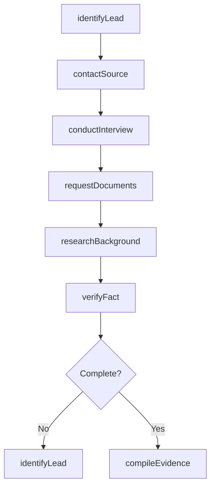
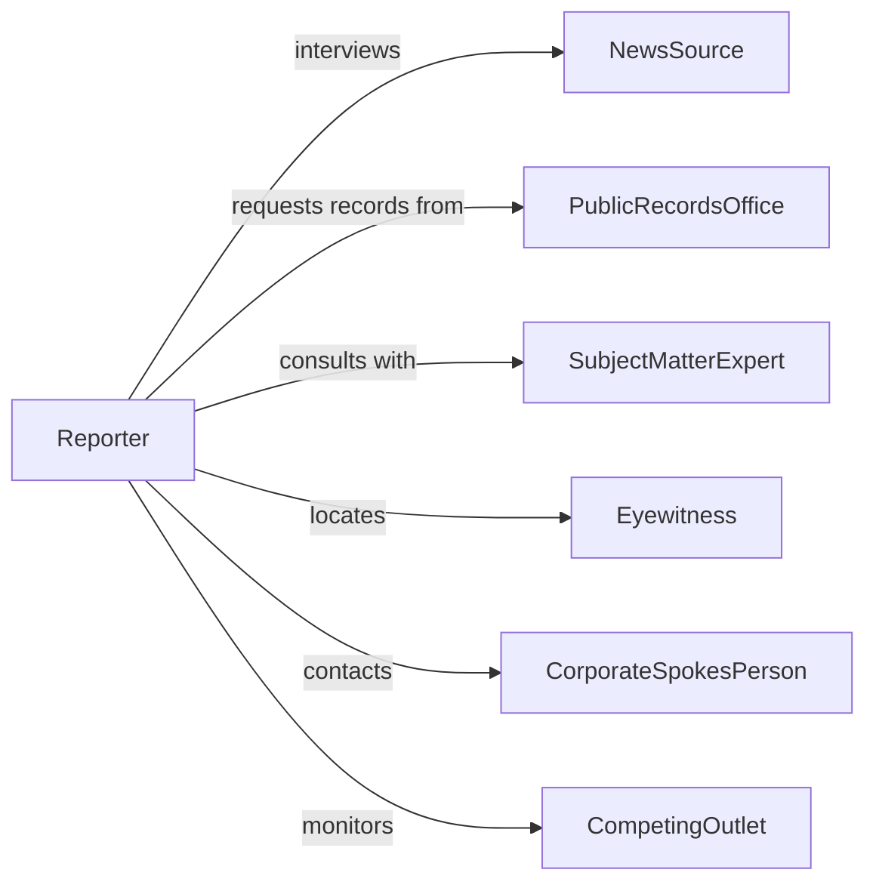

# Gather Information News Stories

> Business-as-Code definition for gathering information for news stories. Models comprehensive news research, source identification, fact-checking, and investigative journalism workflows.

## Overview

Gathering information for news stories involves researching events, interviewing sources, reviewing documents, verifying facts, and assembling evidence to support accurate reporting. This definition enables reporters to track story leads, manage source contacts, document interviews, cross-reference claims, and build comprehensive story packages across breaking news, investigative features, and ongoing coverage beats.

## Actors

| Actor | Description |
|-------|-------------|
| NewsSource | Individual providing information, quotes, or testimony for stories |
| PublicRecordsOffice | Government agency providing official documents and data |
| SubjectMatterExpert | Specialist offering technical or contextual knowledge |
| Eyewitness | Person who directly observed events being reported |
| CorporateSpokesPerson | Official representative providing organizational statements |
| CompetingOutlet | Other news organizations covering the same story |

## Roles

| Role | Description |
|------|-------------|
| Reporter | Conducts research and gathers information for stories |
| ResearchAssistant | Locates background information and supporting materials |
| FactChecker | Verifies accuracy of claims and sources |
| Editor | Reviews gathered information and directs additional research |

## Entities

| Entity | Description |
|--------|-------------|
| StoryAssignment | A news story assigned for research and reporting |
| SourceContact | Individual or organization providing information |
| Interview | Recorded conversation with a news source |
| Document | Official record, report, or written evidence |
| FactCheck | Verification of a specific claim or statement |
| Lead | Potential angle or source for story development |

## Actions

| Action | Description |
|--------|-------------|
| identifyLead | Recognize potential story angle or information source |
| conductInterview | Perform interview with source to gather information |
| requestDocuments | Obtain official records or supporting materials |
| verifyFact | Check accuracy of claim against reliable sources |
| researchBackground | Investigate context and history related to story |
| contactSource | Reach out to potential interview subject or expert |
| compileEvidence | Assemble all gathered information into story package |

## Events

| Event | Description |
|-------|-------------|
| leadIdentified | Potential story angle or source has been recognized |
| interviewConducted | Interview session with source has been completed |
| documentsReceived | Requested records or materials have been obtained |
| factVerified | Claim accuracy has been confirmed or refuted |
| backgroundResearched | Contextual information has been gathered |
| sourceContacted | Outreach to potential interview subject has been made |
| evidenceCompiled | All information has been assembled for story |

## Searches

| Search | Description |
|--------|-------------|
| findAssignments | List story assignments by reporter, date, or topic |
| getSources | Retrieve source contacts by story, expertise, or organization |
| getInterviews | Find recorded interviews by source, date, or topic |
| getFactChecks | Search fact verifications by claim, story, or result |

## Workflow



## Actor Relationships



## Usage

### Calling Actions

```typescript
import { gatherInformationNewsStories } from '@headlessly/gather-information-news-stories'

const newsGathering = gatherInformationNewsStories()

// Identify a lead for a breaking story
const lead = await newsGathering.identifyLead({
  storyId: 'breaking-2026-0205',
  topic: 'city-council-budget-vote',
  angle: 'public-reaction-to-proposed-cuts',
  source: 'community-meeting-attendance'
})

// Contact source for interview
await newsGathering.contactSource({
  sourceId: 'SRC-4521',
  method: 'phone',
  purpose: 'interview-request',
  preferredTime: '2026-02-06T14:00:00Z'
})

// Conduct interview and record responses
const interview = await newsGathering.conductInterview({
  sourceId: 'SRC-4521',
  storyId: 'breaking-2026-0205',
  method: 'recorded-phone',
  questions: [
    'How will budget cuts affect your department?',
    'What alternatives were proposed?'
  ],
  duration: 25
})

// Request supporting documents
await newsGathering.requestDocuments({
  storyId: 'breaking-2026-0205',
  source: 'city-finance-department',
  documentTypes: ['budget-proposal', 'impact-analysis', 'public-comments']
})

// Verify key fact claim
await newsGathering.verifyFact({
  storyId: 'breaking-2026-0205',
  claim: 'Budget cuts will eliminate 45 positions',
  sources: ['budget-document', 'city-manager-statement', 'HR-records']
})
```

### Event-Driven Automation

```typescript
// Request documents when interview reveals new information
newsGathering.interviewConducted(async ({ storyId, sourceId, keyPoints }) => {
  const documentNeeds = keyPoints.filter(p => p.requiresDocumentation)
  for (const need of documentNeeds) {
    await newsGathering.requestDocuments({
      storyId,
      documentTypes: [need.documentType],
      urgency: 'high'
    })
  }
})

// Alert editor when fact-check fails
newsGathering.factVerified(async ({ storyId, claim, result }) => {
  if (result === 'false' || result === 'unverifiable') {
    await notify({
      to: 'story-editor',
      message: `Fact check failed for story ${storyId}: "${claim}" - ${result}`
    })
  }
})

// Compile evidence when all verifications are complete
newsGathering.backgroundResearched(async ({ storyId }) => {
  await newsGathering.compileEvidence({ storyId })
})
