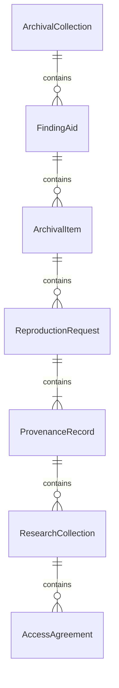
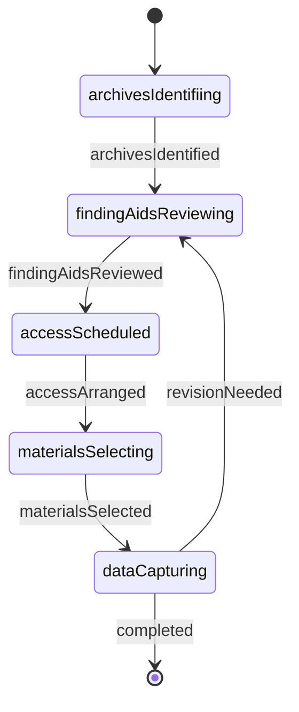
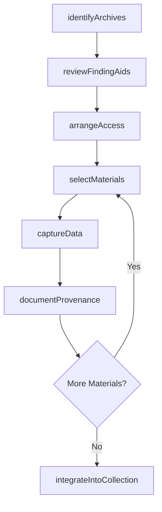
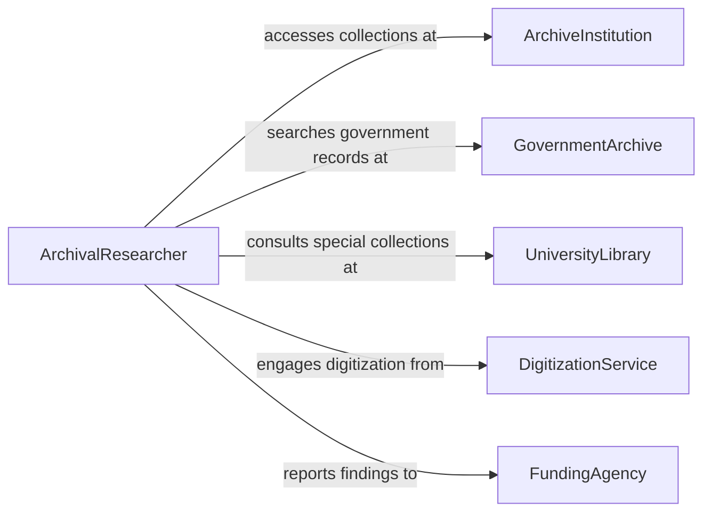

# Collect Archival Data

> Business-as-Code definition for collecting archival data. Models the workflow from archive identification through access arrangement, material selection, data capture, provenance documentation, and collection integration.

## Overview

Collecting archival data involves locating and accessing historical records, manuscripts, photographs, maps, institutional records, and other primary source materials held in archives, special collections, and repositories. Researchers identify relevant holdings, arrange access, select materials, capture or reproduce data, document provenance, and integrate findings into research collections or institutional records. This definition exposes actions for archival collection, events for acquisition milestones, and searches for locating archived materials.

## Actors

| Actor | Description |
|-------|-------------|
| ArchiveInstitution | Houses and preserves historical records and special collections |
| GovernmentArchive | Maintains official records of government agencies and proceedings |
| UniversityLibrary | Holds academic special collections, manuscripts, and research papers |
| PrivateCollector | Owns historical materials that may be made available for research |
| DigitizationService | Converts physical archival materials into digital formats |
| FundingAgency | Provides grants and resources for archival research projects |

## Roles

| Role | Description |
|------|-------------|
| ArchivalResearcher | Identifies, locates, and collects data from archival sources |
| Archivist | Facilitates access to collections and advises on holdings |
| PreservationSpecialist | Ensures proper handling of fragile or sensitive materials |
| MetadataCataloguer | Records provenance, condition, and descriptive information for collected items |

## Entities

| Entity | Description |
|--------|-------------|
| ArchivalCollection | A group of related records or materials held by a repository |
| FindingAid | A descriptive guide to the contents and organization of an archival collection |
| ArchivalItem | A single document, photograph, map, or artifact within a collection |
| ReproductionRequest | A formal ask to copy, photograph, or digitize archival materials |
| ProvenanceRecord | Documentation of the origin, custody, and transfer history of materials |
| ResearchCollection | An organized set of data gathered from archival sources for a project |
| AccessAgreement | Terms governing the use and reproduction of archival materials |

## Actions

| Action | Description |
|--------|-------------|
| identifyArchives | Locate repositories holding materials relevant to the research need |
| reviewFindingAids | Examine descriptive guides to determine what materials exist |
| arrangeAccess | Negotiate terms and schedule visits or digital access to collections |
| selectMaterials | Choose specific items from the archive for data collection |
| captureData | Photograph, transcribe, or digitize selected archival materials |
| documentProvenance | Record the origin, location, and handling of each collected item |
| integrateIntoCollection | Add captured data to the research collection with proper metadata |

## Events

| Event | Description |
|-------|-------------|
| archivesIdentified | Repositories with relevant holdings have been located |
| findingAidsReviewed | Descriptive guides have been examined to assess available materials |
| accessArranged | Terms for accessing the archive have been agreed and scheduled |
| materialsSelected | Specific archival items have been chosen for collection |
| dataCaptured | Selected materials have been photographed, transcribed, or digitized |
| provenanceDocumented | The origin and custody chain of collected items have been recorded |
| collectionIntegrated | Captured data has been added to the research collection |

## Searches

| Search | Description |
|--------|-------------|
| findArchives | Search repositories by subject, geographic area, or time period |
| getFindingAids | Locate descriptive guides by collection, repository, or keyword |
| getArchivalItems | List items within a collection by type, date, or creator |
| getReproductions | Find reproduction requests by project, repository, or status |
| getResearchCollections | Retrieve assembled research collections by project or researcher |

## Entity Relationships



## State Diagram



## Workflow



## Actor Relationships



## Usage

### Calling Actions

```typescript
import { collectArchivalData } from '@headlessly/collect-archival-data'

const archival = collectArchivalData()

// Identify archives with relevant holdings
const archives = await archival.identifyArchives({
  projectId: 'civil-war-correspondence-2026',
  subject: 'Union Army officer correspondence 1862-1865',
  regions: ['mid-atlantic', 'new-england'],
  materialTypes: ['manuscripts', 'letters', 'diaries']
})

// Review finding aids and arrange access
const findingAids = await archival.reviewFindingAids({
  repositoryIds: archives.map(a => a.id),
  keywords: ['officer', 'correspondence', 'regiment']
})

await archival.arrangeAccess({
  repositoryId: archives[0].id,
  collectionId: findingAids[0].collectionId,
  visitDates: ['2026-03-10', '2026-03-11'],
  purpose: 'academic-research'
})

// Select and capture materials
const items = await archival.selectMaterials({
  collectionId: findingAids[0].collectionId,
  criteria: { dateRange: { from: '1863-01-01', to: '1864-12-31' }, type: 'letter' }
})

await archival.captureData({
  items: items.map(i => i.id),
  method: 'highResolutionScan',
  resolution: '600dpi'
})
```

### Event-Driven Automation

```typescript
// Notify cataloguer when data is captured
archival.dataCaptured(async ({ projectId, itemCount, method }) => {
  await notify({
    to: 'metadata-cataloguer',
    message: `${itemCount} items captured via ${method} for project ${projectId}`
  })
})

// Auto-document provenance after capture
archival.dataCaptured(async ({ items, repositoryId, collectionId }) => {
  for (const itemId of items) {
    await archival.documentProvenance({
      itemId,
      repository: repositoryId,
      collection: collectionId,
      captureDate: new Date().toISOString()
    })
  }
})
```
