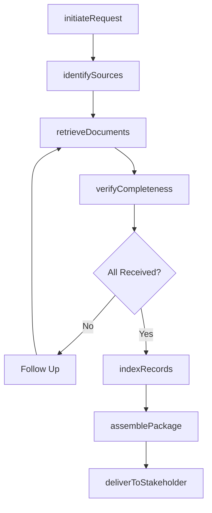
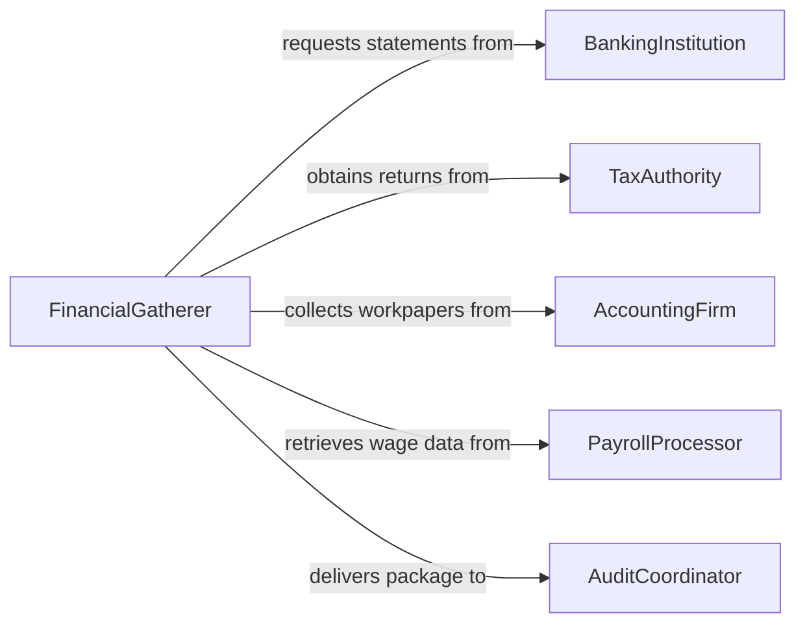

# Gather Financial Records

> Business-as-Code definition for gathering financial records. Models the workflow from record request initiation through source identification, document retrieval, verification, organization, and delivery to stakeholders.

## Overview

Gathering financial records involves identifying, requesting, retrieving, and organizing bank statements, tax returns, invoices, ledgers, payroll records, and other financial documents needed for auditing, compliance, litigation, lending, or regulatory reporting. The process requires navigating multiple custodians and systems while maintaining chain of custody and confidentiality. This definition exposes actions for financial document collection, events for retrieval milestones, and searches for locating gathered records.

## Actors

| Actor | Description |
|-------|-------------|
| BankingInstitution | Provides account statements, wire transfer records, and deposit histories |
| TaxAuthority | Supplies filed tax returns, assessments, and compliance records |
| AccountingFirm | Maintains prepared financial statements and workpapers |
| PayrollProcessor | Holds wage records, withholding data, and compensation summaries |
| BrokerageHouse | Provides investment account statements and trade confirmations |
| InsuranceCarrier | Supplies premium records, claims histories, and policy documents |

## Roles

| Role | Description |
|------|-------------|
| FinancialGatherer | Coordinates the collection of financial documents from all sources |
| AuditCoordinator | Directs what records are needed for the engagement |
| DocumentController | Manages version control, indexing, and secure storage of gathered records |
| ComplianceAnalyst | Verifies that gathered records meet regulatory requirements |

## Entities

| Entity | Description |
|--------|-------------|
| RecordRequest | A formal ask for specific financial documents from a custodian |
| BankStatement | A periodic summary of account transactions from a financial institution |
| TaxReturn | A filed declaration of income, deductions, and tax liability |
| GeneralLedger | A complete record of all financial transactions for an entity |
| Invoice | A document requesting payment for goods or services rendered |
| PayrollRecord | A summary of employee compensation, withholdings, and benefits |
| FinancialPackage | An organized collection of gathered financial documents |
| ChainOfCustodyLog | A record tracking the handling and transfer of financial documents |

## Actions

| Action | Description |
|--------|-------------|
| initiateRequest | Create a formal request for financial records from a custodian |
| identifySources | Determine which institutions and systems hold the needed records |
| retrieveDocuments | Obtain the requested financial records from custodians |
| verifyCompleteness | Confirm all requested records have been received and are legible |
| indexRecords | Catalog and tag each document for organized retrieval |
| assemblePackage | Compile all gathered records into a structured financial package |
| deliverToStakeholder | Transfer the completed package to the requesting party |

## Events

| Event | Description |
|-------|-------------|
| requestInitiated | A formal request for financial records has been created |
| sourcesIdentified | Custodians and systems holding needed records have been determined |
| documentsRetrieved | Requested financial records have been obtained |
| completenessVerified | All requested records have been confirmed received |
| recordsIndexed | Gathered documents have been cataloged and tagged |
| packageAssembled | All records have been compiled into a structured package |
| packageDelivered | The financial package has been transferred to the stakeholder |

## Searches

| Search | Description |
|--------|-------------|
| findRequests | Search record requests by engagement, custodian, or status |
| getDocuments | Retrieve gathered financial documents by type, date, or entity |
| getPackages | List assembled financial packages by engagement or recipient |
| getCustodyLogs | Find chain of custody records by document or handler |
| getPendingItems | Locate outstanding requests awaiting fulfillment |

## Workflow



## Actor Relationships



## Usage

### Calling Actions

```typescript
import { gatherFinancialRecords } from '@headlessly/gather-financial-records'

const records = gatherFinancialRecords()

// Initiate a request for audit-related records
const request = await records.initiateRequest({
  engagementId: 'audit-2026-q1',
  entity: 'acme-corp',
  documentTypes: ['bankStatements', 'generalLedger', 'taxReturns', 'payrollRecords'],
  period: { from: '2025-01-01', to: '2025-12-31' }
})

// Retrieve documents from identified sources
const docs = await records.retrieveDocuments({
  requestId: request.id,
  sources: ['first-national-bank', 'adp-payroll', 'irs-transcripts']
})

// Verify completeness and assemble
await records.verifyCompleteness({
  requestId: request.id,
  expectedDocuments: request.documentTypes,
  receivedCount: docs.length
})

await records.assemblePackage({
  requestId: request.id,
  recipient: 'external-auditor'
})
```

### Event-Driven Automation

```typescript
// Alert coordinator when documents are retrieved
records.documentsRetrieved(async ({ requestId, source, documentCount }) => {
  await notify({
    to: 'audit-coordinator',
    message: `${documentCount} documents received from ${source} for request ${requestId}`
  })
})

// Auto-assemble package when all records are verified
records.completenessVerified(async ({ requestId, complete }) => {
  if (complete) {
    await records.indexRecords({ requestId })
    await records.assemblePackage({ requestId })
  }
})
```
