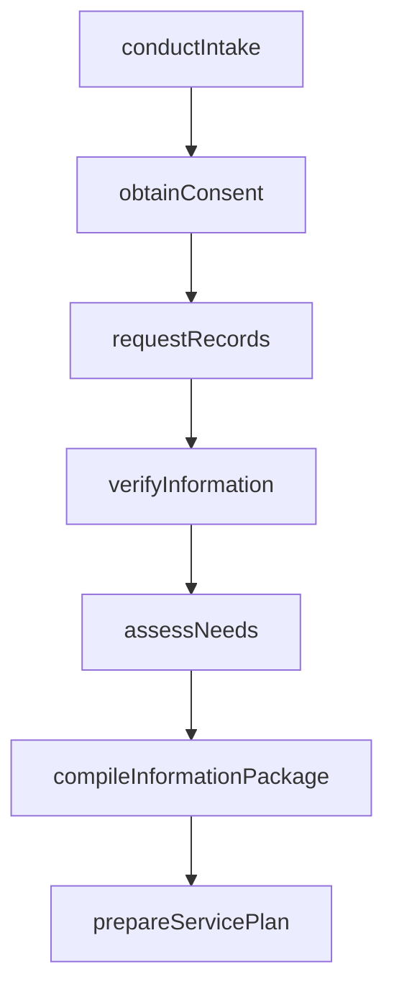
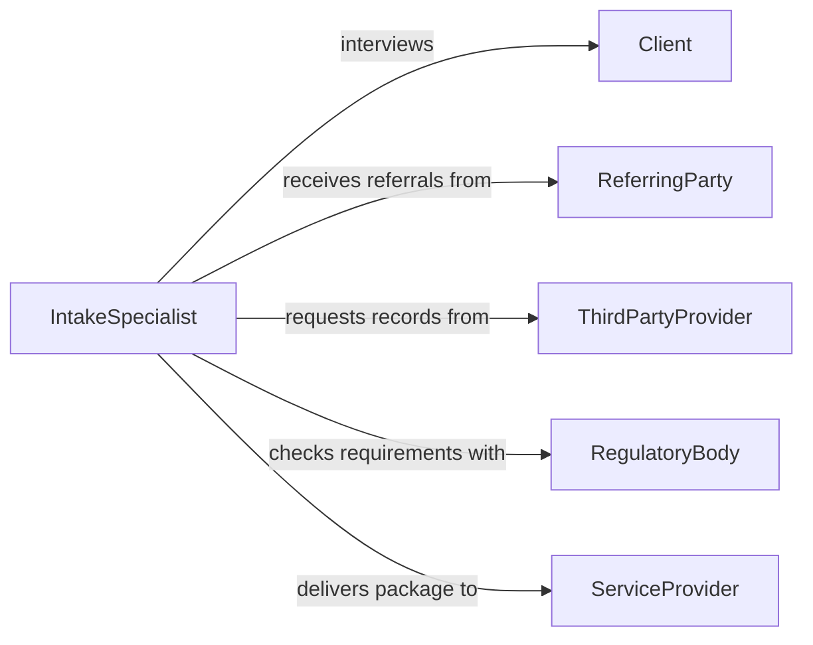

# Gather Information in Order to Provide Services

> Business-as-Code definition for gathering information in order to provide services to clients. Models the workflow from client intake through needs assessment, data collection, information synthesis, and service delivery preparation.

## Overview

Gathering information to provide services to clients involves conducting intake interviews, reviewing existing records, collecting relevant documentation, and synthesizing findings to understand client needs before delivering professional services. This applies across consulting, legal, financial advisory, healthcare, social services, and technical support contexts. This definition exposes actions for client-centered information gathering, events for collection milestones, and searches for retrieving client data and service records.

## Actors

| Actor | Description |
|-------|-------------|
| Client | Provides personal, business, or technical information needed for service delivery |
| ReferringParty | Transfers the client with background information and referral notes |
| ThirdPartyProvider | Supplies supplementary records such as medical, financial, or legal documents |
| RegulatoryBody | Sets requirements for what information must be gathered before service delivery |
| InsuranceProvider | Requires specific documentation for coverage and reimbursement |
| PriorServiceProvider | Holds historical records from previous engagements |

## Roles

| Role | Description |
|------|-------------|
| IntakeSpecialist | Conducts the initial information-gathering session with the client |
| ServiceCoordinator | Determines what additional data is needed based on the service type |
| RecordsAnalyst | Reviews and organizes gathered information into a usable format |
| ServiceProvider | Uses the gathered information to deliver the requested service |

## Entities

| Entity | Description |
|--------|-------------|
| IntakeForm | A structured document capturing initial client information |
| ClientProfile | A comprehensive record of client demographics, history, and needs |
| ConsentAuthorization | A signed form permitting the collection and use of client information |
| SupportingDocument | A record obtained from third parties to supplement client data |
| NeedsAssessment | An analysis of what services the client requires based on gathered data |
| ServicePlan | A proposed course of action developed from the information gathered |
| InformationPackage | The complete set of documents and data assembled for service delivery |

## Actions

| Action | Description |
|--------|-------------|
| conductIntake | Perform the initial interview to capture client information |
| obtainConsent | Secure authorization to collect and use the client's data |
| requestRecords | Ask third parties for supporting documents and history |
| verifyInformation | Confirm the accuracy of client-provided and third-party data |
| assessNeeds | Analyze gathered information to determine service requirements |
| compileInformationPackage | Assemble all data into an organized package for the service provider |
| prepareServicePlan | Develop a service plan based on the needs assessment |

## Events

| Event | Description |
|-------|-------------|
| intakeConducted | The initial client information session has been completed |
| consentObtained | Authorization to collect and use client data has been secured |
| recordsRequested | Supporting documents have been requested from third parties |
| informationVerified | Client and third-party data have been confirmed as accurate |
| needsAssessed | The client's service requirements have been determined |
| informationPackageCompiled | All data has been assembled for the service provider |
| servicePlanPrepared | A course of action has been developed from gathered information |

## Searches

| Search | Description |
|--------|-------------|
| findClients | Search client profiles by name, case number, or referral source |
| getIntakeForms | Retrieve intake records by date, specialist, or service type |
| getSupportingDocuments | List third-party documents by client or record type |
| getNeedsAssessments | Find assessments by client, service category, or date |
| getServicePlans | Locate service plans by client, status, or provider |

## Workflow



## Actor Relationships



## Usage

### Calling Actions

```typescript
import { gatherInformationOrderProvideServices } from '@headlessly/gather-information-order-provide-services'

const intake = gatherInformationOrderProvideServices()

// Conduct client intake
const form = await intake.conductIntake({
  clientId: 'client-2026-0891',
  serviceType: 'financialAdvisory',
  demographics: {
    name: 'Jane Smith',
    dateOfBirth: '1978-06-22',
    contactEmail: 'jane.smith@example.com'
  },
  referralSource: 'accounting-firm-jones'
})

// Obtain consent and request supporting records
await intake.obtainConsent({
  clientId: form.clientId,
  consentTypes: ['dataCollection', 'thirdPartyRelease', 'electronicCommunication']
})

await intake.requestRecords({
  clientId: form.clientId,
  sources: ['prior-advisor', 'brokerage-account', 'tax-preparer'],
  documentTypes: ['investmentStatements', 'taxReturns', 'estateDocuments']
})

// Assess needs and prepare plan
const assessment = await intake.assessNeeds({
  clientId: form.clientId,
  serviceCategory: 'retirementPlanning'
})
```

### Event-Driven Automation

```typescript
// Notify service provider when information package is ready
intake.informationPackageCompiled(async ({ clientId, serviceType }) => {
  await notify({
    to: 'service-provider',
    message: `Information package ready for client ${clientId} - ${serviceType}`
  })
})

// Auto-assess needs when all information is verified
intake.informationVerified(async ({ clientId }) => {
  await intake.assessNeeds({ clientId })
})
```
