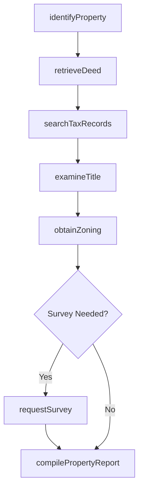
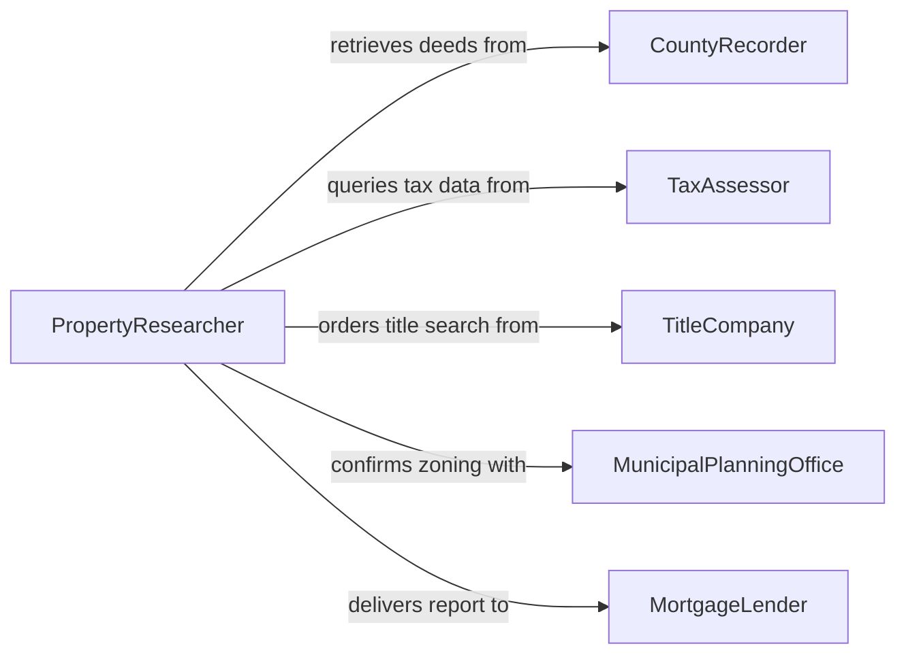

# Obtain Property Information

> Business-as-Code definition for obtaining property information. Models the workflow from property identification through records retrieval, title examination, valuation assessment, and report compilation.

## Overview

Obtaining property information involves researching ownership records, legal descriptions, tax assessments, zoning classifications, encumbrances, and physical characteristics of real or personal property. This process supports transactions, appraisals, lending decisions, insurance underwriting, and legal proceedings. This definition exposes actions for property data acquisition, events for retrieval milestones, and searches for querying property records.

## Actors

| Actor | Description |
|-------|-------------|
| CountyRecorder | Maintains official records of deeds, liens, and encumbrances |
| TaxAssessor | Provides assessed values and property tax records |
| TitleCompany | Conducts title searches and issues insurance commitments |
| MunicipalPlanningOffice | Supplies zoning designations and land use permits |
| MortgageLender | Requests property data for underwriting decisions |
| PropertyOwner | Provides access to the property and existing documentation |

## Roles

| Role | Description |
|------|-------------|
| PropertyResearcher | Gathers and compiles property data from multiple sources |
| TitleExaminer | Reviews chain of title and identifies encumbrances |
| Appraiser | Assesses property value based on market and physical data |
| RealEstateAnalyst | Synthesizes property information for investment or transaction decisions |

## Entities

| Entity | Description |
|--------|-------------|
| PropertyRecord | A composite profile of ownership, legal description, and characteristics |
| DeedDocument | A recorded instrument conveying property ownership |
| TitleReport | A summary of ownership history, liens, and encumbrances |
| TaxAssessment | The assessed value and tax liability assigned to a property |
| ZoningDesignation | The municipal classification governing permitted land uses |
| SurveyPlat | A legal boundary map prepared by a licensed surveyor |
| EncumbranceRecord | A lien, easement, or restriction affecting the property |
| AppraisalReport | A professional estimate of market value |

## Actions

| Action | Description |
|--------|-------------|
| identifyProperty | Locate and confirm the subject property by address or parcel number |
| retrieveDeed | Obtain the recorded deed and chain of title documents |
| searchTaxRecords | Query tax assessment rolls for valuation and payment history |
| examineTitle | Review ownership chain and identify outstanding encumbrances |
| obtainZoning | Retrieve the current zoning classification and permitted uses |
| requestSurvey | Order a boundary or topographic survey of the property |
| compilePropertyReport | Assemble all findings into a comprehensive property profile |

## Events

| Event | Description |
|-------|-------------|
| propertyIdentified | The subject property has been located and confirmed |
| deedRetrieved | The recorded deed and title documents have been obtained |
| taxRecordsSearched | Tax assessment and payment history have been retrieved |
| titleExamined | The ownership chain and encumbrances have been reviewed |
| zoningObtained | The zoning classification and restrictions have been confirmed |
| surveyCompleted | A boundary or topographic survey has been delivered |
| propertyReportCompiled | All property information has been assembled into a report |

## Searches

| Search | Description |
|--------|-------------|
| findProperties | Search properties by address, parcel number, or owner name |
| getTaxHistory | Retrieve tax assessment and payment records by parcel |
| getTitleReports | Find title reports by property or transaction |
| getEncumbrances | List liens, easements, and restrictions on a property |
| getAppraisals | Locate appraisal reports by property or date range |

## Workflow



## Actor Relationships



## Usage

### Calling Actions

```typescript
import { obtainPropertyInformation } from '@headlessly/obtain-property-information'

const property = obtainPropertyInformation()

// Identify the subject property
const parcel = await property.identifyProperty({
  address: '1425 Elm Street',
  city: 'Springfield',
  state: 'IL',
  parcelNumber: '14-23-301-009'
})

// Retrieve the deed and examine title
const deed = await property.retrieveDeed({
  parcelId: parcel.id,
  county: 'sangamon'
})

const title = await property.examineTitle({
  parcelId: parcel.id,
  deedIds: [deed.id],
  searchDepth: '60-years'
})

// Compile the full property report
await property.compilePropertyReport({
  parcelId: parcel.id,
  sections: ['ownership', 'taxHistory', 'encumbrances', 'zoning', 'valuation']
})
```

### Event-Driven Automation

```typescript
// Alert lender when title examination is complete
property.titleExamined(async ({ parcelId, encumbrances }) => {
  if (encumbrances.length > 0) {
    await notify({
      to: 'mortgage-underwriter',
      message: `Title examination found ${encumbrances.length} encumbrances on parcel ${parcelId}`
    })
  }
})

// Auto-compile report when all data is gathered
property.zoningObtained(async ({ parcelId }) => {
  await property.compilePropertyReport({ parcelId })
})
```
