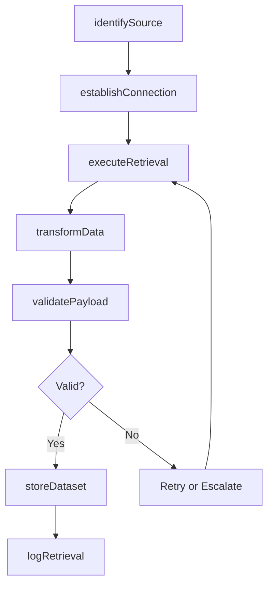
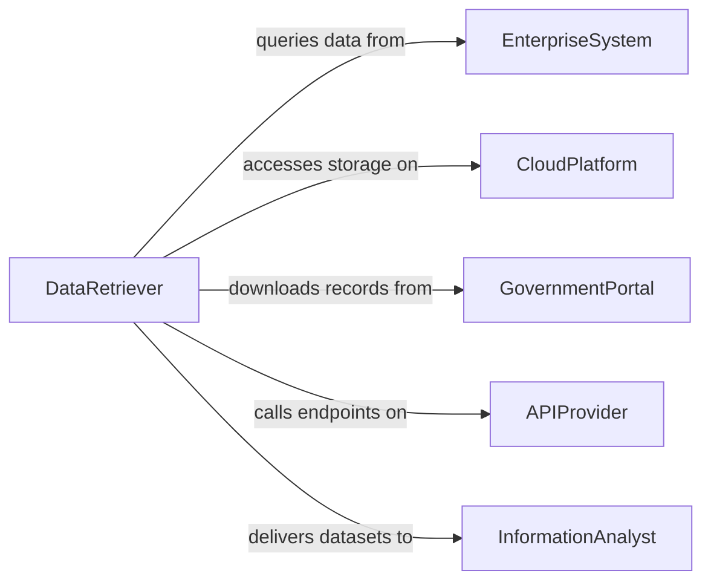

# Retrieve Information from Electronic Sources

> Business-as-Code definition for retrieving information from electronic sources. Models the workflow from source identification through connection, query execution, data extraction, validation, and storage.

## Overview

Retrieving information from electronic sources involves accessing digital databases, online repositories, enterprise systems, cloud platforms, and web services to obtain data needed for operational, analytical, or compliance purposes. Practitioners navigate authentication requirements, API protocols, and data formats to extract structured and unstructured information. This definition exposes actions for electronic data retrieval, events for extraction milestones, and searches for managing retrieved datasets.

## Actors

| Actor | Description |
|-------|-------------|
| EnterpriseSystem | Hosts internal business data such as ERP, CRM, and HRIS platforms |
| CloudPlatform | Provides hosted data storage and computing services |
| GovernmentPortal | Publishes regulatory filings, permits, and public records electronically |
| DataAggregator | Consolidates information from multiple electronic sources into a single feed |
| APIProvider | Exposes programmatic access to data through web services |
| ContentManagementSystem | Stores and organizes digital documents, media, and records |

## Roles

| Role | Description |
|------|-------------|
| DataRetriever | Connects to electronic sources and extracts the required information |
| SystemAdministrator | Manages credentials, access permissions, and connectivity to sources |
| DataEngineer | Transforms and loads retrieved data into target systems |
| InformationAnalyst | Validates and interprets the retrieved data for business use |

## Entities

| Entity | Description |
|--------|-------------|
| ElectronicSource | A digital system or service from which data can be retrieved |
| ConnectionProfile | Configuration details for accessing an electronic source |
| RetrievalQuery | A request specifying what data to extract from a source |
| DataPayload | The raw information returned from an electronic source |
| TransformationRule | A mapping that converts retrieved data into a target format |
| RetrievedDataset | A validated and formatted collection of data from electronic sources |
| RetrievalLog | A timestamped record of what was retrieved, from where, and by whom |

## Actions

| Action | Description |
|--------|-------------|
| identifySource | Determine which electronic systems contain the needed information |
| establishConnection | Authenticate and connect to the target electronic source |
| executeRetrieval | Run queries or API calls to extract data from the source |
| transformData | Convert retrieved data into the required format and structure |
| validatePayload | Verify the completeness and accuracy of extracted data |
| storeDataset | Persist the validated data in the target repository |
| logRetrieval | Record the retrieval activity for audit and troubleshooting |

## Events

| Event | Description |
|-------|-------------|
| sourceIdentified | An electronic source containing needed data has been located |
| connectionEstablished | Authentication and connectivity to the source have been confirmed |
| retrievalExecuted | Data has been extracted from the electronic source |
| dataTransformed | Retrieved data has been converted to the target format |
| payloadValidated | Extracted data has been verified for completeness and accuracy |
| datasetStored | Validated data has been persisted in the target repository |
| retrievalLogged | The retrieval activity has been recorded for audit purposes |

## Searches

| Search | Description |
|--------|-------------|
| findSources | List available electronic sources by type, domain, or data category |
| getRetrievalLogs | Search retrieval history by source, date, or analyst |
| getDatasets | Locate stored datasets by source, date range, or content type |
| getConnectionProfiles | Find configured connection profiles by system or status |
| getPendingRetrievals | List scheduled or queued retrieval tasks |

## Workflow



## Actor Relationships



## Usage

### Calling Actions

```typescript
import { retrieveInformationElectronicSources } from '@headlessly/retrieve-information-electronic-sources'

const retrieval = retrieveInformationElectronicSources()

// Identify and connect to the source
const source = await retrieval.identifySource({
  dataNeeded: 'employeeCompensationRecords',
  systems: ['workday-hris', 'adp-payroll']
})

await retrieval.establishConnection({
  sourceId: source.id,
  credentials: 'vault://hris-service-account',
  protocol: 'restApi'
})

// Execute retrieval and transform
const payload = await retrieval.executeRetrieval({
  sourceId: source.id,
  query: {
    entity: 'compensationHistory',
    filters: { department: 'engineering', period: '2025' },
    fields: ['employeeId', 'baseSalary', 'bonus', 'effectiveDate']
  }
})

await retrieval.transformData({
  payloadId: payload.id,
  targetFormat: 'parquet',
  mappings: { employeeId: 'empId', baseSalary: 'base' }
})
```

### Event-Driven Automation

```typescript
// Notify analyst when dataset is stored
retrieval.datasetStored(async ({ sourceId, recordCount, datasetId }) => {
  await notify({
    to: 'information-analyst',
    message: `${recordCount} records retrieved and stored from source ${sourceId}`
  })
})

// Auto-retry on validation failure
retrieval.payloadValidated(async ({ payloadId, valid, errors }) => {
  if (!valid) {
    await notify({
      to: 'data-engineer',
      message: `Validation failed for payload ${payloadId}: ${errors.join(', ')}`
    })
  }
})
```
