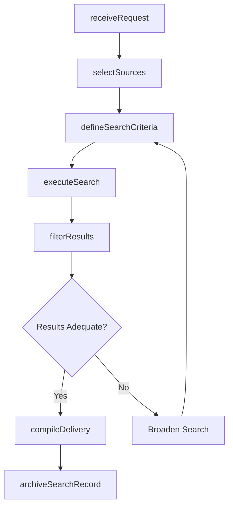
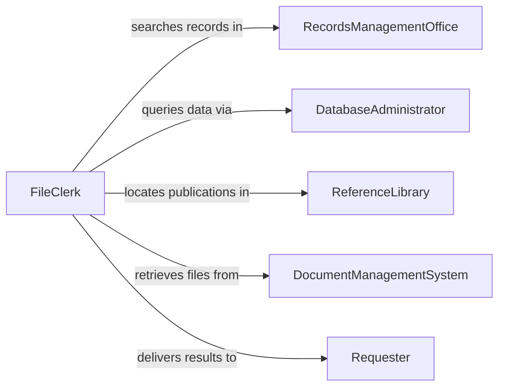

# Search Files, Databases, or Reference Materials

> Business-as-Code definition for searching files, databases, or reference materials to obtain needed information. Models the workflow from information need identification through source selection, search execution, result filtering, and data delivery.

## Overview

Searching files, databases, or reference materials involves identifying what information is needed, selecting the most appropriate physical or digital repositories, executing targeted searches using keywords and criteria, filtering and sorting results, and delivering the relevant data to the requester. This is a foundational activity across administrative, research, technical, and operational functions. This definition exposes actions for systematic file and database searching, events for retrieval progress, and searches for managing query history.

## Actors

| Actor | Description |
|-------|-------------|
| RecordsManagementOffice | Maintains physical and digital filing systems for the organization |
| DatabaseAdministrator | Manages database schemas, indexes, and access permissions |
| ReferenceLibrary | Houses technical manuals, standards, codes, and publications |
| DocumentManagementSystem | Stores and indexes electronic files with metadata and version control |
| ExternalDataService | Provides access to third-party databases and reference collections |
| Requester | The individual or department needing specific information |

## Roles

| Role | Description |
|------|-------------|
| FileClerk | Navigates physical and electronic filing systems to locate records |
| DatabaseQuerySpecialist | Writes and executes structured queries against databases |
| ReferenceLibrarian | Locates information within technical publications and standards |
| InformationCoordinator | Triages requests and routes them to appropriate search resources |

## Entities

| Entity | Description |
|--------|-------------|
| InformationRequest | A formal statement of what data is needed and why |
| FileRecord | A document stored in a physical or electronic filing system |
| DatabaseRecord | A structured entry in a relational or document database |
| ReferenceMaterial | A technical manual, standard, code book, or publication |
| SearchCriteria | The keywords, filters, and parameters used to locate information |
| SearchResultSet | The collection of records returned from a search operation |
| DeliveryPackage | The formatted information provided to the requester |

## Actions

| Action | Description |
|--------|-------------|
| receiveRequest | Accept and log an information request from a requester |
| selectSources | Determine which files, databases, or references to search |
| defineSearchCriteria | Specify keywords, date ranges, categories, and other filters |
| executeSearch | Run the search across selected sources |
| filterResults | Narrow returned records to those most relevant to the request |
| compileDelivery | Format and package the relevant information for the requester |
| archiveSearchRecord | Save the search parameters and results for future reference |

## Events

| Event | Description |
|-------|-------------|
| requestReceived | An information request has been logged |
| sourcesSelected | The files, databases, and references to search have been determined |
| searchCriteriaDefined | Keywords and filters have been specified |
| searchExecuted | The search has been run and results returned |
| resultsFiltered | Returned records have been narrowed to relevant items |
| deliveryCompiled | Information has been formatted and packaged for the requester |
| searchRecordArchived | The search details have been saved for future reference |

## Searches

| Search | Description |
|--------|-------------|
| findRequests | List information requests by requester, date, or status |
| getFileRecords | Search file records by name, date, category, or content |
| getDatabaseRecords | Query database records by table, field, or value |
| getReferenceMaterials | Locate publications by title, standard number, or subject |
| getSearchHistory | Retrieve past searches by analyst, source, or topic |

## Workflow



## Actor Relationships



## Usage

### Calling Actions

```typescript
import { searchFilesDatabasesReferenceMaterials } from '@headlessly/search-files-databases-reference-materials'

const search = searchFilesDatabasesReferenceMaterials()

// Receive an information request
const request = await search.receiveRequest({
  requester: 'project-manager-wilson',
  description: 'Need the original equipment specifications for pump model PX-4200',
  urgency: 'high',
  context: 'maintenance-planning'
})

// Select sources and define search criteria
await search.selectSources({
  requestId: request.id,
  sources: ['equipmentDatabase', 'vendorManualLibrary', 'projectFileArchive']
})

const criteria = await search.defineSearchCriteria({
  requestId: request.id,
  keywords: ['PX-4200', 'pump', 'specification'],
  dateRange: { from: '2018-01-01', to: '2026-02-01' },
  documentTypes: ['specSheet', 'operatingManual', 'drawingSet']
})

// Execute and deliver
const results = await search.executeSearch({
  requestId: request.id,
  criteriaId: criteria.id
})
```

### Event-Driven Automation

```typescript
// Notify requester when delivery is ready
search.deliveryCompiled(async ({ requestId, requester, resultCount }) => {
  await notify({
    to: requester,
    message: `Your information request ${requestId} is ready: ${resultCount} documents found`
  })
})

// Auto-archive after delivery
search.deliveryCompiled(async ({ requestId }) => {
  await search.archiveSearchRecord({ requestId })
})
```
