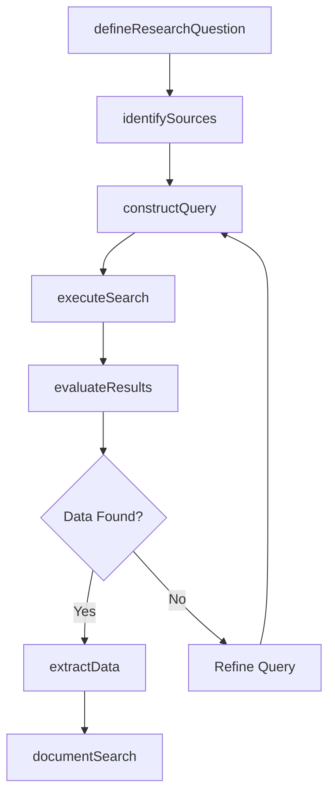
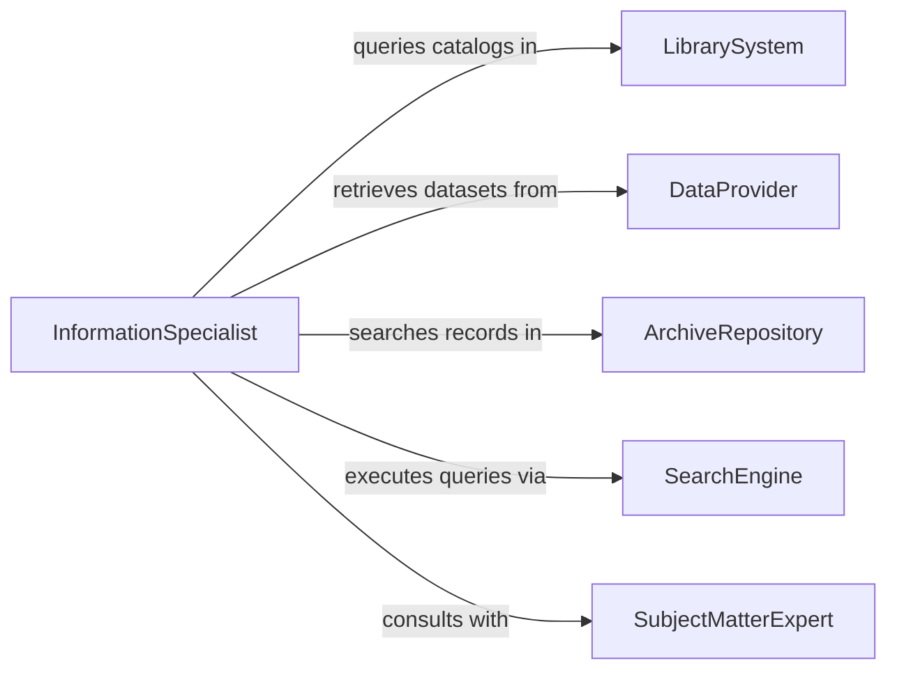

# Search Information Sources to Find Specific Data

> Business-as-Code definition for searching information sources to find specific data. Models the workflow from research question definition through source identification, query execution, result evaluation, and data extraction.

## Overview

Searching information sources to find specific data involves defining precise research questions, identifying appropriate databases, archives, catalogs, and reference systems, executing targeted queries, evaluating the relevance and reliability of returned results, and extracting the needed data for downstream use. This applies across research, business intelligence, library science, and operational planning contexts. This definition exposes actions for systematic data retrieval, events for search milestones, and searches for managing query history and results.

## Actors

| Actor | Description |
|-------|-------------|
| LibrarySystem | Provides catalogs, indexes, and reference collections |
| DataProvider | Maintains structured datasets available through subscription or API |
| ArchiveRepository | Houses historical records, manuscripts, and primary source documents |
| SearchEngine | Indexes and retrieves information from distributed sources |
| SubjectMatterExpert | Advises on where specialized data can be found |
| RegulatoryAgency | Publishes official records, filings, and statistical data |

## Roles

| Role | Description |
|------|-------------|
| InformationSpecialist | Designs and executes searches across multiple sources |
| ResearchAnalyst | Evaluates search results for relevance and quality |
| DataCurator | Organizes and catalogs retrieved data for future access |
| ProjectLead | Defines the research questions and data requirements |

## Entities

| Entity | Description |
|--------|-------------|
| ResearchQuestion | A specific data need stated in searchable terms |
| InformationSource | A database, archive, catalog, or system to be queried |
| SearchQuery | A structured request with keywords, filters, and parameters |
| SearchResult | A record or document returned from a query |
| RelevanceAssessment | An evaluation of how well a result matches the research need |
| ExtractedDataSet | Specific data points pulled from validated results |
| SearchLog | A record of queries executed, sources used, and results obtained |

## Actions

| Action | Description |
|--------|-------------|
| defineResearchQuestion | Articulate the specific data needed and acceptance criteria |
| identifySources | Select the databases, archives, and systems most likely to contain the data |
| constructQuery | Build a structured search with keywords, Boolean operators, and filters |
| executeSearch | Run the query against selected information sources |
| evaluateResults | Assess returned records for relevance, accuracy, and completeness |
| extractData | Pull specific data points from validated results |
| documentSearch | Record the search strategy, sources, and findings for reproducibility |

## Events

| Event | Description |
|-------|-------------|
| researchQuestionDefined | The specific data requirement has been articulated |
| sourcesIdentified | Appropriate information sources have been selected |
| queryConstructed | A structured search has been formulated |
| searchExecuted | The query has been run and results returned |
| resultsEvaluated | Returned records have been assessed for relevance |
| dataExtracted | Specific data points have been pulled from results |
| searchDocumented | The search strategy and findings have been recorded |

## Searches

| Search | Description |
|--------|-------------|
| findSearchLogs | Retrieve past search strategies by topic, date, or researcher |
| getResults | List search results by query, source, or relevance score |
| getSources | Find available information sources by subject area or type |
| getExtractedData | Locate extracted datasets by research question or project |
| getResearchQuestions | List open research questions by project or priority |

## Workflow



## Actor Relationships



## Usage

### Calling Actions

```typescript
import { searchInformationSourcesFindSpecific } from '@headlessly/search-information-sources-find-specific'

const search = searchInformationSourcesFindSpecific()

// Define the research question
const question = await search.defineResearchQuestion({
  projectId: 'market-analysis-2026',
  question: 'What are the current import tariff rates for lithium-ion battery components?',
  acceptanceCriteria: ['currentAsOf2026', 'harmonizedTariffCodes', 'byCountryOfOrigin']
})

// Identify sources and construct a query
const sources = await search.identifySources({
  questionId: question.id,
  sourceTypes: ['governmentRegistry', 'tradeDatabase', 'industryPublication']
})

const query = await search.constructQuery({
  questionId: question.id,
  keywords: ['lithium-ion', 'battery', 'tariff', 'import duty'],
  filters: { jurisdiction: 'US', dateRange: { from: '2025-01-01', to: '2026-02-01' } }
})

// Execute and evaluate
const results = await search.executeSearch({
  queryId: query.id,
  sourceIds: sources.map(s => s.id)
})
```

### Event-Driven Automation

```typescript
// Notify project lead when data is extracted
search.dataExtracted(async ({ questionId, projectId, recordCount }) => {
  await notify({
    to: 'project-lead',
    message: `${recordCount} data points extracted for research question in project ${projectId}`
  })
})

// Auto-document search when results are evaluated
search.resultsEvaluated(async ({ queryId, relevantCount }) => {
  if (relevantCount > 0) {
    await search.documentSearch({ queryId })
  }
})
```
