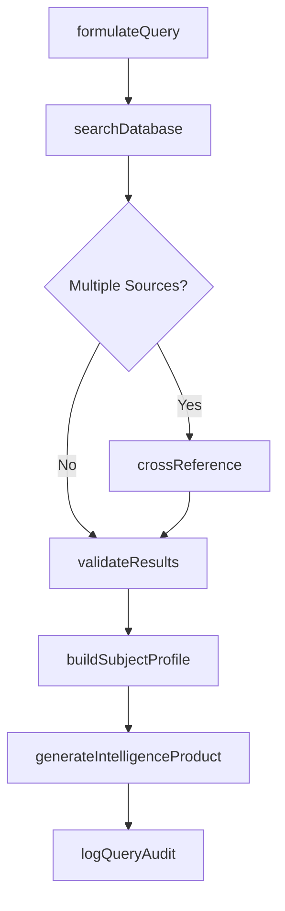
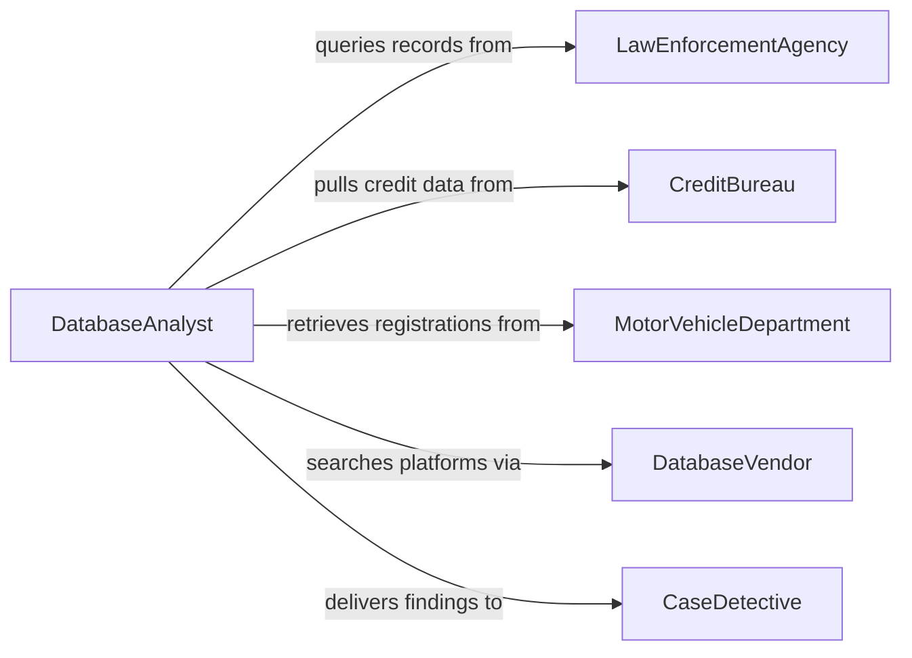

# Use Databases to Locate Investigation Details

> Business-as-Code definition for using databases to locate investigation details or other information. Models the workflow from query formulation through database search, cross-referencing, result validation, and intelligence report generation.

## Overview

Using databases to locate investigation details involves querying law enforcement, financial, public records, and proprietary intelligence databases to retrieve information relevant to active investigations. Analysts formulate structured queries, cross-reference results across multiple systems, validate data accuracy, and compile findings into actionable intelligence products. This definition exposes actions for database-driven investigation, events for search milestones, and searches for retrieving query results and intelligence products.

## Actors

| Actor | Description |
|-------|-------------|
| LawEnforcementAgency | Maintains criminal records, warrant databases, and incident reports |
| CreditBureau | Provides consumer credit histories and identity verification data |
| MotorVehicleDepartment | Supplies vehicle registration and driver records |
| UtilityProvider | Offers service connection records useful for locating individuals |
| SocialMediaPlatform | Hosts publicly available profile and activity data |
| DatabaseVendor | Operates commercial investigative databases and search platforms |

## Roles

| Role | Description |
|------|-------------|
| DatabaseAnalyst | Formulates queries and retrieves data from investigative systems |
| IntelligenceResearcher | Cross-references results to build comprehensive subject profiles |
| CaseDetective | Directs database searches based on investigative leads |
| ComplianceOfficer | Ensures database access and usage comply with privacy regulations |

## Entities

| Entity | Description |
|--------|-------------|
| DatabaseQuery | A structured request submitted to an investigative database |
| SearchResult | A set of records returned from a database query |
| SubjectProfile | A compiled dossier of information about a person or entity of interest |
| CriminalRecord | A history of arrests, charges, and convictions |
| VehicleRegistration | A record linking a vehicle to its registered owner |
| FinancialProfile | Credit history, account information, and transaction patterns |
| IntelligenceProduct | A finished analytical report synthesizing database findings |
| AuditTrail | A log of database queries for compliance and chain-of-custody purposes |

## Actions

| Action | Description |
|--------|-------------|
| formulateQuery | Define search parameters based on investigative leads |
| searchDatabase | Execute a query against one or more investigative databases |
| crossReference | Compare results across multiple databases to identify connections |
| validateResults | Verify the accuracy and currency of retrieved records |
| buildSubjectProfile | Compile validated data into a comprehensive subject dossier |
| generateIntelligenceProduct | Produce an analytical report from cross-referenced findings |
| logQueryAudit | Record all database access for compliance and accountability |

## Events

| Event | Description |
|-------|-------------|
| queryFormulated | Search parameters have been defined from investigative leads |
| databaseSearched | A query has been executed and results returned |
| resultsCrossReferenced | Data from multiple databases has been compared and linked |
| resultsValidated | Retrieved records have been verified for accuracy |
| subjectProfileBuilt | A comprehensive dossier has been compiled |
| intelligenceProductGenerated | An analytical report has been produced |
| queryAuditLogged | Database access has been recorded for compliance |

## Searches

| Search | Description |
|--------|-------------|
| findQueries | Search past queries by case, analyst, or date range |
| getSearchResults | Retrieve results from previous database searches by case or subject |
| getSubjectProfiles | Locate compiled dossiers by name, alias, or identifier |
| getCriminalRecords | Find criminal history records by name, date of birth, or fingerprint |
| getIntelligenceProducts | List finished reports by case, subject, or date |

## Workflow



## Actor Relationships



## Usage

### Calling Actions

```typescript
import { useDatabasesLocateInvestigationDetails } from '@headlessly/use-databases-locate-investigation-details'

const db = useDatabasesLocateInvestigationDetails()

// Formulate a query based on investigative leads
const query = await db.formulateQuery({
  caseId: 'fraud-2026-0412',
  subject: {
    name: 'John Doe',
    dob: '1985-03-15',
    ssn: 'xxx-xx-4532'
  },
  databases: ['ncic', 'lexisNexis', 'dmvRecords', 'creditBureau']
})

// Execute the search across multiple databases
const results = await db.searchDatabase({
  queryId: query.id,
  databases: query.databases,
  timeout: '30s'
})

// Cross-reference and build a subject profile
await db.crossReference({
  caseId: 'fraud-2026-0412',
  resultSets: results.map(r => r.id)
})

const profile = await db.buildSubjectProfile({
  caseId: 'fraud-2026-0412',
  subject: query.subject
})
```

### Event-Driven Automation

```typescript
// Notify detective when subject profile is complete
db.subjectProfileBuilt(async ({ caseId, subject, matchCount }) => {
  await notify({
    to: 'case-detective',
    message: `Subject profile compiled for case ${caseId}: ${matchCount} records matched`
  })
})

// Auto-log audit trail after every database search
db.databaseSearched(async ({ queryId, analyst, databases }) => {
  await db.logQueryAudit({
    queryId,
    analyst,
    databases,
    timestamp: new Date().toISOString()
  })
})
```
